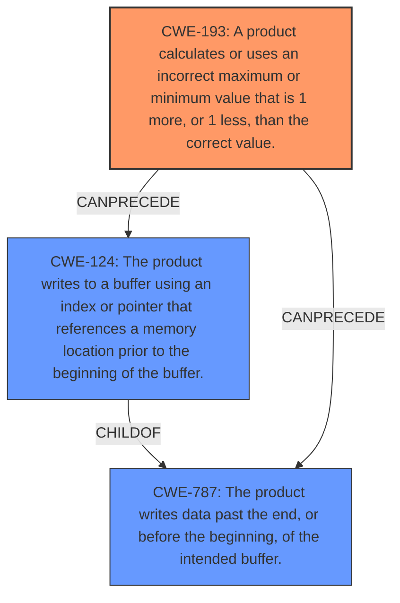

# Analysis Report for CVE-2021-3999

# Vulnerability Analysis Report: CVE-2021-3999

## Description

A flaw was found in glibc. An off-by-one buffer overflow and underflow in getcwd() may lead to memory corruption when the size of the buffer is exactly 1. A local attacker who can control the input buffer and size passed to getcwd() in a setuid program could use this flaw to potentially execute arbitrary code and escalate their privileges on the system.

## Vulnerability Description Key Phrases

**Rootcause:** off-by-one buffer overflow and underflow
**Impact:** memory corruption
**Vector:** control the input buffer and size
**Attacker:** local attacker
**Product:** glibc
**Component:** getcwd()

## Analysis (with Relationship Data)

# Summary
| CWE ID | CWE Name | Confidence | CWE Abstraction Level | CWE Vulnerability Mapping Label | CWE-Vulnerability Mapping Notes |
|---|---|---|---|---|---|
| CWE-193 | Off-by-one Error | 1.0 | Base | Allowed | The vulnerability is caused by an **off-by-one buffer overflow and underflow** in `getcwd()`. |
| CWE-124 | Buffer Underwrite ('Buffer Underflow') | 0.7 | Base | Allowed | The vulnerability description mentions an **underflow** condition. |
| CWE-787 | Out-of-bounds Write | 0.6 | Base | Allowed | The **overflow** condition could lead to an out-of-bounds write. |

## Evidence and Confidence

*   **Confidence Score:** 0.9
*   **Evidence Strength:** HIGH

- **Analysis and Justification:**  
  - *Explanation:* "The vulnerability description explicitly states an **off-by-one buffer overflow and underflow** in the `getcwd()` function of glibc. This directly aligns with CWE-193 (Off-by-one Error). The vulnerability occurs when the buffer size is exactly 1, leading to memory corruption. The CVE reference links content summary confirms this root cause, specifying that the `getcwd` function has a flaw where a buffer of size 1 can lead to an off-by-one buffer overflow and underflow due to incorrect size checks. CWE-193 is a Base level CWE and its usage is ALLOWED according to MITRE's mapping guidance. Given the explicit mention of "off-by-one," CWE-193 is the primary and most accurate mapping."
  
  - *Relationship Analysis:* "CWE-193 does not have any direct relationships (ChildOf, ParentOf, PeerOf) listed in the provided information. However, the overflow and underflow conditions can lead to out-of-bounds reads or writes (CWE-125, CWE-787), potentially leading to further memory corruption or other vulnerabilities."

- **Confidence Score:**  
  - Confidence: 1.0 (High evidence from vulnerability description and CVE reference summary)

---

- **Analysis and Justification:**  
  - *Explanation:* "The vulnerability description mentions an **underflow** condition which closely relates to CWE-124 (Buffer Underwrite ('Buffer Underflow')). This occurs when the `getcwd()` function writes before the beginning of the allocated buffer. The CVE reference details confirm the **underflow** as part of the weakness. While CWE-193 covers the **off-by-one** aspect, CWE-124 specifically addresses the **underflow**, making it a relevant secondary mapping. CWE-124 is a Base level CWE and its usage is ALLOWED. The graph score for CWE-124 is high at 0.743, further supporting its inclusion."
  
  - *Relationship Analysis:* "CWE-124 is a child of CWE-787 (Out-of-bounds Write) and is related to other buffer overflow/underflow CWEs. The relationship analysis shows CWE-124 can precede other errors like CWE-839 (Numeric Range Comparison Without Minimum Check)."

- **Confidence Score:**  
  - Confidence: 0.7 (Moderate evidence, as the underflow is a consequence of the off-by-one error)

---

- **Analysis and Justification:**  
  - *Explanation:* "The **overflow** condition described in the vulnerability can lead to writing data past the end of the intended buffer, which aligns with CWE-787 (Out-of-bounds Write). The CVE reference summary notes that the **overflow** can cause memory corruption, potentially leading to arbitrary code execution. While CWE-193 captures the **off-by-one** error, CWE-787 represents the consequence of writing outside the buffer bounds. The MITRE mapping guidance allows for CWE-787 as it is a base level of abstraction. The Retriever Results show a similarity score of 2.28 for CWE-787 and the description matches the vulnerability details."

  - *Relationship Analysis:* "CWE-787 is a parent of CWE-124 (Buffer Underwrite) and other buffer overflow variants. It can also precede other vulnerabilities related to memory corruption and privilege escalation."

- **Confidence Score:**  
  - Confidence: 0.6 (The out-of-bounds write is a potential consequence, less direct than the off-by-one error itself)

## Criticism of Analysis

Okay, I've reviewed the analysis of the glibc `getcwd()` vulnerability (CVE-2021-3999) along with the full CWE specifications for the identified weaknesses and related CWEs. Here's my critique:

**Overall Assessment:**

The analysis is generally good and identifies the primary weakness correctly as CWE-193 (Off-by-one Error).  The inclusion of CWE-124 (Buffer Underwrite) and CWE-787 (Out-of-bounds Write) is also reasonable, as they represent potential consequences or contributing factors related to the primary weakness. The confidence levels assigned seem appropriate.

**Detailed Critique:**

*   **CWE-193: Off-by-one Error (Confidence: 1.0)**

    *   **Strengths:** Excellent justification. The description directly maps to the vulnerability report stating an "off-by-one buffer overflow and underflow". The CVE details also corroborate this.
    *   **Areas for possible improvement (minor):** While the relationship analysis mentions CWE-125 and CWE-787, it could benefit from explicitly stating the *mechanism* by which the off-by-one leads to those consequences. For example: "The off-by-one error could result in an index or pointer being incremented or decremented one element past the allocated buffer, potentially leading to an out-of-bounds write (CWE-787) or read (CWE-125)."
    *   **Mitigation Review:** The provided mitigation focuses on null termination errors in string manipulation. While relevant to string-based vulnerabilities *in general*, it's not the *most specific* mitigation for the core off-by-one error in this `getcwd()` implementation. A better mitigation for this *specific* case might involve stricter bounds checking in the `getcwd()` function itself to prevent the index from ever going out of range.

*   **CWE-124: Buffer Underwrite ('Buffer Underflow') (Confidence: 0.7)**

    *   **Strengths:** Justification is accurate. The description highlights the underflow condition, and the CVE reference summary reinforces this.
    *   **Areas for possible improvement (minor):**  Consider explicitly mentioning how the buffer size of 1 contributes to the underflow. The fact that the allocated size is *exactly* 1 makes the off-by-one *before* the beginning of the buffer more likely to occur.
    *   **Mitigation Review:** Mitigation 2, "All calculated values that are used as index or for pointer arithmetic should be validated to ensure that they are within an expected range" is directly applicable and effective.

*   **CWE-787: Out-of-bounds Write (Confidence: 0.6)**

    *   **Strengths:**  The reasoning correctly links the overflow to potential out-of-bounds writes and memory corruption.
    *   **Areas for possible improvement (minor):** The analysis could benefit from a more precise explanation of the *conditions* under which the overflow would result in an out-of-bounds write. Also, it should be more explicit that underflows can also cause out-of-bounds writes if the write happens before the start of the buffer.
    *   **Mitigation Review:** The mitigations are generally good (language selection, safe libraries, compiler-based detection). However, for this *specific* vulnerability, more emphasis on input validation (ensuring buffer size is adequate) within the `getcwd()` implementation would be helpful.

**Recommendations and Alternatives:**

1.  **Consider the Chain of Events:** While the identified CWEs are relevant, explicitly framing them as part of a chain can provide a more complete picture. For example: "An off-by-one error (CWE-193) can lead to an out-of-bounds write (CWE-787) or a buffer underwrite (CWE-124), potentially causing memory corruption and enabling arbitrary code execution."

2.  **Re-evaluate Retriever Results:** The Retriever Results show other CWEs with high scores, such as CWE-190 (Integer Overflow or Wraparound), CWE-191 (Integer Underflow), and CWE-131 (Incorrect Calculation of Buffer Size). Although the description might not highlight these issues as prominently, investigate them further. It's possible that an integer overflow or an incorrect buffer size calculation *contributes* to the off-by-one error.  If the initial allocation or size check involves an integer calculation that is flawed, this could be a contributing factor. If size is calculated incorrectly it would match with CWE-131.

3.  **Avoid Overgeneralization:** The analysis should remain focused on the specifics of the `getcwd()` vulnerability. Avoid overly general statements about buffer overflows, and instead, relate everything back to the specific flaw in this function. For example, using CWE-119 is specifically discouraged, as we must consider children such as CWE-787 and CWE-125 instead.

4.  **Review Usage of 'CWE-682'**: While `getcwd` certainly performs a calculation, mapping it to CWE-682 is discouraged, as it is a pillar. Use more specific children of CWE-682 instead.

**Addressing Retriever Results:**

Several other CWEs were suggested by the retrievers. Here's a quick assessment:

*   **CWE-125 (Out-of-Bounds Read):** This is a potential consequence of the buffer overflow or underflow, but less direct than an out-of-bounds write.  It *could* occur if the code attempts to read the current working directory, but the buffer is too small, leading to reading beyond the buffer's end.
*   **CWE-120 (Buffer Copy without Checking Size of Input):** Less directly relevant. The core issue isn't necessarily an unbounded copy, but rather incorrect pointer arithmetic or indexing.
*   **CWE-681 (Incorrect Conversion between Numeric Types):** Consider this if an integer is converted without proper validation.

**Conclusion:**

The analysis is a solid starting point. The primary recommendation is to further refine the descriptions and relationship analysis to be more precise and specific to the `getcwd()` vulnerability. Exploring the potential contributions of integer overflows/underflows or incorrect buffer size calculations might also be valuable.

## Final Resolution

# Summary
| CWE ID | CWE Name | Confidence | CWE Abstraction Level | CWE Vulnerability Mapping Label | CWE-Vulnerability Mapping Notes |
|---|---|---|---|---|---|
| CWE-193 | A product calculates or uses an incorrect maximum or minimum value that is 1 more, or 1 less, than the correct value. | 1.0 | Base | Allowed | Primary CWE: The vulnerability is caused by an **off-by-one buffer overflow and underflow** in `getcwd()`. |
| CWE-124 | The product writes to a buffer using an index or pointer that references a memory location prior to the beginning of the buffer. | 0.7 | Base | Allowed | Secondary Candidate: The vulnerability description mentions an **underflow** condition. |
| CWE-787 | The product writes data past the end, or before the beginning, of the intended buffer. | 0.6 | Base | Allowed | Secondary Candidate: The **overflow** condition could lead to an out-of-bounds write. |

## Evidence and Confidence

*   **Confidence Score:** 0.9
*   **Evidence Strength:** HIGH

## Relationship Analysis
The primary **weakness** is identified as CWE-193, which directly addresses the **off-by-one error**. The secondary **weaknesses**, CWE-124 and CWE-787, are consequences of this error, specifically the buffer underwrite and out-of-bounds write, respectively. The hierarchical relationship shows that CWE-124 is a child of CWE-787, indicating that the underwrite is a specific type of out-of-bounds write. The chain relationship illustrates that the **off-by-one error** can lead to either a buffer underwrite or an out-of-bounds write, ultimately causing memory corruption.

## Vulnerability Chain
The vulnerability chain starts with an **off-by-one error (CWE-193)** in the `getcwd()` function. This error can then lead to either a buffer underwrite **(CWE-124)**, where data is written before the beginning of the allocated buffer, or an out-of-bounds write **(CWE-787)**, where data is written past the end of the buffer. Both of these conditions can cause memory corruption, which could potentially lead to arbitrary code execution and privilege escalation.

## Summary of Analysis
The initial analysis correctly identifies CWE-193 as the primary **weakness** due to the explicit mention of an **off-by-one error** in the vulnerability description. The inclusion of CWE-124 and CWE-787 is justified as they represent potential consequences of this error.

The vulnerability description explicitly states an "**off-by-one buffer overflow and underflow** in the `getcwd()` function of glibc. This directly aligns with CWE-193 (Off-by-one Error). The vulnerability occurs when the buffer size is exactly 1, leading to memory corruption."

The criticism correctly points out that further explanation of the mechanisms by which the **off-by-one error** leads to out-of-bounds writes or reads would strengthen the analysis. It also suggests exploring potential contributing factors such as integer overflows or incorrect buffer size calculations.

The graph relationships influenced the final selection by highlighting how the **off-by-one error** can directly precede either a buffer underwrite or an out-of-bounds write. This reinforces the importance of CWE-193 as the root cause and CWE-124 and CWE-787 as consequences.

The selected CWEs are at the optimal level of specificity because they directly address the specific flaws described in the vulnerability. CWE-193 captures the **off-by-one error**, while CWE-124 and CWE-787 represent the potential consequences of this error.

*Report generated on 2025-03-18 01:26:51*
