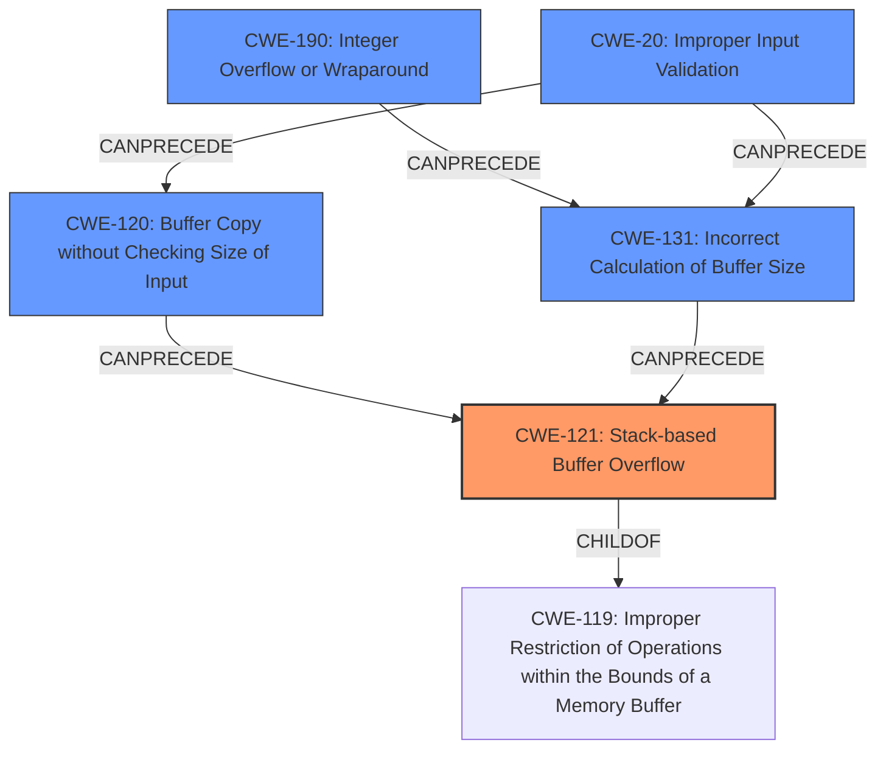

# Final Resolution for CVE-2021-39990

# Summary
| CWE ID | CWE Name | Confidence | CWE Abstraction Level | CWE Vulnerability Mapping Label | CWE-Vulnerability Mapping Notes |
|---|---|---|---|---|---|
| CWE-121 | Stack-based Buffer Overflow | 0.9 | Variant | Allowed | Primary CWE |
| CWE-120 | Buffer Copy without Checking Size of Input ('Classic Buffer Overflow') | 0.7 | Base | Allowed-with-Review | Secondary Candidate: Potential Root Cause |
| CWE-190 | Integer Overflow or Wraparound | 0.4 | Base | Allowed | Secondary Candidate: Contributing Factor to Incorrect Buffer Size Calculation |
| CWE-131 | Incorrect Calculation of Buffer Size | 0.4 | Base | Allowed | Secondary Candidate: Contributing Factor to Incorrect Buffer Size Calculation |
| CWE-20 | Improper Input Validation | 0.3 | Class | Discouraged | Secondary Candidate: Contributing Factor to Input Size |

## Evidence and Confidence

*   **Confidence Score:** 0.7
*   **Evidence Strength:** MEDIUM

## Relationship Analysis
The analysis considers the parent-child relationship between CWE-121 and CWE-119, correctly identifying CWE-121 as a more specific variant. It also explores potential chain relationships, considering CWE-120, CWE-131, CWE-190 and CWE-20 as potential causes that could precede CWE-121. The abstraction levels influenced the decision to prefer the base-level CWEs for potential root causes.

## Vulnerability Chain
The vulnerability chain starts with a potential root cause such as **CWE-20 (Improper Input Validation)**, **CWE-131 (Incorrect Calculation of Buffer Size)**, **CWE-190 (Integer Overflow or Wraparound)** and/or **CWE-120 (Buffer Copy without Checking Size of Input)**. The incorrect calculation of the buffer size, or unchecked copy leads to **CWE-121 (Stack-based Buffer Overflow)**. The overflow on the stack then leads to the impact of affecting user experience.

## Summary of Analysis
The initial analysis correctly identified **CWE-121 (Stack-based Buffer Overflow)** as the primary weakness based on the vulnerability description stating "Stack-based Buffer Overflow vulnerability". However, the criticism highlighted the need to investigate potential root causes and contributing factors. The retriever results also suggested other relevant CWEs.

The graph relationships influenced the final selection by highlighting potential chains of weaknesses. **CWE-120 (Buffer Copy without Checking Size of Input)** was identified as a potential root cause because it's a common scenario where data is copied into a stack buffer without proper size checks. **CWE-131 (Incorrect Calculation of Buffer Size)** and **CWE-190 (Integer Overflow or Wraparound)** were considered as contributing factors because they could lead to the buffer being allocated too small on the stack. **CWE-20 (Improper Input Validation)** was considered as a possible contributing factor, allowing the input to exceed the buffer's capacity.

The selected CWEs are at the optimal level of specificity. **CWE-121 (Stack-based Buffer Overflow)** is a specific variant of buffer overflow. The other CWEs are base-level and can directly contribute to the **WEAKNESS**. The evidence for **CWE-121 (Stack-based Buffer Overflow)** is strong due to the direct mention in the vulnerability description. The evidence for the other CWEs is less direct, but plausible given the nature of buffer overflows. The final confidence score is 0.7, reflecting the strong evidence for the primary **WEAKNESS** but the less certain evidence for the contributing factors.