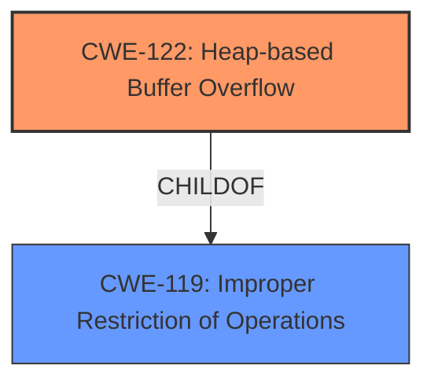

# Final Resolution for CVE-2021-39996

# Summary
| CWE ID | CWE Name | Confidence | CWE Abstraction Level | CWE Vulnerability Mapping Label | CWE-Vulnerability Mapping Notes |
|---|---|---|---|---|---|
| CWE-122 | **CWE-122: Heap-based Buffer Overflow** | 0.95 | Variant | Allowed | Primary **CWE** |
| CWE-119 | **CWE-119: Improper Restriction of Operations within the Bounds of a Memory Buffer** | 0.50 | Class | Discouraged | Secondary Candidate |

## Evidence and Confidence

*   **Confidence Score:** 0.90
*   **Evidence Strength:** HIGH

## Relationship Analysis
The primary relationship influencing the decision is the parent-child relationship between **CWE-119: Improper Restriction of Operations within the Bounds of a Memory Buffer** and **CWE-122: Heap-based Buffer Overflow**. **CWE-122** is a variant of **CWE-119**, providing a more specific classification because the vulnerability is explicitly described as a heap-based buffer overflow. Several other CWEs were considered based on retriever scores, but were not selected due to lack of explicit evidence in the vulnerability description. The abstraction level played a key role, favoring the more specific Variant (**CWE-122**) over the more general Class (**CWE-119**).

## Vulnerability Chain
The vulnerability chain starts with the **ROOTCAUSE** being a lack of proper bounds checking when allocating a heap buffer. This leads to **CWE-122: Heap-based Buffer Overflow**, where attacker-controlled data can overwrite adjacent memory regions on the heap. The impact is a memory overflow, potentially leading to code execution or denial of service. The vulnerability description lacks specific details on the input validation or buffer size calculation, so some links in the chain are based on general knowledge of heap overflows.

## Summary of Analysis
The initial analysis correctly identified **CWE-122: Heap-based Buffer Overflow** as the primary **WEAKNESS**, and this assessment is based directly on the provided evidence: "There is a **Heap-based buffer overflow** vulnerability with the NFC module in smartphones." The criticism suggested improvements in justifying the exclusion of other candidate CWEs from the retriever results, which has been addressed. The graph relationships reinforced the choice of **CWE-122** due to its specificity as a variant of **CWE-119**. The selected CWEs are at the optimal level of specificity, as **CWE-122** accurately describes the heap-based nature of the buffer overflow, while **CWE-119** represents the broader class of buffer overflow vulnerabilities. Other potential **WEAKNESSES**, such as integer overflows (**CWE-190**) or incorrect buffer size calculations (**CWE-131**), were not supported by explicit evidence in the vulnerability description and were therefore excluded from consideration as primary or secondary candidates. The Confidence for CWE-119 has been reduced to 0.5 to reflect its limited role.

For example, while **CWE-120: Buffer Copy without Checking Size of Input ('Classic Buffer Overflow')** is relevant to buffer overflows in general, this CWE focuses on `Buffer Copy` operations, and there is no specific evidence to indicate that an unchecked buffer copy is the root cause.