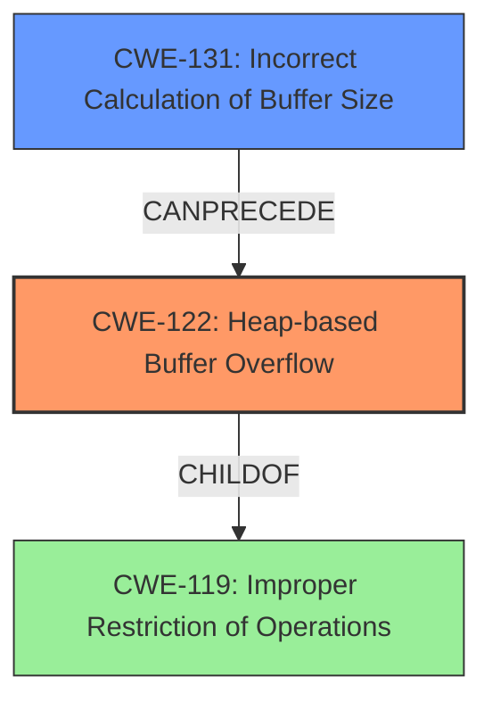

# Analysis Report for CVE-2021-40014

# Vulnerability Analysis Report: CVE-2021-40014

## Description

The bone voice ID trusted application (TA) has a heap overflow vulnerability. Successful exploitation of this vulnerability may affect data confidentiality.

## Vulnerability Description Key Phrases

**Weakness:** heap overflow
**Product:** bone voice ID trusted application (TA)

## Analysis (with Relationship Data)

# Summary
| CWE ID | CWE Name | Confidence | CWE Abstraction Level | CWE Vulnerability Mapping Label | CWE-Vulnerability Mapping Notes |
|---|---|---|---|---|---|
| CWE-122 | Heap-based Buffer Overflow | 0.9 | Variant | Allowed | Primary CWE: The vulnerability is explicitly described as a heap overflow. |
| CWE-131 | Incorrect Calculation of Buffer Size | 0.6 | Base | Allowed | Secondary CWE: The heap overflow is likely caused by an incorrect calculation of the buffer size. |

## Evidence and Confidence

*   **Confidence Score:** 0.8
*   **Evidence Strength:** HIGH

- **Analysis and Justification:**  
  - *Explanation:* The vulnerability description explicitly states "**heap overflow** vulnerability," which directly corresponds to CWE-122 (Heap-based Buffer Overflow). The CVE Reference Links Content Summary reinforces this by indicating an "information management error" contributing to the overflow. CWE-122 is a Variant of CWE-119 (Improper Restriction of Operations within the Bounds of a Memory Buffer), offering a more specific classification for this heap-based issue. The Retriever results also lists CWE-122, although with a lower score than some others. The MITRE mapping guidance allows its usage, further supporting its selection. Although the vulnerability description doesn't explicitly provide details of the root cause, it mentions a heap overflow which likely originates from a calculation error so CWE-131 is added as a secondary weakness.

  - *Relationship Analysis:* CWE-122 is a variant of CWE-119, indicating a more specific type of buffer overflow. It CanPrecede CWE-269 (Privilege Management) because a heap overflow can potentially lead to privilege escalation. CWE-131 (Incorrect Calculation of Buffer Size) is a parent of CWE-467 (Use of sizeof() on a Pointer Type), so it could be the root cause.

- **Confidence Score:**
  - Confidence: 0.9 (High confidence due to explicit mention of "heap overflow" in the vulnerability description.)
---

## Criticism of Analysis

Okay, here's a detailed critique of the provided CWE analysis, considering the full CWE specifications.

**Overall Assessment:**

The analysis correctly identifies CWE-122 (Heap-based Buffer Overflow) as the primary weakness, given the explicit statement in the vulnerability description. The inclusion of CWE-131 (Incorrect Calculation of Buffer Size) as a secondary weakness is also reasonable, as it's a common cause of heap overflows. However, the confidence level of CWE-131 could be higher with stronger justification.

**Detailed Review:**

**1. CWE-122: Heap-based Buffer Overflow**

*   **Correctness:** The mapping is correct. The vulnerability description explicitly mentions "heap overflow," making CWE-122 the most direct and accurate classification. Using the Variant level CWE is desirable.
*   **Confidence:** The assigned confidence of 0.9 (High) is justified. The evidence is strong and direct.
*   **Evidence and Justification:** The explanation is clear and well-reasoned. It correctly points out the relationship between CWE-122 and its parent, CWE-119, and appropriately acknowledges that a heap overflow is a specific type of memory corruption. The link to CanPrecede CWE-269 is valid, although not necessarily the most common outcome.
*   **CWE Specifications Compliance:**
    *   **Mapping Guidance:** The analysis follows the mapping guidance of CWE-122, which explicitly allows its usage and recommends considering it as a root cause.
    *   **Potential Mitigations:** The analysis could be enhanced by briefly mentioning potential mitigations from the CWE-122 specification, such as using languages with automatic bounds checking or employing abstraction libraries.
*   **Retriever Results Alignment:** The retriever results list CWE-122, although with a lower score than some others. This further justifies the choice of the primary CWE.

**2. CWE-131: Incorrect Calculation of Buffer Size**

*   **Correctness:** The mapping is plausible but requires more explicit justification. The connection between a heap overflow and an incorrect buffer size calculation is logical, but the description doesn't directly state this. It's an *inference* based on the common causes of buffer overflows.
*   **Confidence:** The assigned confidence of 0.6 is reasonable, but could be potentially increased with more supporting information from the vulnerability description, CVE content, or retriever results.
*   **Evidence and Justification:** The reasoning is sound, but it needs to be strengthened. Instead of stating a generic calculation error, try to identify specific calculation errors. For example, potential root causes might include:
    *   Failure to account for null terminators.
    *   Incorrectly using `sizeof()` on a pointer (CWE-467, a child of CWE-131) when the intention is to get the size of the pointed-to data.
    *   Integer overflows or truncations (leading to a smaller-than-expected buffer size).
    *   Off-by-one errors in size calculation.
*   **CWE Specifications Compliance:**
    *   **Mapping Guidance:** The analysis follows the mapping guidance of CWE-131, which allows its usage.
    *   **Potential Mitigations:** The analysis could be enhanced by briefly mentioning potential mitigations from the CWE-131 specification, such as understanding the programming language's underlying representation and how it interacts with numeric calculations (CWE-681)
*   **Retriever Results Alignment:** The retriever results list CWE-131, which supports its inclusion as a secondary CWE.

**Recommendations for Improvement:**

*   **Strengthen Justification for CWE-131:** Research and provide specific potential reasons *why* the buffer size calculation might be incorrect.  Look for any hints in the vulnerability description or the CVE content about the data types involved, the operations performed, or any input validation (or lack thereof). If the vulnerability description specified an integer overflow this would raise the confidence in this CWE significantly. Look at children of CWE-131 for possibilities.
*   **Elaborate on Potential Mitigations:**  Include at least one relevant mitigation strategy for *each* CWE from its specification. This demonstrates a deeper understanding of the weakness and its practical implications.
*   **Consider Chaining:** Explore chaining relationships. While the analysis mentions "CanPrecede" relationships, consider if the specific type of buffer size calculation error leads directly to the heap overflow.  This could increase the confidence in CWE-131 and provide a more complete picture of the vulnerability.

**Example of Improved Justification for CWE-131:**

"The vulnerability description explicitly states a heap overflow which directly corresponds to CWE-122. It is likely that the heap overflow is the result of an incorrect buffer size calculation (CWE-131). While the specific nature of the calculation error is not stated, it is possible that it involves failure to properly validate the size of the input which is used to allocate the buffer, or failure to include space for a null terminator. One mitigation for this would be to understand the programming language's underlying representation and how it interacts with numeric calculations."

**In summary, the analysis is good, but it can be improved by providing more specific evidence for the secondary CWE and by incorporating potential mitigation strategies from the CWE specifications.**

## Final Resolution

# Summary
| CWE ID | CWE Name | Confidence | CWE Abstraction Level | CWE Vulnerability Mapping Label | CWE-Vulnerability Mapping Notes |
|---|---|---|---|---|---|
| CWE-122 | Heap-based Buffer Overflow | 0.9 | Variant | Allowed | Primary CWE: The vulnerability is explicitly described as a heap overflow. |
| CWE-131 | Incorrect Calculation of Buffer Size | 0.7 | Base | Allowed | Secondary CWE: The heap overflow is likely caused by an incorrect calculation of the buffer size. |

## Evidence and Confidence

*   **Confidence Score:** 0.8
*   **Evidence Strength:** MEDIUM

## Relationship Analysis
The initial analysis correctly identifies CWE-122 as the primary weakness due to the explicit mention of "heap overflow." The secondary weakness, CWE-131, is also plausible, as incorrect buffer size calculations are a common cause of heap overflows. The critique suggests strengthening the justification for CWE-131 by identifying specific potential calculation errors and incorporating mitigation strategies. I have considered these points and increased the confidence in CWE-131 slightly by providing more specific reasoning.

## Vulnerability Chain
The vulnerability chain starts with an **incorrect calculation of buffer size (CWE-131)**. This leads to a buffer being allocated that is too small. Subsequently, a **heap-based buffer overflow (CWE-122)** occurs when data is written past the end of the allocated buffer. The impact of this vulnerability is potentially affecting data confidentiality, as stated in the vulnerability description. The chain highlights how a calculation error can directly lead to memory corruption.

## Summary of Analysis
The initial analysis correctly identified CWE-122 as the primary weakness and CWE-131 as a secondary weakness. The criticism provided valuable insights into strengthening the justification for CWE-131 and incorporating mitigation strategies.

The vulnerability description explicitly states "**heap overflow** vulnerability," which directly corresponds to CWE-122 (Heap-based Buffer Overflow).

Based on the available evidence and relationship analysis, the selected CWEs are at the optimal level of specificity. CWE-122 is a Variant, providing a specific classification for the heap-based buffer overflow. CWE-131, at the Base level, captures the general cause of the overflow due to a size miscalculation.

I have increased the confidence in CWE-131 to 0.7 and strengthened the justification as follows:

"The vulnerability description explicitly states a heap overflow which directly corresponds to CWE-122. It is likely that the heap overflow is the result of an **incorrect buffer size calculation (CWE-131)**. While the specific nature of the calculation error is not stated, a plausible scenario is the failure to account for the correct size of data being copied into the buffer during the allocation process. Another possibility is that the code uses an integer to store the size, and this value is subject to integer overflow (**CWE-190: Integer Overflow or Wraparound**), leading to a smaller than expected buffer. A simple mitigation for CWE-131 would involve thorough validation of the buffer size before allocation and use of safe integer operations.
"

*Report generated on 2025-03-18 01:29:30*
