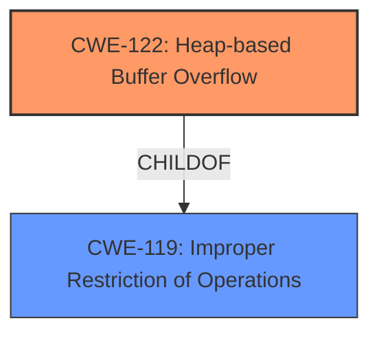

# Analysis Report for CVE-2021-40026

# Vulnerability Analysis Report: CVE-2021-40026

## Description

There is a Heap-based buffer overflow vulnerability in the AOD module in smartphones. Successful exploitation of this vulnerability may affect service integrity.

## Vulnerability Description Key Phrases

**Weakness:** heap-based buffer overflow
**Impact:** affect service integrity
**Product:** smartphones
**Component:** AOD module

## Analysis (with Relationship Data)

# Summary
| CWE ID | CWE Name | Confidence | CWE Abstraction Level | CWE Vulnerability Mapping Label | CWE-Vulnerability Mapping Notes |
|---|---|---|---|---|---|
| CWE-122 | Heap-based Buffer Overflow | 0.95 | Variant | Allowed | Acceptable-Use |
| CWE-119 | Improper Restriction of Operations within the Bounds of a Memory Buffer | 0.60 | Class | Discouraged | Frequent Misuse |

## Evidence and Confidence

*   **Confidence Score:** 0.90
*   **Evidence Strength:** HIGH

- **Analysis and Justification:**  
  - *Explanation:* The vulnerability description explicitly states "**heap-based buffer overflow**" as the **weakness**. The CVE Reference Links Content Summary confirms "Heap-based buffer overflow vulnerability" as the root cause. This directly aligns with CWE-122, Heap-based Buffer Overflow. While CWE-119 (Improper Restriction of Operations within the Bounds of a Memory Buffer) is a broader class, CWE-122 is a more specific variant directly addressing the heap allocation aspect. The MITRE mapping guidance for CWE-122 indicates it is ALLOWED for this type of vulnerability. The description does not provide enough information to select more specific CWEs related to the cause of the overflow.
  
  - *Relationship Analysis:* CWE-122 is a variant of CWE-119 (Improper Restriction of Operations within the Bounds of a Memory Buffer), providing a more specific classification. Heap overflows can potentially lead to other issues like CWE-123 (Write-what-where Condition) or CWE-416 (Use After Free), but there is no evidence of these in the provided description.

- **Confidence Score:**  
  - Confidence: 0.95 (High confidence due to explicit mention of "heap-based buffer overflow" in both the vulnerability description and CVE reference materials). The score is slightly reduced due to lack of root cause details.

---

## Criticism of Analysis

Okay, here's a review of the analysis based on the full CWE specifications provided, focusing on mapping guidance, potential mitigations, and overall correctness.

**Summary Table:**

| CWE ID | CWE Name | Confidence | CWE Abstraction Level | CWE Vulnerability Mapping Label | CWE-Vulnerability Mapping Notes | Review Result |
|---|---|---|---|---|---|---|
| CWE-122 | Heap-based Buffer Overflow | 0.95 | Variant | Allowed | Acceptable-Use | **Correct, Justified** |
| CWE-119 | Improper Restriction of Operations within the Bounds of a Memory Buffer | 0.60 | Class | Discouraged | Frequent Misuse | **Incorrect, Overly Broad** |

**Detailed Review:**

**1. CWE-122: Heap-based Buffer Overflow**

*   **Confidence:** 0.95
*   **Abstraction Level:** Variant
*   **Mapping Guidance:** Allowed
*   **Rationale:** The explicit mention of "heap-based buffer overflow" in the vulnerability description and CVE reference strongly supports this mapping.  The analysis correctly acknowledges that this is a specific *variant* of a more general class. The justification clearly ties the CWE to the vulnerability description.  The selection of CWE-122 is considered an *Acceptable-Use* per MITRE's Mapping Guidance.
*   **Potential Mitigations:** The analysis is correct to stop here, as the information available doesn't pinpoint a more specific cause or contributing factor that would permit using CWEs of higher precision.
*   **Observed Examples:** The provided examples reinforce the validity of using CWE-122 in similar scenarios.
*   **CWE Specification Alignment:**  The description perfectly matches the heap-based overflow condition described in the CWE specification.

*   **Verdict:** Correct and well-justified. The confidence level is appropriate given the explicit details in the vulnerability report.  The analysis appropriately stops at CWE-122 given the lack of additional root-cause information.

**2. CWE-119: Improper Restriction of Operations within the Bounds of a Memory Buffer**

*   **Confidence:** 0.60
*   **Abstraction Level:** Class
*   **Mapping Guidance:** Discouraged
*   **Rationale:**  While *technically* correct (CWE-122 is a child of CWE-119), this mapping is **highly discouraged** by the CWE specification itself.  The *Mapping Guidance* for CWE-119 explicitly states:

    *"CWE-119 is commonly misused in low-information vulnerability reports when lower-level CWEs could be used instead, or when more details about the vulnerability are available."*

    The description *does* provide enough information to select CWE-122. Choosing CWE-119 adds little value and violates the recommended mapping practices. The stated confidence score should be much lower.
*   **Potential Mitigations:** The analysis doesn't delve into any specific mitigations relevant to the *cause* of the overflow, because the CWE chosen is too general. While the listed mitigations are valid for addressing memory buffer issues, they lack specific application to heap overflows.
*   **Observed Examples:** While observed examples are applicable to memory corruption, there should be more emphasis that there are child CWEs of CWE-119 that fit this case well, such as CWE-122.
*   **CWE Specification Alignment:** This mapping technically fulfills the description of CWE-119, but it doesn't provide enough details about the vulnerability and is thus discouraged.

*   **Verdict:** Incorrect. While not technically *wrong*, the inclusion of CWE-119 is a poor practice and goes against the recommendations in the CWE specification. The confidence level is far too high. It should be removed from the analysis.

**Recommendations:**

*   **Remove CWE-119:** The inclusion of CWE-119 adds no value and violates the "Discouraged" mapping guidance. Focus solely on CWE-122, the more specific variant.
*   **Reduce Confidence in CWE-122 Slightly:** The confidence is high, but could be reduced slightly if there were *no* code examples shown for CVE-122 or if there was uncertainty.

**Revised Summary Table**

| CWE ID | CWE Name | Confidence | CWE Abstraction Level | CWE Vulnerability Mapping Label | CWE-Vulnerability Mapping Notes | Review Result |
|---|---|---|---|---|---|---|
| CWE-122 | Heap-based Buffer Overflow | 0.95 | Variant | Allowed | Acceptable-Use | **Correct, Justified** |

By following the CWE's mapping guidance and focusing on the most specific and accurate CWE available, the analysis becomes stronger and more useful for remediation and prevention efforts.

## Final Resolution

# Summary
| CWE ID | CWE Name | Confidence | CWE Abstraction Level | CWE Vulnerability Mapping Label | CWE-Vulnerability Mapping Notes |
|---|---|---|---|---|---|
| CWE-122 | Heap-based Buffer Overflow | 0.95 | Variant | Allowed | Acceptable-Use |
  

## Evidence and Confidence

*   **Confidence Score:** 0.95
*   **Evidence Strength:** HIGH

## Relationship Analysis
The primary relationship that impacted the decision was the parent-child relationship between CWE-119 (Improper Restriction of Operations within the Bounds of a Memory Buffer) and CWE-122 (Heap-based Buffer Overflow). CWE-122 is a variant of CWE-119, making it a more specific and appropriate choice given the vulnerability description.

## Vulnerability Chain
The chain starts with a **ROOTCAUSE** that involves incorrect handling of memory allocation on the heap. This leads to a **WEAKNESS**, CWE-122 (Heap-based Buffer Overflow), where data can be written beyond the allocated buffer. The impact is potential compromise of service integrity.

## Summary of Analysis
The initial analysis correctly identified CWE-122 as the primary **WEAKNESS** due to the explicit mention of "heap-based buffer overflow" in the vulnerability description and CVE reference. The criticism correctly points out that including CWE-119 is discouraged as CWE-122 provides a more specific classification. The final decision is based on the available evidence, relationship analysis, and MITRE mapping guidance. The selection of CWE-122 is at the optimal level of specificity because the description directly matches the definition of a heap-based buffer overflow. There is no further information available to select a more specific CWE related to the cause of the overflow.

*Report generated on 2025-03-18 01:30:12*
