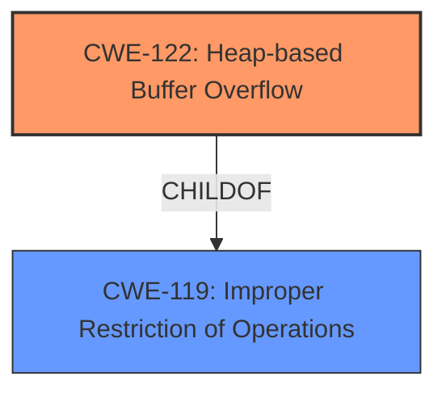

# Final Resolution for CVE-2021-40026

# Summary
| CWE ID | CWE Name | Confidence | CWE Abstraction Level | CWE Vulnerability Mapping Label | CWE-Vulnerability Mapping Notes |
|---|---|---|---|---|---|
| CWE-122 | Heap-based Buffer Overflow | 0.95 | Variant | Allowed | Acceptable-Use |
  

## Evidence and Confidence

*   **Confidence Score:** 0.95
*   **Evidence Strength:** HIGH

## Relationship Analysis
The primary relationship that impacted the decision was the parent-child relationship between CWE-119 (Improper Restriction of Operations within the Bounds of a Memory Buffer) and CWE-122 (Heap-based Buffer Overflow). CWE-122 is a variant of CWE-119, making it a more specific and appropriate choice given the vulnerability description.

## Vulnerability Chain
The chain starts with a **ROOTCAUSE** that involves incorrect handling of memory allocation on the heap. This leads to a **WEAKNESS**, CWE-122 (Heap-based Buffer Overflow), where data can be written beyond the allocated buffer. The impact is potential compromise of service integrity.

## Summary of Analysis
The initial analysis correctly identified CWE-122 as the primary **WEAKNESS** due to the explicit mention of "heap-based buffer overflow" in the vulnerability description and CVE reference. The criticism correctly points out that including CWE-119 is discouraged as CWE-122 provides a more specific classification. The final decision is based on the available evidence, relationship analysis, and MITRE mapping guidance. The selection of CWE-122 is at the optimal level of specificity because the description directly matches the definition of a heap-based buffer overflow. There is no further information available to select a more specific CWE related to the cause of the overflow.