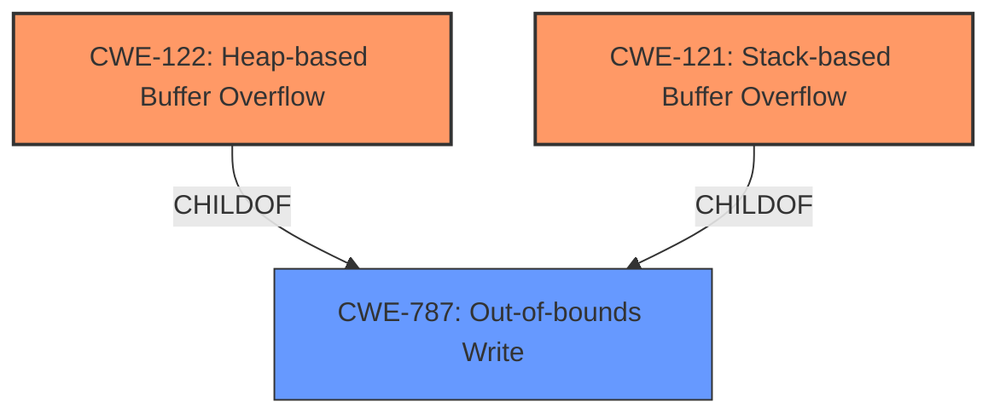

# Final Resolution for CVE-2021-40057

# Summary
| CWE ID | CWE Name | Confidence | CWE Abstraction Level | CWE Vulnerability Mapping Label | CWE-Vulnerability Mapping Notes |
|---|---|---|---|---|---|
| CWE-122 | Heap-based Buffer Overflow | 0.9 | Variant | Allowed | Primary CWE |
| CWE-121 | Stack-based Buffer Overflow | 0.9 | Variant | Allowed | Primary CWE |
| CWE-787 | Out-of-bounds Write | 0.7 | Base | Allowed | Secondary Candidate |

## Evidence and Confidence

*   **Confidence Score:** 0.9
*   **Evidence Strength:** HIGH

## Relationship Analysis
The primary relationship is that CWE-122 (Heap-based Buffer Overflow) and CWE-121 (Stack-based Buffer Overflow) are both variants (children) of the base CWE-787 (Out-of-bounds Write). This hierarchical relationship suggests that while the specific location of the overflow (heap or stack) is known and important, the fundamental issue is still an out-of-bounds write. The abstraction levels influenced the decision by allowing us to choose the more specific variants (CWE-121 and CWE-122) over the more general base (CWE-787) while still acknowledging CWE-787's relevance as a contributing factor.

## Vulnerability Chain
The vulnerability chain starts with the **ROOTCAUSE** being the conditions that lead to writing outside the intended buffer boundaries. The **WEAKNESS** is the actual buffer overflow, manifested as either CWE-122 (Heap-based Buffer Overflow) or CWE-121 (Stack-based Buffer Overflow). The impact is the potential for affecting availability, as stated in the vulnerability description. There aren't any missing links based on the information provided.

## Summary of Analysis
The initial analysis and criticism both correctly identify CWE-122 and CWE-121 as the primary weaknesses based on the explicit mention of "heap-based and stack-based buffer overflow" in the vulnerability description. The evidence is strong, leading to a high confidence score.

The graph relationships influenced the final selection by highlighting the hierarchical connection between the specific buffer overflow types (CWE-121 and CWE-122) and the more general out-of-bounds write (CWE-787). While CWE-121 and CWE-122 are the most specific and relevant classifications, CWE-787 is included as a secondary candidate to acknowledge the fundamental nature of the vulnerability.

The selected CWEs are at the optimal level of specificity because the vulnerability description provides enough detail to differentiate between heap-based and stack-based overflows. Using the more general CWE-119 (Improper Restriction of Operations within the Bounds of a Memory Buffer) would be less informative, as it doesn't capture the specific location of the overflow.