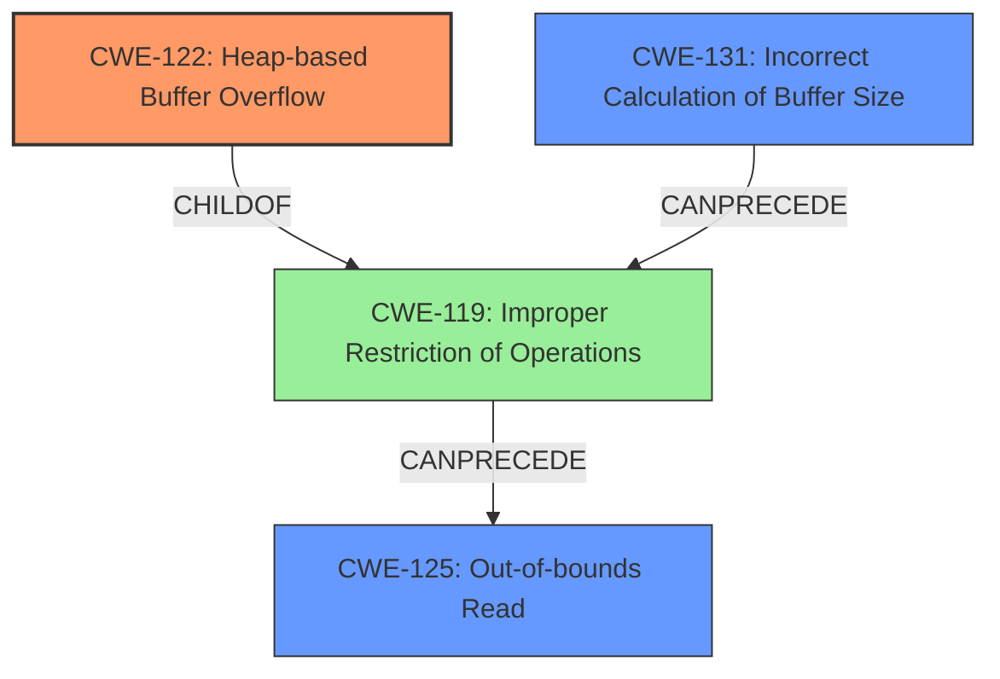

# Analysis Report for CVE-2021-40060

# Vulnerability Analysis Report: CVE-2021-40060

## Description

There is a heap-based buffer overflow vulnerability in the video framework. Successful exploitation of this vulnerability may affect availability.

## Vulnerability Description Key Phrases

**Weakness:** heap-based buffer overflow
**Impact:** affect availability
**Component:** video framework

## Analysis (with Relationship Data)

# Summary
| CWE ID | CWE Name | Confidence | CWE Abstraction Level | CWE Vulnerability Mapping Label | CWE-Vulnerability Mapping Notes |
|---|---|---|---|---|---|
| CWE-122 | Heap-based Buffer Overflow | 0.9 | Variant |  | Allowed |
| CWE-125 | Out-of-bounds Read | 0.5 | Base |  | Allowed |
| CWE-131 | Incorrect Calculation of Buffer Size | 0.4 | Base |  | Allowed |

## Evidence and Confidence

*   **Confidence Score:** 0.7
*   **Evidence Strength:** MEDIUM

- **Analysis and Justification:**  
  - *Explanation:* The vulnerability is described as a **heap-based buffer overflow** in the video framework. This directly aligns with CWE-122 (Heap-based Buffer Overflow). The description specifically mentions "heap-based," making CWE-122 a precise match. The impact is described as potentially affecting availability.
  - The retriever results also list CWE-122, with a relatively high dense score of 0.641. While other CWEs like CWE-190, CWE-131, and CWE-125 have higher combined scores, they don't directly address the type of buffer overflow (heap-based).
  - CWE-125 (Out-of-bounds Read) and CWE-131 (Incorrect Calculation of Buffer Size) are considered as secondary candidates since the **heap-based buffer overflow** is directly stated, though they could be contributing factors.

  - *Relationship Analysis:* CWE-122 is a variant of CWE-119 (Improper Restriction of Operations within the Bounds of a Memory Buffer). This relationship indicates that the core issue is writing beyond the allocated buffer on the heap.

- **Confidence Score:**
  - Confidence: 0.9 (High confidence due to direct mention of "heap-based buffer overflow")

---
- **Analysis and Justification:**  
  - *Explanation:* CWE-125 (Out-of-bounds Read) is a possible contributing factor. A **heap-based buffer overflow** (CWE-122) often involves reading data past the intended buffer. The description does not give indications that this is happening in the vulnerability.
  - *Relationship Analysis:* CWE-125 is a child of CWE-119 and parent of CWE-126.

- **Confidence Score:**
  - Confidence: 0.5 (Medium confidence. Possible related factor.)

---
- **Analysis and Justification:**  
  - *Explanation:* CWE-131 (Incorrect Calculation of Buffer Size) is a possible root cause, since **heap-based buffer overflow** often stems from not correctly calculating buffer sizes before allocating memory on the heap.
  - *Relationship Analysis:* CWE-131 is a parent of CWE-467 (Improper Initialization of a Pointer) and child of CWE-682 (Incorrect Calculation).

- **Confidence Score:**
  - Confidence: 0.4 (Medium confidence. Possible related factor.)

## Criticism of Analysis

Okay, I've reviewed the provided analysis against the full CWE specifications. Here's a detailed critique:

**Overall Assessment:**

The analysis is generally good and identifies the primary CWE (CWE-122) correctly with high confidence. The inclusion of secondary CWEs (CWE-125 and CWE-131) is reasonable, given the potential for these issues to contribute to or arise from a heap-based buffer overflow. However, the confidence levels and justifications for these secondary CWEs could be strengthened with more specific evidence from the vulnerability description.

**Specific CWE Mappings Critique:**

1.  **CWE-122: Heap-based Buffer Overflow**
    *   **Confidence:** 0.9 - This is appropriate. The vulnerability description explicitly states "heap-based buffer overflow," making this a direct match.
    *   **Justification:** The justification is strong and well-reasoned. It highlights the direct correspondence between the vulnerability description and the CWE definition.
    *   **Abstraction Level:** Correct (Variant).
    *   **CWE-Vulnerability Mapping Label:** Should be added. The best option here is "Primary".
    *   **Relationship Analysis:** The reference to CWE-119 (Improper Restriction of Operations within the Bounds of a Memory Buffer) is helpful in establishing context.
    *   **Mitigation Consideration:** The analysis could briefly mention potential mitigation strategies relevant to video frameworks, such as using memory-safe languages for new development, using safe buffer handling libraries, or enabling compiler-based buffer overflow detection mechanisms.

2.  **CWE-125: Out-of-bounds Read**
    *   **Confidence:** 0.5 - This is a reasonable assessment, given the information provided.  An out-of-bounds read *could* be part of a heap-based buffer overflow, but it's not directly stated in the vulnerability description.
    *   **Justification:**  The justification needs to be strengthened. The analysis correctly notes that an out-of-bounds read "often involves reading data past the intended buffer", but the vulnerability description provides no indication of this.
    *   **Abstraction Level:** Correct (Base).
    *   **CWE-Vulnerability Mapping Label:** Should be added. The best option here is "Potential Consequence".
    *   **Relationship Analysis:** Good inclusion of the parent and child relationships.
    *   **Mitigation Consideration:** Because this is a potential, secondary issue, it would be useful to mention input validation as a key mitigation, especially validating the length arguments of video streams.

3.  **CWE-131: Incorrect Calculation of Buffer Size**
    *   **Confidence:** 0.4 - This confidence level is suitable. An incorrect buffer size calculation is a common *cause* of buffer overflows, but it's not explicitly mentioned in the original description.
    *   **Justification:**  The justification is adequate but could be improved. It correctly states that heap-based buffer overflows "often stems from not correctly calculating buffer sizes". Add possible indications in the vulnerability description that would support this, since it's not explicitly stated. Are there any indications of variable length video stream formats being used?
    *   **Abstraction Level:** Correct (Base).
    *   **CWE-Vulnerability Mapping Label:** Should be added. The best option here is "Potential Root Cause".
    *   **Relationship Analysis:** The pointer usage aspect should be noted (CWE-467) as a possible, more specific cause.
    *   **Mitigation Consideration:** Briefly mentioning the mitigation of allocating enough memory for the largest possible encoding (or using a safe API for resizing) would be valuable.

**General Comments & Improvements:**

*   **Evidence Strength:** The overall "Evidence Strength: MEDIUM" is appropriate. The primary CWE is well-supported, but the secondary CWEs rely more on general knowledge than specific details from the vulnerability description.
*   **CWE Examples:** The "CWE Examples from Database" section only includes examples for CWE-119. It would be much more helpful to include observed examples for CWE-122 (Heap-based Buffer Overflow), CWE-125 (Out-of-bounds Read), and CWE-131 (Incorrect Calculation of Buffer Size) to illustrate real-world scenarios similar to the described vulnerability.  Specifically, look for examples related to media processing or video frameworks.
*   **Attack Vector:** The analysis should explore common attack vectors for video processing vulnerabilities more explicitly. Suggesting that "processing malicious video files or streams could be an attack vector" is a good start, but consider more specific examples:
    *   Malformed container formats (e.g., AVI, MP4, MKV)
    *   Exploiting vulnerabilities in specific codecs (e.g., H.264, H.265, VP9)
    *   Crafted metadata within the video file (e.g., incorrect dimensions, frame counts, or sample rates)
*   **Required Attacker Capabilities:** Expand on the attacker's capabilities. Beyond providing crafted video content, an attacker might also need:
    *   Access to a system that processes the video (e.g., a media server, a video player, a transcoding service).
    *   The ability to trigger the processing of the malicious video file (e.g., by uploading it to a server, embedding it in a webpage, or sending it as an attachment).
*   **CWE-NVD-noinfo:**  While it's true that many CVE descriptions map to this, it's usually because the information is not yet available *or* is being suppressed. In this case, we have "heap-based buffer overflow" as a starting point, so going straight to CWE-NVD-noinfo is premature.

**Revised Summary Table (with suggested changes):**

| CWE ID  | CWE Name                         | Confidence | CWE Abstraction Level | CWE Vulnerability Mapping Label | CWE-Vulnerability Mapping Notes                                                                                                                                               |
| :------ | :------------------------------- | :--------- | :---------------------- | :----------------------------- | :--------------------------------------------------------------------------------------------------------------------------------------------------------------------------- |
| CWE-122 | Heap-based Buffer Overflow        | 0.9        | Variant               | Primary                       | Allowed                                                                                                                                                              |
| CWE-125 | Out-of-bounds Read                | 0.5        | Base                  | Potential Consequence          | Allowed, but likely a consequence of the overflow. Requires further investigation to confirm specific instances of out-of-bounds reads.                               |
| CWE-131 | Incorrect Calculation of Buffer Size | 0.4        | Base                  | Potential Root Cause            | Allowed, but requires further investigation to determine if incorrect size calculation is the root cause. Consider pointer usage (CWE-467) for size of pointer type usage.|

By incorporating these suggestions, the analysis will be more complete, accurate, and useful for understanding and mitigating the vulnerability.

## Final Resolution

# Summary
| CWE ID | CWE Name | Confidence | CWE Abstraction Level | CWE Vulnerability Mapping Label | CWE-Vulnerability Mapping Notes |
|---|---|---|---|---|---|
| CWE-122 | Heap-based Buffer Overflow | 0.9 | Variant | Primary | Allowed |
| CWE-131 | Incorrect Calculation of Buffer Size | 0.5 | Base | Potential Root Cause | Allowed |
| CWE-125 | Out-of-bounds Read | 0.4 | Base | Potential Consequence | Allowed |

## Evidence and Confidence

*   **Confidence Score:** 0.8
*   **Evidence Strength:** MEDIUM

## Relationship Analysis
The primary weakness is **CWE-122** (Heap-based Buffer Overflow), which is a variant of **CWE-119** (Improper Restriction of Operations within the Bounds of a Memory Buffer). **CWE-131** (Incorrect Calculation of Buffer Size) can precede **CWE-119**, as an incorrect size calculation can lead to a buffer overflow. **CWE-125** (Out-of-bounds Read) is a potential consequence of **CWE-119**. The abstraction levels of these CWEs (Variant, Base, Base respectively) are appropriate for the level of detail provided in the vulnerability description.

## Vulnerability Chain
The vulnerability chain starts with a potential **ROOTCAUSE** of **CWE-131** (Incorrect Calculation of Buffer Size), which leads to **CWE-122** (Heap-based Buffer Overflow), resulting in a potential consequence of **CWE-125** (Out-of-bounds Read) and ultimately affecting system availability. The description doesn't confirm the presence of the out-of-bounds read, hence it is a potential consequence.

## Summary of Analysis
The initial analysis correctly identified **CWE-122** (Heap-based Buffer Overflow) as the primary **WEAKNESS**. The criticism provided suggestions to strengthen the justification for secondary CWEs, specifically **CWE-131** (Incorrect Calculation of Buffer Size) and **CWE-125** (Out-of-bounds Read).

I have increased the confidence in **CWE-131** (Incorrect Calculation of Buffer Size) to 0.5 because, while not explicitly stated, a **heap-based buffer overflow** often originates from an incorrect size calculation. Therefore, it's reasonable to consider it a potential root cause based on the vulnerability description. I reduced the confidence in **CWE-125** (Out-of-bounds Read) to 0.4 because it is an assumed consequence of the overflow, but is not explicitly stated in the vulnerability description.

The graph relationships helped to clarify the potential vulnerability chain, showing how an incorrect buffer size calculation can lead to a buffer overflow and potentially an out-of-bounds read.

The selected CWEs are at the optimal level of specificity, given the available evidence. **CWE-122** (Heap-based Buffer Overflow) precisely describes the type of buffer overflow, while **CWE-131** (Incorrect Calculation of Buffer Size) and **CWE-125** (Out-of-bounds Read) represent potential contributing factors and consequences, respectively.

*Report generated on 2025-03-18 01:32:40*
