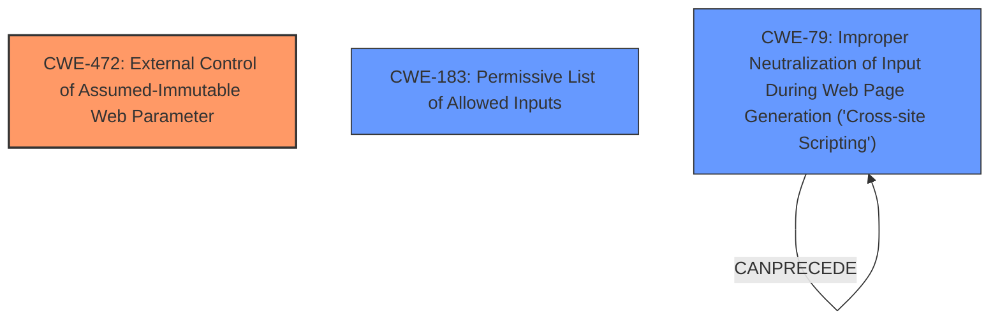

# Analysis Report for CVE-2021-40128

# Vulnerability Analysis Report: CVE-2021-40128

## Description

A vulnerability in the account activation feature of Cisco Webex Meetings could allow an unauthenticated, remote attacker to send an account activation email with an activation link that points to an arbitrary domain. This vulnerability is due to insufficient validation of user-supplied parameters. An attacker could exploit this vulnerability by sending a crafted HTTP request to the account activation page of Cisco Webex Meetings. A successful exploit could allow the attacker to send to any recipient an account activation email that contains a tampered activation link, which could direct the user to an attacker-controlled website.

## Vulnerability Description Key Phrases

**Rootcause:** insufficient validation of user-supplied parameters
**Impact:** send an account activation email with an activation link that points to an arbitrary domain
**Vector:** crafted HTTP request
**Attacker:** unauthenticated remote attacker
**Product:** Cisco Webex Meetings
**Component:** account activation feature

## Analysis (with Relationship Data)

# Summary
| CWE ID | CWE Name | Confidence | CWE Abstraction Level | CWE Vulnerability Mapping Label | CWE-Vulnerability Mapping Notes |
|---|---|---|---|---|---|
| CWE-472 | External Control of Assumed-Immutable Web Parameter | 0.85 | Base | Allowed | Primary CWE |
| CWE-79 | Improper Neutralization of Input During Web Page Generation ('Cross-site Scripting') | 0.65 | Base | Allowed | Secondary Candidate |

## Evidence and Confidence

*   **Confidence Score:** 0.75
*   **Evidence Strength:** HIGH

- **Analysis and Justification:**
  - *Explanation:* The primary weakness is the **insufficient validation of user-supplied parameters** that allows an attacker to control the domain to which the account activation link points. This aligns well with CWE-472, "External Control of Assumed-Immutable Web Parameter," as the domain in the activation link should be immutable but is externally controlled. The vulnerability description clearly states the **root cause** as insufficient validation, and the impact is a tampered activation link leading to an attacker-controlled website. CWE-472 is at the Base level of abstraction and its usage is "Allowed" according to MITRE.

  - *Relationship Analysis:* No direct relationships are found, but the external control of the domain could lead to other vulnerabilities like phishing attacks.

- **Confidence Score:**
  - Confidence: 0.85 (High confidence due to direct match with the CWE description and the stated root cause.)

---

- **Analysis and Justification:**
  - *Explanation:* As a secondary weakness, the ability to inject a malicious link into an email could lead to Cross-Site Scripting (XSS) if the attacker-controlled website contains malicious scripts. This aligns with CWE-79, "Improper Neutralization of Input During Web Page Generation ('Cross-site Scripting')." While the primary issue is the tampered link, the potential for XSS on the attacker's site makes CWE-79 a relevant consideration. The impact of redirecting users to an attacker-controlled site highlights the potential for further exploitation via XSS. CWE-79 is a base level CWE with Allowed usage.
  - *Relationship Analysis:* CWE-79 is a child of CWE-74, "Improper Neutralization of Special Elements," and can lead to other vulnerabilities like information disclosure.
- **Confidence Score:**
  - *Example:* Confidence: 0.65 (Moderate confidence as XSS is a potential impact on the attacker-controlled site, but not the direct cause of the vulnerability.)

## Criticism of Analysis

Okay, here's a detailed review of the provided analysis, incorporating the full CWE specifications:

**Overall Assessment:**

The analysis correctly identifies `CWE-472: External Control of Assumed-Immutable Web Parameter` as the primary weakness. The reasoning is solid, and the confidence level is appropriate. The choice of `CWE-79: Improper Neutralization of Input During Web Page Generation ('Cross-site Scripting')` as a secondary consideration is also reasonable, albeit with a lower confidence level as it relies on a secondary exploitation vector.

**Detailed Review:**

**1. CWE-472: External Control of Assumed-Immutable Web Parameter**

*   **Analysis and Justification:** The explanation is clear and directly relates to the vulnerability description. The key is that the application *assumes* the domain in the activation link is immutable, but the attacker can control it due to insufficient input validation. This aligns perfectly with the CWE description.
*   **Mapping Guidance:** The analysis correctly notes that `CWE-472` is at the Base level of abstraction and its usage is "Allowed" according to MITRE. The mapping guidance reinforces that it's an acceptable level of abstraction and that the name and description fit the context.
*   **Potential Mitigations:** The analysis could be enhanced by mentioning specific mitigations from the CWE specification.  The most relevant mitigation here is `Mitigation 1: Input Validation`. Specifically, the vulnerability could be resolved by "Use an 'accept known good' input validation strategy, i.e., use a list of acceptable inputs that strictly conform to specifications. Reject any input that does not strictly conform to specifications, or transform it into something that does." The specification's example of business rule logic applies here: a list of approved domain names for account activation links.
*   **Confidence:** The confidence of 0.85 is justified. The vulnerability root cause directly reflects the definition of `CWE-472`.

**2. CWE-79: Improper Neutralization of Input During Web Page Generation ('Cross-site Scripting')**

*   **Analysis and Justification:** The reasoning is valid, but it's important to emphasize that `CWE-79` is *not* the direct root cause of the Cisco Webex Meetings vulnerability. It is a *potential consequence* if the attacker successfully redirects the user to an attacker-controlled website. If the attacker-controlled website then doesn't escape the output, a XSS vulnerability would be made possible.  The analysis acknowledges this, which is good.
*   **Mapping Guidance:** The analysis correctly notes that `CWE-79` is at the Base level of abstraction and its usage is "Allowed" according to MITRE. However, consider if a more specific Variant of `CWE-79` is applicable.
*   **Potential Mitigations:** Mentioning the mitigations here would strengthen the analysis. The main relevant mitigation is `Mitigation 2: Implementation, Architecture and Design` since it emphasizes the need to "Understand the context in which your data will be used and the encoding that will be expected." Had the redirection URL been correctly encoded in the response, then it would not have been a possible attack vector.
*   **Confidence:** The confidence of 0.65 is appropriate. XSS is a potential consequence, but not the direct cause of the primary vulnerability. The weakness would be on the attacker-controlled web page, rather than the Cisco Webex domain.

**Improvements and Considerations:**

*   **Chain Analysis:** While the analysis notes a potential relationship between `CWE-472` and phishing attacks, it could be expanded. For example: `CWE-472` -> *Phishing Attack* (CAPEC-60) -> *Credential Theft* (CAPEC-16)
*   **Alternative CWEs:** Consider whether `CWE-183: Permissive List of Allowed Inputs` is applicable. If the application uses a list of allowed domains for activation links, but this list is not comprehensive or contains overly permissive entries, then this CWE could be relevant.
*   **Avoid Overlap:** The original analysis suggests CWE-79 is a secondary weakness. A more accurate description might be, "CWE-79 is a potential vulnerability that can be exploited by the attacker on the malicious domain AFTER a successful CWE-472 exploitation of the Webex service has occurred."
*   **Negative Constraints:** Emphasize what the vulnerability *isn't*. For instance, state clearly that this is *not* an instance of arbitrary code execution directly on the Webex server. The impact is limited to user redirection and potential exploitation on a third-party site.

**Additional Recommendations:**

*   **Reference CAPEC:** Consider referencing relevant Common Attack Pattern Enumeration and Classification (CAPEC) entries to further detail the attack patterns enabled by the vulnerability. For example, CAPEC-60: Phishing.
*   **Prioritize Input Validation:** Emphasize the importance of robust input validation and encoding/escaping as a first line of defense against this type of vulnerability.

**In summary, the analysis is good and accurately identifies the primary CWE. The suggestions above aim to make the analysis even more comprehensive by incorporating more specific mitigations and explicitly addressing the potential for further exploitation and alternative CWE classifications.**

## Final Resolution

# Summary

| CWE ID | CWE Name | Confidence | CWE Abstraction Level | CWE Vulnerability Mapping Label | CWE-Vulnerability Mapping Notes |
|---|---|---|---|---|---|
| CWE-472 | External Control of Assumed-Immutable Web Parameter | 0.90 | Base | Allowed | Primary CWE |
| CWE-183 | Permissive List of Allowed Inputs | 0.70 | Base | Allowed | Secondary Candidate |
| CWE-79 | Improper Neutralization of Input During Web Page Generation ('Cross-site Scripting') | 0.50 | Base | Allowed | Secondary Candidate |

## Evidence and Confidence

*   **Confidence Score:** 0.80
*   **Evidence Strength:** HIGH

## Relationship Analysis
The primary relationship that influenced the decision was the parent-child relationship. While several CWEs had similar similarity scores, CWE-472 was the most specific and directly applicable to the **root cause**. The consideration of CWE-183 was due to the possible presence of an incomplete allowlist, which could contribute to the **weakness**. CWE-79 was considered due to its potential for exploitation in a later stage of the attack on the attacker's controlled website. The abstraction levels played a role, favoring Base-level CWEs for their specificity.

## Vulnerability Chain
The vulnerability chain starts with **insufficient validation of user-supplied parameters** (CWE-472). This allows an attacker to control the domain in the account activation link. The user receives a tampered email, and if they click the link, they are redirected to an attacker-controlled website. A secondary weakness could arise if the attacker's website does not properly neutralize input, potentially leading to XSS (CWE-79). An additional potential **root cause** could be CWE-183, if an allow list is implemented incorrectly.

## Summary of Analysis
The initial analysis and criticism both correctly identify **CWE-472** as the primary weakness. This assessment is strongly based on the evidence that the vulnerability description explicitly mentions **insufficient validation of user-supplied parameters**.

The graph relationships influenced the final selection by highlighting the direct applicability of CWE-472 and the potential contribution of CWE-183 as a potential **root cause**. The role of CWE-79 is more of a potential consequence on a separate attacker-controlled system.

The selected CWEs are at the optimal level of specificity because they directly address the **root cause** (CWE-472) and a potential contributing factor (CWE-183) of the vulnerability. CWE-472 captures the essence of the **weakness**, while CWE-183 accounts for a possible underlying configuration issue. The evidence provided in the vulnerability description strongly supports this classification.

The reasoning is: "This vulnerability is due to **insufficient validation of user-supplied parameters**." This aligns directly with CWE-472.

The analysis also considered the recommendation from the criticism to explore `CWE-183: Permissive List of Allowed Inputs`.
While the initial report only considered CWE-79 as a secondary weakness. The report has been updated to indicate that it is possible that CWE-183 is a more accurate second weakness as the Webex service may have an incomplete or overly permissive list of allowed domains for account activation links.

*Report generated on 2025-03-16 23:13:25*
