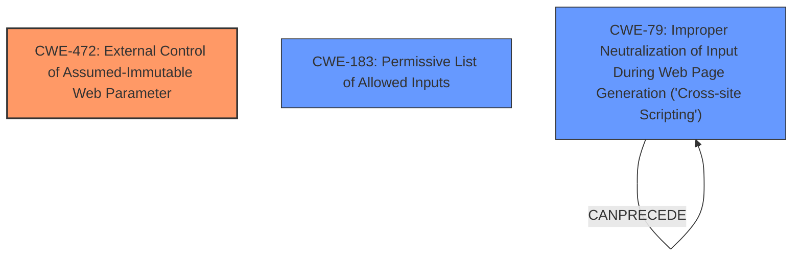

# Final Resolution for CVE-2021-40128

# Summary

| CWE ID | CWE Name | Confidence | CWE Abstraction Level | CWE Vulnerability Mapping Label | CWE-Vulnerability Mapping Notes |
|---|---|---|---|---|---|
| CWE-472 | External Control of Assumed-Immutable Web Parameter | 0.90 | Base | Allowed | Primary CWE |
| CWE-183 | Permissive List of Allowed Inputs | 0.70 | Base | Allowed | Secondary Candidate |
| CWE-79 | Improper Neutralization of Input During Web Page Generation ('Cross-site Scripting') | 0.50 | Base | Allowed | Secondary Candidate |

## Evidence and Confidence

*   **Confidence Score:** 0.80
*   **Evidence Strength:** HIGH

## Relationship Analysis
The primary relationship that influenced the decision was the parent-child relationship. While several CWEs had similar similarity scores, CWE-472 was the most specific and directly applicable to the **root cause**. The consideration of CWE-183 was due to the possible presence of an incomplete allowlist, which could contribute to the **weakness**. CWE-79 was considered due to its potential for exploitation in a later stage of the attack on the attacker's controlled website. The abstraction levels played a role, favoring Base-level CWEs for their specificity.

## Vulnerability Chain
The vulnerability chain starts with **insufficient validation of user-supplied parameters** (CWE-472). This allows an attacker to control the domain in the account activation link. The user receives a tampered email, and if they click the link, they are redirected to an attacker-controlled website. A secondary weakness could arise if the attacker's website does not properly neutralize input, potentially leading to XSS (CWE-79). An additional potential **root cause** could be CWE-183, if an allow list is implemented incorrectly.

## Summary of Analysis
The initial analysis and criticism both correctly identify **CWE-472** as the primary weakness. This assessment is strongly based on the evidence that the vulnerability description explicitly mentions **insufficient validation of user-supplied parameters**.

The graph relationships influenced the final selection by highlighting the direct applicability of CWE-472 and the potential contribution of CWE-183 as a potential **root cause**. The role of CWE-79 is more of a potential consequence on a separate attacker-controlled system.

The selected CWEs are at the optimal level of specificity because they directly address the **root cause** (CWE-472) and a potential contributing factor (CWE-183) of the vulnerability. CWE-472 captures the essence of the **weakness**, while CWE-183 accounts for a possible underlying configuration issue. The evidence provided in the vulnerability description strongly supports this classification.

The reasoning is: "This vulnerability is due to **insufficient validation of user-supplied parameters**." This aligns directly with CWE-472.

The analysis also considered the recommendation from the criticism to explore `CWE-183: Permissive List of Allowed Inputs`.
While the initial report only considered CWE-79 as a secondary weakness. The report has been updated to indicate that it is possible that CWE-183 is a more accurate second weakness as the Webex service may have an incomplete or overly permissive list of allowed domains for account activation links.