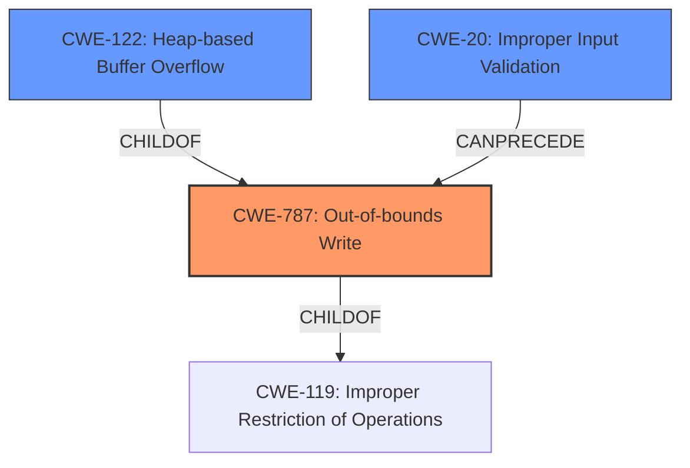

# Final Resolution for CVE-2021-40161

# Summary

| CWE ID | CWE Name | Confidence | CWE Abstraction Level | CWE Vulnerability Mapping Label | CWE-Vulnerability Mapping Notes |
|---|---|---|---|---|---|
| **CWE-787** | **Out-of-bounds Write** | 0.85 | Base | Allowed | Primary **CWE**. The vulnerability involves writing data past the end or before the beginning of an intended buffer, leading to **memory corruption** and potential code execution. |
| CWE-122 | Heap-based Buffer Overflow | 0.5 | Variant | Allowed | Secondary candidate. **CWE-122** is a more specific type of buffer overflow that occurs on the heap. The information provided does not confirm the location so it is considered a secondary candidate. |
| CWE-20 | Improper Input Validation | 0.4 | Base | Allowed | Secondary candidate. The malicious DLL is essentially untrusted input. The PDFTron component isn't properly validating the contents of the DLL, leading to the **memory corruption**. |

## Evidence and Confidence

*   **Confidence Score:** 0.80
*   **Evidence Strength:** HIGH

## Relationship Analysis

The primary **weakness** is **CWE-787 (Out-of-bounds Write)**, which is a child of **CWE-119 (Improper Restriction of Operations within the Bounds of a Memory Buffer)**. However, **CWE-119** is discouraged when more specific **CWEs** are available. **CWE-122 (Heap-based Buffer Overflow)** is a variant of a buffer overflow, specifying the location of the overflow as the heap. **CWE-20 (Improper Input Validation)** is included because a malicious DLL is untrusted input, and the application isn't properly validating it.

## Vulnerability Chain

The vulnerability chain starts with the introduction of a maliciously crafted DLL file. This DLL file is not properly validated (**CWE-20 Improper Input Validation**) by the PDFTron software. Consequently, the software attempts to write data beyond the intended buffer boundaries (**CWE-787 Out-of-bounds Write**), leading to **memory corruption** and ultimately enabling the execution of arbitrary code. If the buffer is allocated on the heap, **CWE-122 (Heap-based Buffer Overflow)** could also be present.

## Summary of Analysis

The initial analysis correctly identified **CWE-787 (Out-of-bounds Write)** as the primary **weakness**, and the criticism validated this selection. The vulnerability description explicitly mentions "**Memory Corruption**," which can lead to code execution via malicious DLL files. The CVE reference reinforces this, stating, "This CVE specifically details a **memory corruption** vulnerability" and "The **memory corruption** vulnerability could allow an attacker to execute arbitrary code on the affected system" via "maliciously crafted DLL files."

The inclusion of **CWE-119 (Improper Restriction of Operations within the Bounds of a Memory Buffer)** was deemed unnecessary and discouraged because **CWE-787** provides a more specific classification. Instead, **CWE-20 (Improper Input Validation)** was added as a secondary **CWE** because the malicious DLL represents untrusted input that is not properly validated. **CWE-122 (Heap-based Buffer Overflow)** remains a secondary candidate due to the uncertainty regarding the memory location of the buffer.

The graph relationships influenced the final selection by highlighting the hierarchical connection between **CWE-787** and **CWE-119**, reinforcing the importance of selecting the most specific **CWE** available. The chain relationship helped identify **CWE-20** as a contributing factor. The selected **CWEs** are at the optimal level of specificity, with **CWE-787** representing the direct cause of the **memory corruption**, **CWE-20** representing the lack of validation, and **CWE-122** representing a potential memory location for the overflow.