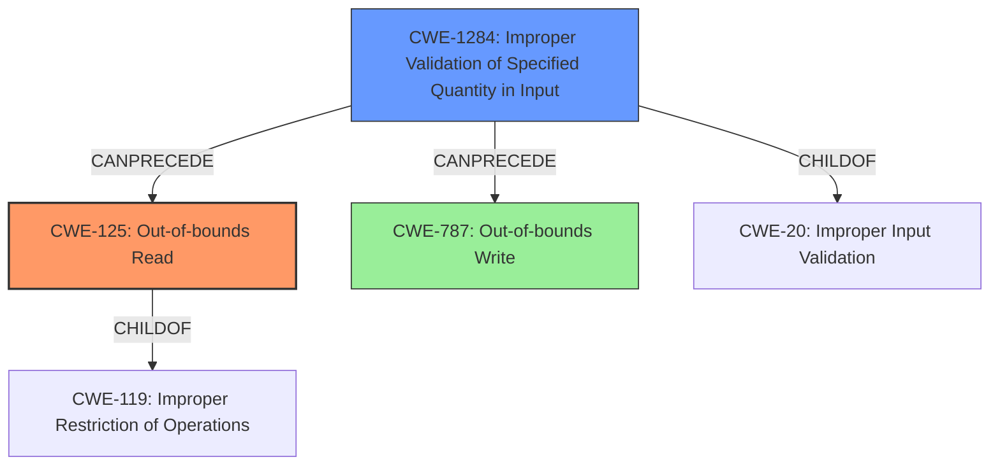

# Final Resolution for CVE-2021-40167

# Summary
| CWE ID | CWE Name | Confidence | CWE Abstraction Level | CWE Vulnerability Mapping Label | CWE-Vulnerability Mapping Notes |
|---|---|---|---|---|---|
| CWE-125 | Out-of-bounds Read | 0.75 | Base | Primary | Allowed |
| CWE-1284 | Improper Validation of Specified Quantity in Input | 0.60 | Base | Contributing Factor | Allowed |
| CWE-787 | Out-of-bounds Write | 0.50 | Base | Secondary Candidate | Allowed |

## Evidence and Confidence

*   **Confidence Score:** 0.70
*   **Evidence Strength:** MEDIUM

## Relationship Analysis
The primary weakness is CWE-125 (**Out-of-bounds Read**), a base-level CWE. It's a child of CWE-119 (**Improper Restriction of Operations within the Bounds of a Memory Buffer**), but selecting CWE-119 would be too general. The criticism suggested CWE-823 (**Use of Out-of-range Pointer Offset**) as a more specific alternative if the offset is attacker-controlled. However, the description lacks this specific detail. CWE-1284 (**Improper Validation of Specified Quantity in Input**) is included as a contributing factor because the vulnerability arises from a maliciously crafted file, implying a failure to validate input size or length. CWE-787 (**Out-of-bounds Write**) remains a secondary candidate because memory corruption could involve writes, though the explicit mention of a "read access violation" makes it less likely. The "CanFollow" relationships of CWE-125 were considered, potentially leading to issues like CWE-825 (**Expired Pointer Dereference**), CWE-824 (**Access of Uninitialized Pointer**), CWE-823, or CWE-822 (**Untrusted Pointer Dereference**), but these are speculative without further information.

## Vulnerability Chain
The vulnerability chain starts with a maliciously crafted DWF or PCT file (CWE-20 **Improper Input Validation** - though this is too general). The crafted file is consumed by DesignReview.exe. A failure to properly validate the size or length fields in the file (CWE-1284 **Improper Validation of Specified Quantity in Input**) leads to an out-of-bounds read (CWE-125 **Out-of-bounds Read**), resulting in memory corruption and a read access violation. This could potentially lead to code execution if exploited in conjunction with other vulnerabilities. The chain highlights how improper input validation enables the out-of-bounds read.

## Summary of Analysis
The initial analysis correctly identified CWE-125 (**Out-of-bounds Read**) as the primary weakness due to the explicit "read access violation" mentioned in the vulnerability description: "A malicious crafted dwf or .pct file when consumed through DesignReview.exe application could lead to **memory corruption vulnerability by read access violation**".

The criticism suggested exploring more specific variants of CWE-125, like CWE-823 (**Use of Out-of-range Pointer Offset**), if the offset was attacker-controlled. However, there's no evidence in the description to support this. The criticism also highlighted the potential role of input validation, which led to the inclusion of CWE-1284 (**Improper Validation of Specified Quantity in Input**) as a contributing factor. This is based on the fact that the file is maliciously crafted, suggesting a failure to properly handle the file's contents, especially size-related fields.

The graph relationships influenced the decision by clarifying the parent-child relationship between CWE-125 and CWE-119 (**Improper Restriction of Operations**), reinforcing that CWE-125 is a more specific and appropriate choice than its parent. The "CanPrecede" relationship between CWE-1284 and CWE-125 highlights how input validation failures can directly lead to out-of-bounds reads.

The selected CWEs are at the optimal level of specificity given the available evidence. While a more specific variant of CWE-125 might exist, there's insufficient information to confirm it. CWE-125 directly reflects the "read access violation," while CWE-1284 accounts for the role of improper input validation in enabling the vulnerability. CWE-787 remains a possibility given memory corruption but is not explicitly indicated. The confidence score reflects the certainty in the mapping based on the vulnerability description.