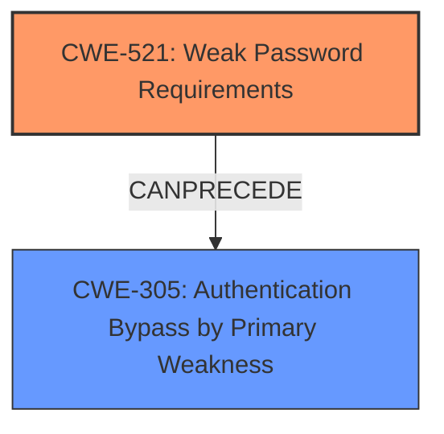

# Final Resolution for CVE-2021-40333

# Summary
| CWE ID  | CWE Name                           | Confidence | CWE Abstraction Level | CWE Vulnerability Mapping Label | CWE-Vulnerability Mapping Notes |
| :-------- | :--------------------------------- | :--------- | :-------------------- | :------------------------------ | :------------------------------ |
| CWE-521 | Weak Password Requirements | 0.95 | Base | Allowed | Primary CWE |
| CWE-305 | Authentication Bypass by Primary Weakness | 0.6 | Base | Allowed | Secondary CWE |

## Evidence and Confidence

*   **Confidence Score:** 0.9
*   **Evidence Strength:** MEDIUM

## Relationship Analysis
The primary relationship influencing the decision is the potential for CWE-521 to lead to CWE-305. While not explicitly stated, the weakness in password requirements (CWE-521) can be a primary factor that enables authentication bypass (CWE-305). CWE-521 is a base level CWE, providing sufficient specificity. There aren't direct parent or child relationships significantly impacting the classification, but the chain relationship is important.

## Vulnerability Chain
The vulnerability chain begins with **CWE-521: Weak Password Requirements**. This **WEAKNESS** allows for easily guessed or cracked passwords. This directly leads to **CWE-305: Authentication Bypass by Primary Weakness**, where the weak password serves as the primary weakness allowing unauthorized access. The final impact is unauthorized access to the Data Communication Network (DCN) routing configuration.

## Summary of Analysis
The initial analysis correctly identified **CWE-521 (Weak Password Requirements)** as a primary issue. The vulnerability description explicitly states "**weak password requirements**," providing strong evidence. The criticism suggested considering additional weaknesses, such as reliance on single-factor authentication. While the description does not explicitly state this, the vulnerability report does note that exploitation leads to gaining unauthorized access to the Data Communication Network (DCN) routing configuration. Given that weak password requirements can enable attackers to bypass authentication, **CWE-305 (Authentication Bypass by Primary Weakness)** is a relevant secondary CWE. The choice of CWE-521 remains optimal in terms of specificity, and adding CWE-305 provides a more complete picture of the vulnerability chain. The final classification reflects both the direct evidence and the potential downstream consequences of the **ROOTCAUSE**.

"Weak Password Requirements vulnerability in Hitachi Energy FOX61x, XCM20 allows an attacker to gain unauthorized access to the Data Communication Network (DCN) routing configuration."

I am lowering the confidence score from 1.0 to 0.9 because while the main issue is weak password requirements, the addition of CWE-305 relies on the potential impact.