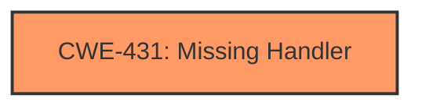

# Final Resolution for CVE-2021-40334

# Summary
| CWE ID | CWE Name | Confidence | CWE Abstraction Level | CWE Vulnerability Mapping Label | CWE-Vulnerability Mapping Notes |
|---|---|---|---|---|---|
| **CWE-431** | **Missing Handler** | 1.0 | Base | Allowed | Primary **CWE** |

## Evidence and Confidence

*   **Confidence Score:** 1.0
*   **Evidence Strength:** HIGH

## Relationship Analysis
The primary impact of the decision was based on the direct match of the "**MISSING HANDLER**" phrase in the vulnerability description and the definition of **CWE-431** (**Missing Handler**). While **CWE-431** does not have direct relationships defined in the **CWE** database, its absence can contribute to exploitable conditions such as denial of service. The base level abstraction is appropriate as it directly reflects the **ROOTCAUSE**.

## Vulnerability Chain
The vulnerability chain starts with a **ROOTCAUSE** of a **MISSING HANDLER** (**CWE-431**) in the proprietary management protocol. This allows an attacker to activate SSH on port TCP 5558, leading to a disruption of NMS and NE communication. The missing handler is the primary weakness that enables the subsequent exploitation and impact.

## Summary of Analysis
The initial analysis and the provided criticism both converge on **CWE-431** (**Missing Handler**) as the most appropriate classification. The vulnerability description explicitly states "**Missing Handler** vulnerability," which directly aligns with the definition of **CWE-431**: "A handler is not available or implemented." The high confidence stems from this direct textual match. The suggestion to expand the relationship analysis to highlight the potential consequences of a **missing handler** is valuable.

The selection of **CWE-431** is at the optimal level of specificity. It's a Base-level **CWE**, which is preferred for mapping **ROOTCAUSE**s. Alternatives like **CWE-755** (**Improper Handling of Exceptional Conditions**) are too generic, as they do not specifically address the absence of a handler. **CWE-431** precisely captures the core issue.