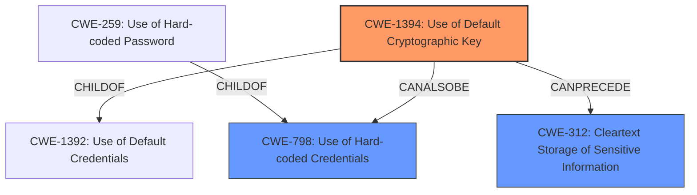

# Final Resolution for CVE-2021-40342

# Summary
| CWE ID | CWE Name | Confidence | CWE Abstraction Level | CWE Vulnerability Mapping Label | CWE-Vulnerability Mapping Notes |
|---|---|---|---|---|---|
| **CWE-1394** | **Use of Default Cryptographic Key** | 0.95 | Base | Allowed | Primary CWE. Mitigation: Require administrator to change the key upon installation. |
| **CWE-798** | **Use of Hard-coded Credentials** | 0.70 | Base | Allowed | Secondary Candidate. The default key is likely hardcoded into the device. Mitigation: Avoid hardcoding credentials and implement secure key management practices. |
| **CWE-312** | **Cleartext Storage of Sensitive Information** | 0.60 | Base | Allowed | Secondary Candidate. Dependent on the ease of compromise of the default key. Mitigation: Encrypt data at rest with strong, non-default keys. |

## Evidence and Confidence

*   **Confidence Score:** 0.90
*   **Evidence Strength:** HIGH

## Relationship Analysis
The primary weakness is clearly the **use of a default cryptographic key (CWE-1394)**. This is a specific instance of using default credentials. **CWE-798 (Use of Hard-coded Credentials)** is a peer of **CWE-259 (Use of Hard-coded Password)**, which is a more specific version of **CWE-798**. The weakness can also lead to **CWE-312 (Cleartext Storage of Sensitive Information)** if the default key is easily compromised. The relationship analysis reinforces the initial assessment, indicating that the selected CWEs accurately capture the vulnerability's characteristics and potential consequences.

## Vulnerability Chain
The vulnerability chain starts with the **root cause: CWE-1394 (Use of Default Cryptographic Key)**. This leads to a situation where sensitive information is encrypted with a key that is known or easily guessed. This may be because of **CWE-798 (Use of Hard-coded Credentials)**. If the key is compromised, the encrypted data is effectively exposed as **CWE-312 (Cleartext Storage of Sensitive Information)**. The ultimate impact is the ability for an attacker to obtain sensitive information and gain unauthorized access to network elements.

## Summary of Analysis
The analysis is based on the vulnerability description, which states that the affected product versions use a default key for encryption. The initial analysis and the criticism both arrive at **CWE-1394 (Use of Default Cryptographic Key)** as the primary weakness, and the confidence score remains high (0.95). The inclusion of **CWE-312 (Cleartext Storage of Sensitive Information)** as a secondary candidate is also reasonable, as the use of a default key can lead to data being exposed as if it were stored in cleartext. As the keys are likely hardcoded into the devices, including **CWE-798 (Use of Hard-coded Credentials)** as a secondary candidate is also warranted. The selected CWEs are at the optimal level of specificity, as they accurately reflect the nature of the vulnerability and its potential impact.