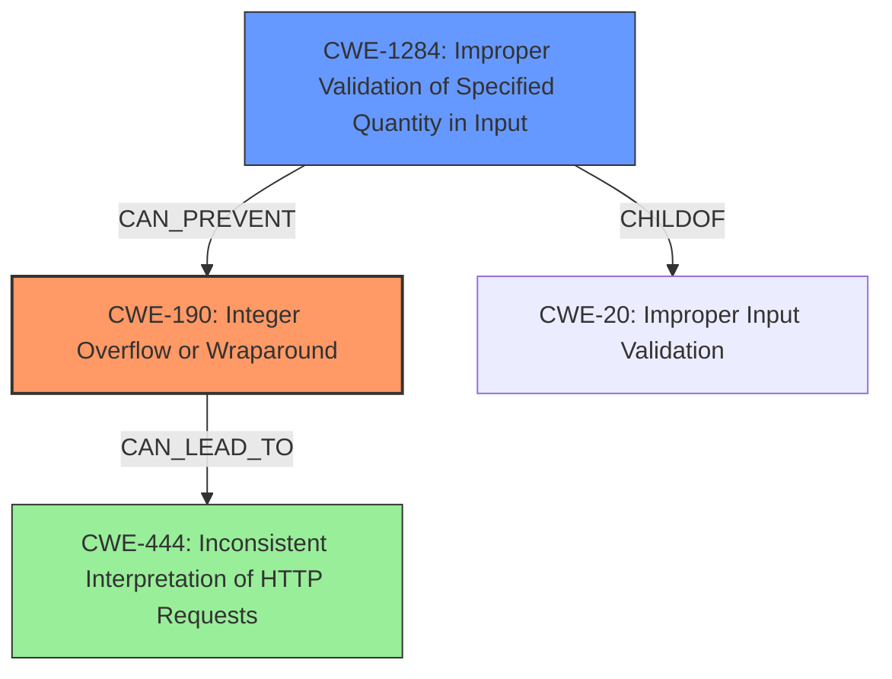

# Analysis Report for CVE-2021-40346

# Vulnerability Analysis Report: CVE-2021-40346

## Description

An integer overflow exists in HAProxy 2.0 through 2.5 in htx_add_header that can be exploited to perform an HTTP request smuggling attack, allowing an attacker to bypass all configured http-request HAProxy ACLs and possibly other ACLs.

## Vulnerability Description Key Phrases

**Rootcause:** integer overflow
**Impact:** ['bypass all configured http-request HAProxy ACLs', 'possibly other ACLs']
**Attacker:** attacker
**Product:** HAProxy
**Version:** 2.0 through 2.5
**Component:** htx_add_header

## Analysis (with Relationship Data)

# Summary
| CWE ID | CWE Name | Confidence | CWE Abstraction Level | CWE Vulnerability Mapping Label | CWE-Vulnerability Mapping Notes |
|---|---|---|---|---|---|
| CWE-190 | Integer Overflow or Wraparound | 0.95 | Base | Allowed | Primary CWE. The vulnerability is caused by an integer overflow.|
| CWE-444 | Inconsistent Interpretation of HTTP Requests ('HTTP Request/Response Smuggling') | 0.75 | Base | Allowed | Secondary CWE. Exploitation of the overflow leads to HTTP request smuggling.|

## Evidence and Confidence

*   **Confidence Score:** 0.85
*   **Evidence Strength:** HIGH

- **Analysis and Justification:**  
  - *Explanation:* The vulnerability is described as an **integer overflow** in HAProxy when handling header lengths. The `htx_add_header()` function lacks proper length validation, leading to an overflow when a header name exceeds 255 characters. This directly matches the description of CWE-190 (Integer Overflow or Wraparound). The overflow leads to incorrect calculation of memory offsets, which allows for HTTP request smuggling (CWE-444). The root cause is the **integer overflow**, and the consequence is the ability to perform HTTP request smuggling. Both are significant, but CWE-190 is the more fundamental issue. The MITRE mapping guidance indicates that CWE-190 is ALLOWED.

  - *Relationship Analysis:* CWE-190 is a base-level CWE. The integer overflow can lead to CWE-444 (Inconsistent Interpretation of HTTP Requests) because the overflow enables the attacker to manipulate the `Content-Length` header, leading to discrepancies between how HAProxy and backend servers interpret the request boundaries.

- **Confidence Score:**  
  - Confidence: 0.95 (High evidence from the vulnerability description and CVE reference materials, especially the root cause analysis.)

---

## Criticism of Analysis

Okay, here's a detailed review of the analysis, considering the full CWE specifications and focusing on the mapping guidance and potential mitigations:

**Overall Assessment:**

The analysis is generally good and identifies the primary and secondary CWEs correctly. The confidence scores are appropriate, and the explanations are clear. The connection between the integer overflow and the resulting HTTP request smuggling is well articulated.

**Detailed Review:**

**1. CWE-190: Integer Overflow or Wraparound**

*   **Mapping:** The analysis correctly identifies CWE-190 as the root cause.  The vulnerability description and CVE reference materials clearly point to an integer overflow as the primary flaw.  The usage is flagged as "Allowed" per the CWE specifications, which aligns with the fact that this is a base-level CWE appropriate for describing the root cause.
*   **Confidence:** 0.95 is justified, given the strong evidence.
*   **Mitigations:** The analysis doesn't explicitly mention mitigations. Considering the CWE specifications, relevant mitigations could be:
    *   **Requirements Phase:** Stricter protocol definitions and conformance.
    *   **Language Selection:** Using languages or compilers with automatic bounds checking (e.g., Rust, AddressSanitizer (ASan) enabled compilers).
    *   **Architecture and Design:**  Employing safe integer handling libraries (e.g., SafeInt for C++).
*   **Improvements:** Briefly mentioning one or two of these mitigations would strengthen the analysis. The analysis should highlight the importance of input validation. Specifically, the size of the header name should be validated to ensure it's within acceptable bounds.

**2. CWE-444: Inconsistent Interpretation of HTTP Requests ('HTTP Request/Response Smuggling')**

*   **Mapping:** Correctly identified as a secondary CWE, describing the impact of the integer overflow. The analysis explains how the overflow can be exploited to manipulate the `Content-Length` header, leading to request smuggling. The usage is also "Allowed" as it's a base-level CWE.
*   **Confidence:** 0.75 is reasonable. While HTTP Request Smuggling is a significant consequence, it's a result of the primary CWE-190.
*   **Mitigations:** The analysis doesn't explicitly mention mitigations. From the CWE Specifications:
    *   **Implementation Phase:** Using a web server with a strict HTTP parsing procedure (e.g., Apache).
    *   **Implementation Phase:** Using SSL/TLS communication (although this only protects the communication channel and doesn't directly address the parsing inconsistency).
    *   **Implementation Phase:** Terminating the client session after each request (less practical in many scenarios).
*   **Improvements:**  A brief mention of a suitable mitigation strategy would improve the analysis. The analysis could mention that proper input validation on the header length (to prevent the overflow) would also mitigate this secondary vulnerability.

**General Observations and Potential Improvements:**

*   **Chaining:** The analysis does a decent job explaining the chain of events (Integer Overflow -> Incorrect Memory Offset Calculation -> HTTP Request Smuggling). Consider explicitly mentioning that this is a *chain* of vulnerabilities.
*   **Retriever Results:** The retriever results section includes several other CWEs. While CWE-190 and CWE-444 are the most relevant, some of the others have a tangential connection. For example:
    *   **CWE-1284: Improper Validation of Specified Quantity in Input:**  This is *very* relevant. The root cause is the *lack* of validation on the length of the header name. It's worth considering including this CWE.
    *  **CWE-119: Improper Restriction of Operations within the Bounds of a Memory Buffer**: This could be a tertiary consequence, depending on how the incorrect memory offsets resulting from the integer overflow are handled. It might be a stretch, however.
    *   **CWE-770: Allocation of Resources Without Limits or Throttling:** A successful exploit might lead to resource exhaustion, making this somewhat relevant.
*   **Observed Examples:** The "Observed Examples" sections for each CWE in the CWE specifications provide a wealth of information for additional context and relevant CVEs. This could be used to enhance your analysis.

**Revised Summary Table (incorporating suggestions):**

| CWE ID | CWE Name | Confidence | CWE Abstraction Level | CWE Vulnerability Mapping Label | CWE-Vulnerability Mapping Notes |
|---|---|---|---|---|---|
| CWE-190 | Integer Overflow or Wraparound | 0.95 | Base | Allowed | Primary CWE. The vulnerability is caused by an integer overflow in the header length calculation. Mitigation: Use safe integer handling libraries, language features that provide bounds checking, and ensure strict protocol definitions. |
| CWE-1284 | Improper Validation of Specified Quantity in Input | 0.85 | Base | Allowed | Contributing CWE.  The header name length is not validated. Mitigation: Implement strict input validation to ensure the header name length is within acceptable bounds (e.g., < 256 bytes). |
| CWE-444 | Inconsistent Interpretation of HTTP Requests ('HTTP Request/Response Smuggling') | 0.75 | Base | Allowed | Secondary CWE. Exploitation of the overflow leads to HTTP request smuggling. Mitigation: Use a web server with strict HTTP parsing, and ensure the underlying integer overflow is prevented via input validation. |

**Revised Conclusion:**

The analysis provides a solid foundation for understanding the vulnerability. By incorporating the suggested improvements, including mentioning relevant mitigations and highlighting the chain of events, the analysis can be made more comprehensive and informative. Furthermore, incorporating CWE-1284 improves the granularity of the analysis.

## Final Resolution

# Summary
| CWE ID | CWE Name | Confidence | CWE Abstraction Level | CWE Vulnerability Mapping Label | CWE-Vulnerability Mapping Notes |
|---|---|---|---|---|---|
| CWE-190 | **Integer Overflow or Wraparound** | 0.95 | Base | Allowed | Primary CWE. The vulnerability is caused by an **integer overflow** in the header length calculation. Mitigation: Use safe integer handling libraries, language features that provide bounds checking, and ensure strict protocol definitions. |
| CWE-1284 | **Improper Validation of Specified Quantity in Input** | 0.85 | Base | Allowed | Contributing CWE. The header name length is not validated. Mitigation: Implement strict input validation to ensure the header name length is within acceptable bounds (e.g., < 256 bytes). |
| CWE-444 | **Inconsistent Interpretation of HTTP Requests ('HTTP Request/Response Smuggling')** | 0.75 | Base | Allowed | Secondary CWE. Exploitation of the overflow leads to HTTP request smuggling. Mitigation: Use a web server with strict HTTP parsing, and ensure the underlying **integer overflow** is prevented via input validation. |

## Evidence and Confidence

*   **Confidence Score:** 0.90
*   **Evidence Strength:** HIGH

## Relationship Analysis
The decision to include CWE-1284 was heavily influenced by its relationship to both the **root cause** and the resulting vulnerability. It represents the missing link in preventing the **integer overflow**.

- **Parent-child relationships:** While CWE-190 doesn't have direct parent-child relationships listed in the provided data, CWE-1284 is a child of CWE-20 (Improper Input Validation), which broadly captures the **root cause**.
- **Chain relationships:** CWE-1284 `CANPRECEDE` CWE-789 (Uncontrolled Memory Allocation), which could be a potential consequence of the **integer overflow**, though not explicitly stated in the vulnerability description.
- **Peer relationships:** No relevant peer relationships were identified for CWE-190.
- **Abstraction levels:** All selected CWEs (CWE-190, CWE-1284, and CWE-444) are at the Base level, making them suitable for root cause analysis and vulnerability mapping.

## Vulnerability Chain
The vulnerability chain starts with the lack of input validation, leading to an **integer overflow**, and culminating in HTTP request smuggling.
- The sequence begins with CWE-1284 (**Improper Validation of Specified Quantity in Input**), where the header length is not validated.
- This leads to CWE-190 (**Integer Overflow or Wraparound**) when the header length exceeds the maximum allowed value.
- The **integer overflow** results in incorrect memory offset calculations.
- Finally, this enables CWE-444 (**Inconsistent Interpretation of HTTP Requests**), allowing an attacker to perform HTTP request smuggling.
- Missing links: The vulnerability description doesn't explicitly describe the memory offset calculation, but it is implied.

## Summary of Analysis
The initial analysis correctly identified CWE-190 and CWE-444. The criticism highlighted the importance of input validation and suggested including CWE-1284, which I agree with.

- The assessment is heavily based on the vulnerability description: "An **integer overflow** exists in HAProxy 2.0 through 2.5 in htx_add_header that can be exploited to perform an HTTP request smuggling attack..." This clearly indicates CWE-190 as the **root cause** and CWE-444 as a consequence.
- The graph relationships influenced the decision to include CWE-1284. Its `CHILDOF` relationship with CWE-20 and its ability to `CANPREVENT` CWE-190 demonstrates its significance.
- The selected CWEs are at the optimal level of specificity. All are at the Base level, which is preferred for root cause analysis. CWE-190 accurately describes the **integer overflow**, CWE-1284 captures the missing input validation, and CWE-444 describes the resulting HTTP request smuggling.
- The inclusion of CWE-1284 is justified because it addresses the lack of input validation on the header length, which is a key factor in preventing the **integer overflow**.

*Report generated on 2025-03-16 16:38:39*
