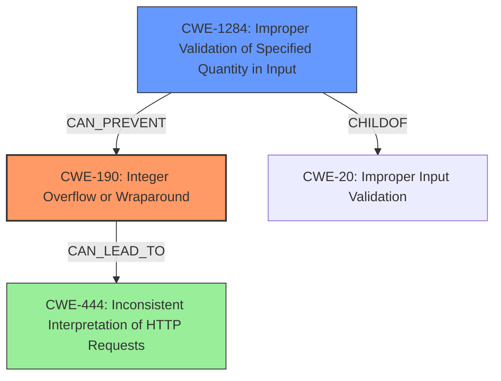

# Final Resolution for CVE-2021-40346

# Summary
| CWE ID | CWE Name | Confidence | CWE Abstraction Level | CWE Vulnerability Mapping Label | CWE-Vulnerability Mapping Notes |
|---|---|---|---|---|---|
| CWE-190 | **Integer Overflow or Wraparound** | 0.95 | Base | Allowed | Primary CWE. The vulnerability is caused by an **integer overflow** in the header length calculation. Mitigation: Use safe integer handling libraries, language features that provide bounds checking, and ensure strict protocol definitions. |
| CWE-1284 | **Improper Validation of Specified Quantity in Input** | 0.85 | Base | Allowed | Contributing CWE. The header name length is not validated. Mitigation: Implement strict input validation to ensure the header name length is within acceptable bounds (e.g., < 256 bytes). |
| CWE-444 | **Inconsistent Interpretation of HTTP Requests ('HTTP Request/Response Smuggling')** | 0.75 | Base | Allowed | Secondary CWE. Exploitation of the overflow leads to HTTP request smuggling. Mitigation: Use a web server with strict HTTP parsing, and ensure the underlying **integer overflow** is prevented via input validation. |

## Evidence and Confidence

*   **Confidence Score:** 0.90
*   **Evidence Strength:** HIGH

## Relationship Analysis
The decision to include CWE-1284 was heavily influenced by its relationship to both the **root cause** and the resulting vulnerability. It represents the missing link in preventing the **integer overflow**.

- **Parent-child relationships:** While CWE-190 doesn't have direct parent-child relationships listed in the provided data, CWE-1284 is a child of CWE-20 (Improper Input Validation), which broadly captures the **root cause**.
- **Chain relationships:** CWE-1284 `CANPRECEDE` CWE-789 (Uncontrolled Memory Allocation), which could be a potential consequence of the **integer overflow**, though not explicitly stated in the vulnerability description.
- **Peer relationships:** No relevant peer relationships were identified for CWE-190.
- **Abstraction levels:** All selected CWEs (CWE-190, CWE-1284, and CWE-444) are at the Base level, making them suitable for root cause analysis and vulnerability mapping.

## Vulnerability Chain
The vulnerability chain starts with the lack of input validation, leading to an **integer overflow**, and culminating in HTTP request smuggling.
- The sequence begins with CWE-1284 (**Improper Validation of Specified Quantity in Input**), where the header length is not validated.
- This leads to CWE-190 (**Integer Overflow or Wraparound**) when the header length exceeds the maximum allowed value.
- The **integer overflow** results in incorrect memory offset calculations.
- Finally, this enables CWE-444 (**Inconsistent Interpretation of HTTP Requests**), allowing an attacker to perform HTTP request smuggling.
- Missing links: The vulnerability description doesn't explicitly describe the memory offset calculation, but it is implied.

## Summary of Analysis
The initial analysis correctly identified CWE-190 and CWE-444. The criticism highlighted the importance of input validation and suggested including CWE-1284, which I agree with.

- The assessment is heavily based on the vulnerability description: "An **integer overflow** exists in HAProxy 2.0 through 2.5 in htx_add_header that can be exploited to perform an HTTP request smuggling attack..." This clearly indicates CWE-190 as the **root cause** and CWE-444 as a consequence.
- The graph relationships influenced the decision to include CWE-1284. Its `CHILDOF` relationship with CWE-20 and its ability to `CANPREVENT` CWE-190 demonstrates its significance.
- The selected CWEs are at the optimal level of specificity. All are at the Base level, which is preferred for root cause analysis. CWE-190 accurately describes the **integer overflow**, CWE-1284 captures the missing input validation, and CWE-444 describes the resulting HTTP request smuggling.
- The inclusion of CWE-1284 is justified because it addresses the lack of input validation on the header length, which is a key factor in preventing the **integer overflow**.