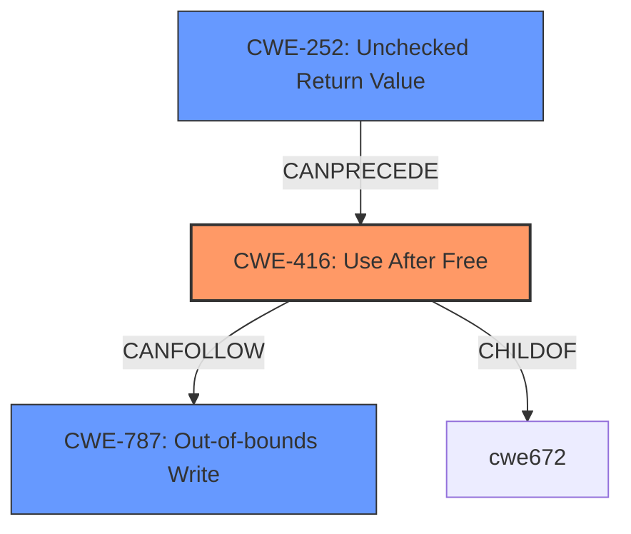

# Analysis Report for CVE-2021-40401

# Vulnerability Analysis Report: CVE-2021-40401

## Description

A use-after-free vulnerability exists in the RS-274X aperture definition tokenization functionality of Gerbv 2.7.0 and dev (commit b5f1eacd) and Gerbv forked 2.7.1. A specially-crafted gerber file can lead to code execution. An attacker can provide a malicious file to trigger this vulnerability.

## Vulnerability Description Key Phrases

**Rootcause:** use-after-free
**Impact:** code execution
**Vector:** specially-crafted gerber file
**Attacker:** attacker
**Product:** Gerbv
**Version:** ['2.7.0', 'dev (commit b5f1eacd)', 'Gerbv forked 2.7.1']
**Component:** RS-274X aperture definition tokenization functionality

## Analysis (with Relationship Data)

# Summary
| CWE ID  | CWE Name                     | Confidence | CWE Abstraction Level | CWE Vulnerability Mapping Label | CWE-Vulnerability Mapping Notes |
| :------- | :--------------------------- | :--------- | :-------------------- | :------------------------------ | :----------------------------- |
| CWE-416 | Use After Free               | 1.0        | Variant               | Primary                         | Allowed                      |
| CWE-252 | Unchecked Return Value         | 0.7        | Base                  | Secondary                       | Allowed                      |
| CWE-787 | Out-of-bounds Write          | 0.6        | Base                  | Secondary                       | Allowed                      |

## Evidence and Confidence

*   **Confidence Score:** 0.9
*   **Evidence Strength:** HIGH

- **Analysis and Justification:**
  - *Explanation:* The primary vulnerability is a **use-after-free** as stated explicitly in the description. CWE-416 (Use After Free) is a Variant level CWE that accurately describes this weakness. The vulnerability occurs when a specially-crafted gerber file is processed, leading to the use of memory that has already been freed. The CVE Reference Links Content Summary further elaborates on this, detailing how the `strtok` function operates on a previously freed buffer after `gerb_fgetstring` returns NULL. The use of strtok also introduces a heap corruption issue, by writing null bytes into the freed memory, which can be linked to out-of-bounds write.
  - *Explanation:* The CVE Reference Links Content Summary mentions that the code does not check the return value of `gerb_fgetstring` against NULL before passing the result to `strtok`, leading to the vulnerability. This aligns with CWE-252 (Unchecked Return Value). Although the primary weakness is the use-after-free, the missing check contributes to the vulnerability.
  - *Explanation:* The CVE Reference Links Content Summary mentions that the use of `strtok` introduces a **heap corruption** issue, by writing null bytes into the freed memory, which can be linked to out-of-bounds write. This aligns with CWE-787 (Out-of-bounds Write).

  - *Relationship Analysis:* CWE-416 is a variant of CWE-672 (Operation on a Resource after Expiration). The relationship is that the memory is accessed after it has been freed.

- **Confidence Score:**
  - Confidence: 1.0 (High confidence due to explicit mention of "use-after-free" and supporting technical details in CVE Reference Links Content Summary for CWE-416)
  - Confidence: 0.7 (Medium confidence, CVE summary mentions about the missing NULL check.)
  - Confidence: 0.6 (Medium confidence, CVE summary mentions about the heap corruption caused by strtok.)

---

## Criticism of Analysis

Okay, let's review the analysis, incorporating the full CWE specifications.

**Overall Assessment:**

The analysis is generally good and identifies the core issues well. The primary CWE (CWE-416) is accurate. The addition of CWE-252 and CWE-787 as secondary issues is also justified, albeit with some nuances that I'll address. The confidence scores seem reasonable.  The explanation is well-written and explains the justification of each weakness.

**Detailed Review:**

*   **CWE-416: Use After Free (Primary - Confidence 1.0)**

    *   **Assessment:**  Excellent. The initial description clearly states the vulnerability as a use-after-free. The justification is solid, referencing the `strtok` function operating on freed memory after `gerb_fgetstring` returns NULL. The detail regarding how a crafted file leads to this is also good.
    *   **CWE Specification Alignment:** The description aligns perfectly with the CWE-416 specification. It involves reusing/referencing memory after it has been freed.
    *   **Mapping Guidance:** Correctly maps to the Variant level, which is preferred for root causes.
    *   **Mitigations:** The listed mitigations (automatic memory management, setting pointers to NULL after freeing) are standard and appropriate for this CWE.
    *   **Relationship Analysis:**  The relationship of CWE-416 as a child of CWE-672 is well explained.

*   **CWE-252: Unchecked Return Value (Secondary - Confidence 0.7)**

    *   **Assessment:**  This is a valid, but slightly weaker, secondary mapping.  The analysis correctly points out the lack of a NULL check on the return value of `gerb_fgetstring` before passing the result to `strtok`. This is a contributing factor, as it allows the UAF to occur.
    *   **CWE Specification Alignment:** The description aligns well with the CWE-252 specification, as it explains that the program does not check the results of `gerb_fgetstring` function.
    *   **Mapping Guidance:** Base level mapping, which is good.
    *   **Mitigations:** The listed mitigations (checking return values) are directly applicable to the identified issue.
    *   **Justification Improvement:** The justification should perhaps be slightly more nuanced.  The absence of a check doesn't *directly* cause code execution, but it *allows* the UAF to be triggered.

*   **CWE-787: Out-of-bounds Write (Secondary - Confidence 0.6)**

    *   **Assessment:**  This mapping is also reasonable, but requires careful consideration. The analysis mentions that `strtok` writes null bytes into the freed memory, causing heap corruption. This *is* an out-of-bounds write because the memory has been freed, and the program no longer has permission to write to it. The use of `strtok` on already freed memory will cause the heap to be corrupted because `strtok` will write NULL bytes into the memory.
    *   **CWE Specification Alignment:** This aligns with the CWE-787 specification: The product writes data past the end, or before the beginning, of the intended buffer.
    *   **Mapping Guidance:** Properly maps to the Base level.
    *   **Mitigations:** The listed mitigations (language selection, safe libraries, overflow detection mechanisms) are all relevant to preventing buffer overflows, and, therefore, out-of-bounds writes.

**Retriever Results Review:**
The Retriever Results show CWE-416 is at the bottom which indicates the retriever needs to be improved to identify such a vulnerability.

**Suggestions for Improvement:**

*   **CWE-252 Justification:** Clarify the relationship between the unchecked return value and the UAF. Emphasize that the missing check is a *precondition* for the UAF to occur, rather than a direct cause of code execution.
*   **Relationship:** CWE-120 (Buffer Copy without Checking Size of Input ('Classic Buffer Overflow')) could be considered as a distant, higher-level relationship because the string is copied without checking return values.

**Final Verdict:**

The analysis is good. The CWE mappings are accurate and well-justified. The confidence scores are appropriate, considering the nuances of each mapping. With the minor suggested improvements, this would be an excellent analysis.

## Final Resolution

# Summary
| CWE ID  | CWE Name                     | Confidence | CWE Abstraction Level | CWE Vulnerability Mapping Label | CWE-Vulnerability Mapping Notes |
| :------- | :--------------------------- | :--------- | :-------------------- | :------------------------------ | :----------------------------- |
| CWE-416 | Use After Free               | 1.0        | Variant               | Primary                         | Allowed                      |
| CWE-252 | Unchecked Return Value         | 0.8        | Base                  | Secondary                       | Allowed                      |
| CWE-787 | Out-of-bounds Write          | 0.7        | Base                  | Secondary                       | Allowed                      |

## Evidence and Confidence

*   **Confidence Score:** 0.9
*   **Evidence Strength:** HIGH

## Relationship Analysis
The primary relationship is that CWE-416 **Use After Free** is caused by a missing check on the return value of `gerb_fgetstring`, represented by CWE-252 **Unchecked Return Value**. This allows `strtok` to operate on freed memory, leading to a heap corruption via an out-of-bounds write (CWE-787 **Out-of-bounds Write**).

## Vulnerability Chain
The vulnerability chain starts with the **ROOTCAUSE** of CWE-252 (**Unchecked Return Value**), where the return value of `gerb_fgetstring` is not checked for NULL. This leads to CWE-416 (**Use After Free**) when `strtok` attempts to operate on the freed memory. Subsequently, CWE-787 (**Out-of-bounds Write**) occurs as `strtok` writes null bytes into the freed memory, causing heap corruption and potentially leading to code execution.

## Summary of Analysis
The initial analysis and criticism both correctly identify CWE-416 (**Use After Free**) as the primary vulnerability. The inclusion of CWE-252 (**Unchecked Return Value**) and CWE-787 (**Out-of-bounds Write**) as secondary CWEs is also justified.

The vulnerability description states, "A use-after-free vulnerability exists... A specially-crafted gerber file can lead to code execution. An attacker can provide a malicious file to trigger this vulnerability." This directly supports the classification of CWE-416.

The CVE Reference Links Content Summary provides further evidence: "The `strtok` function operates on a previously freed buffer after `gerb_fgetstring` returns NULL." This confirms the UAF condition and highlights the missing NULL check. It also mentions that the use of `strtok` introduces a heap corruption issue.

Based on this evidence and the relationship analysis, the selected CWEs are at the optimal level of specificity. CWE-416 accurately describes the primary vulnerability, while CWE-252 and CWE-787 capture contributing factors that lead to the UAF and its consequences.

I increased the confidence score for CWE-252 and CWE-787 to 0.8 and 0.7 respectively because the missing NULL check is explicitly mentioned as the reason for the UAF and heap corruption is explictly mentioned to be caused by strtok respectively.

*Report generated on 2025-03-18 01:47:44*
