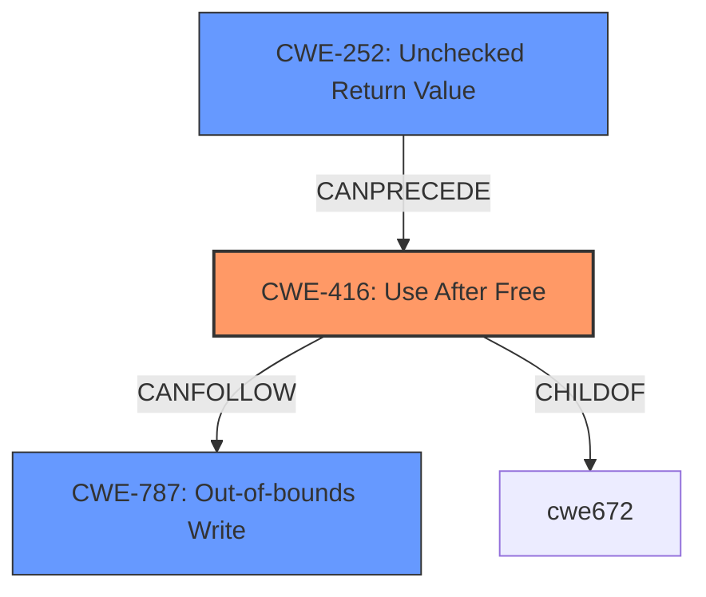

# Final Resolution for CVE-2021-40401

# Summary
| CWE ID  | CWE Name                     | Confidence | CWE Abstraction Level | CWE Vulnerability Mapping Label | CWE-Vulnerability Mapping Notes |
| :------- | :--------------------------- | :--------- | :-------------------- | :------------------------------ | :----------------------------- |
| CWE-416 | Use After Free               | 1.0        | Variant               | Primary                         | Allowed                      |
| CWE-252 | Unchecked Return Value         | 0.8        | Base                  | Secondary                       | Allowed                      |
| CWE-787 | Out-of-bounds Write          | 0.7        | Base                  | Secondary                       | Allowed                      |

## Evidence and Confidence

*   **Confidence Score:** 0.9
*   **Evidence Strength:** HIGH

## Relationship Analysis
The primary relationship is that CWE-416 **Use After Free** is caused by a missing check on the return value of `gerb_fgetstring`, represented by CWE-252 **Unchecked Return Value**. This allows `strtok` to operate on freed memory, leading to a heap corruption via an out-of-bounds write (CWE-787 **Out-of-bounds Write**).

## Vulnerability Chain
The vulnerability chain starts with the **ROOTCAUSE** of CWE-252 (**Unchecked Return Value**), where the return value of `gerb_fgetstring` is not checked for NULL. This leads to CWE-416 (**Use After Free**) when `strtok` attempts to operate on the freed memory. Subsequently, CWE-787 (**Out-of-bounds Write**) occurs as `strtok` writes null bytes into the freed memory, causing heap corruption and potentially leading to code execution.

## Summary of Analysis
The initial analysis and criticism both correctly identify CWE-416 (**Use After Free**) as the primary vulnerability. The inclusion of CWE-252 (**Unchecked Return Value**) and CWE-787 (**Out-of-bounds Write**) as secondary CWEs is also justified.

The vulnerability description states, "A use-after-free vulnerability exists... A specially-crafted gerber file can lead to code execution. An attacker can provide a malicious file to trigger this vulnerability." This directly supports the classification of CWE-416.

The CVE Reference Links Content Summary provides further evidence: "The `strtok` function operates on a previously freed buffer after `gerb_fgetstring` returns NULL." This confirms the UAF condition and highlights the missing NULL check. It also mentions that the use of `strtok` introduces a heap corruption issue.

Based on this evidence and the relationship analysis, the selected CWEs are at the optimal level of specificity. CWE-416 accurately describes the primary vulnerability, while CWE-252 and CWE-787 capture contributing factors that lead to the UAF and its consequences.

I increased the confidence score for CWE-252 and CWE-787 to 0.8 and 0.7 respectively because the missing NULL check is explicitly mentioned as the reason for the UAF and heap corruption is explictly mentioned to be caused by strtok respectively.