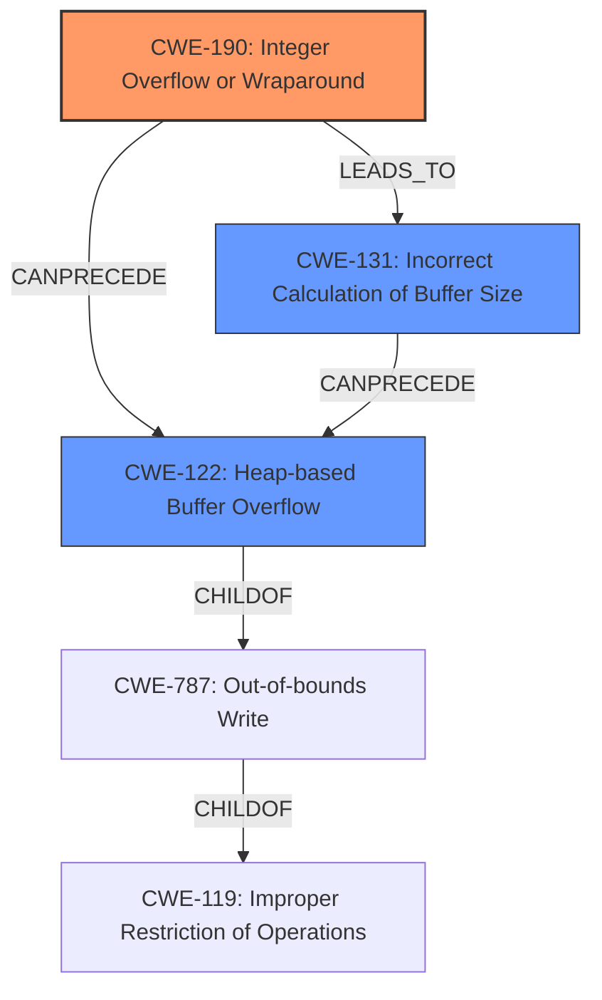

# Analysis Report for CVE-2021-40417

# Vulnerability Analysis Report: CVE-2021-40417

## Description

When parsing a file that is submitted to the DPDecoder service as a job, the service will use the combination of decoding parameters that were submitted with the job along with fields that were parsed for the submitted video by the R3D SDK to calculate the size of a heap buffer. Due to an integer overflow with regards to this calculation, this can result in an undersized heap buffer being allocated. When this heap buffer is written to, a heap-based buffer overflow will occur. This can result in code execution under the context of the application.

## Vulnerability Description Key Phrases

**Rootcause:** integer overflow
**Weakness:** heap-based buffer overflow
**Impact:** code execution
**Product:** DPDecoder service

## Analysis (with Relationship Data)

# Summary
| CWE ID | CWE Name | Confidence | CWE Abstraction Level | CWE Vulnerability Mapping Label | CWE-Vulnerability Mapping Notes |
|---|---|---|---|---|---|
| CWE-190 | Integer Overflow or Wraparound | 0.95 | Base | Allowed | Primary CWE: The integer overflow is the root cause of the vulnerability. |
| CWE-122 | Heap-based Buffer Overflow | 0.85 | Variant | Allowed | Secondary CWE: The integer overflow leads directly to a heap-based buffer overflow. |

## Evidence and Confidence

*   **Confidence Score:** 0.90
*   **Evidence Strength:** HIGH

- **Analysis and Justification:**
  - *Explanation:* The vulnerability description clearly states that an **integer overflow** occurs when calculating the size of a heap buffer, leading to an undersized buffer allocation. This aligns directly with CWE-190 (Integer Overflow or Wraparound). The CVE Reference Links Content Summary confirms this, stating "Root cause of vulnerability: Integer overflow during heap buffer size calculation when parsing a video file." Because the **integer overflow** results in an undersized buffer, a subsequent write operation causes a **heap-based buffer overflow**, which is represented by CWE-122. CWE-190 is the root cause, while CWE-122 is the direct consequence of the **integer overflow**. Both are relevant in understanding the vulnerability. The MITRE mapping guidance marks both CWE-190 and CWE-122 as ALLOWED, which aligns with this assessment.

  - *Relationship Analysis:* CWE-190 does not have any direct relationships listed in the provided data. CWE-122 is a child of CWE-787 (Out-of-bounds Write) and is related to CWE-119 (Improper Restriction of Operations within the Bounds of a Memory Buffer). The chain relationship can be seen as CWE-190 (Integer Overflow) CanPrecede CWE-122 (Heap-based Buffer Overflow), as the overflow directly causes the buffer overflow.

- **Confidence Score:**
  - Confidence: 0.95 (High evidence from the vulnerability description, CVE reference links, and retriever results supporting both CWEs).

---

## Criticism of Analysis

Okay, I've reviewed the analysis and the provided CWE specifications. Here's my critique, focusing on the mapping and confidence levels:

**Overall Assessment:**

The analysis is generally sound and well-reasoned. The mapping of CWE-190 and CWE-122 is accurate, and the confidence levels are justified. The analysis demonstrates a good understanding of the vulnerability and the relationships between the CWEs.

**Detailed Review:**

*   **CWE-190: Integer Overflow or Wraparound**

    *   **Mapping:** The mapping to CWE-190 is **correct and appropriate.** The vulnerability description explicitly states an integer overflow during heap buffer size calculation. The CVE summary confirms this.
    *   **Confidence:** The confidence level of 0.95 is **justified**. The evidence is strong: the vulnerability description, the CVE summary, and the retriever results all point to integer overflow as the root cause.
    *   **Abstraction Level:** The analysis correctly identifies CWE-190 as a *Base* level CWE, which is preferred for root cause analysis.
    *   **Mitigation Review:** the provided mitigations for CWE-190 are relevant. Using a language with automatic bounds checking or safe integer handling libraries are good preventative measures. Ensuring strict protocol definitions can help too.

*   **CWE-122: Heap-based Buffer Overflow**

    *   **Mapping:** The mapping to CWE-122 is **correct and appropriate.** The integer overflow directly leads to an undersized heap buffer, which in turn causes a heap-based buffer overflow when data is written to it.
    *   **Confidence:** The confidence level of 0.85 is **justified**. While the evidence is strong for a heap-based buffer overflow, it's slightly lower than CWE-190 because CWE-122 is a *direct consequence* of the overflow, not the root cause itself.
    *   **Abstraction Level:** The analysis correctly identifies CWE-122 as a *Variant* level CWE.
    *   **Relationship Analysis:** The analysis correctly notes the ChildOf relationship to CWE-787 (Out-of-bounds Write) and the relationship to CWE-119 (Improper Restriction of Operations within the Bounds of a Memory Buffer).  The "CanPrecede" relationship (CWE-190 CanPrecede CWE-122) is also accurately identified.
    *   **Mitigation Review:** The provided mitigations for CWE-122, such as using languages or compilers with automatic bounds checking or abstraction libraries, are relevant. Environment hardening techniques are also useful.

**Considerations based on Retriever Results**
The retriever results suggest a few other CWEs that, while not as directly relevant as CWE-190 and CWE-122, might provide additional context:

*   **CWE-131: Incorrect Calculation of Buffer Size:** This CWE is certainly related, as the integer overflow leads to an incorrect buffer size calculation. However, it's arguably *less* precise than CWE-190 because it doesn't specify the *type* of calculation error (i.e., an overflow).  Including this CWE would add more specific guidance on mitigation regarding buffer size calculations.
*   **CWE-1284: Improper Validation of Specified Quantity in Input:** There might be a case for including this CWE if the decoding parameters submitted with the job are not properly validated. However, the primary issue is the *calculation* using those parameters, not necessarily the parameters themselves.  If the service accepted an extremely large parameter *without* an overflow occurring, *then* allocated a huge buffer, CWE-1284 would be more central. As it stands now the validation happens post calculation, which causes the BOF.
*   **CWE-680: Integer Overflow to Buffer Overflow:** This is a *Compound* CWE that specifically describes the chain of events in this vulnerability. The analysis *could* use this CWE to summarize everything into a single CWE. However, *compound* CWEs are usually discouraged in favor of mapping to each separate weakness in the chain. The way the analysis has it is preferable.

**Recommendations:**

1.  **Maintain the current CWE mapping.** CWE-190 and CWE-122 accurately represent the root cause and direct consequence of the vulnerability.
2.  **Consider adding CWE-131 to list mitigations relating to buffer sizes:** Consider adding CWE-131 to the list of CWEs and explaining that since the core is not just the integer overflow, but the flawed calculation, including CWE-131 as a secondary CWE is helpful.

By following these recommendations, the analysis will be even more comprehensive and informative.

## Final Resolution

# Summary
| CWE ID | CWE Name | Confidence | CWE Abstraction Level | CWE Vulnerability Mapping Label | CWE-Vulnerability Mapping Notes |
|---|---|---|---|---|---|
| CWE-190 | Integer Overflow or Wraparound | 0.95 | Base | Allowed | Primary CWE: The **integer overflow** is the **root cause** of the vulnerability. |
| CWE-122 | Heap-based Buffer Overflow | 0.85 | Variant | Allowed | Secondary CWE: The **integer overflow** leads directly to a **heap-based buffer overflow**. |
| CWE-131 | Improper Calculation of Buffer Size | 0.75 | Base | Allowed | Secondary CWE: The **integer overflow** results in an incorrect buffer size calculation leading to a heap buffer overflow. |

## Evidence and Confidence

*   **Confidence Score:** 0.92
*   **Evidence Strength:** HIGH

## Relationship Analysis
The primary relationships are as follows:
  - CWE-122 is a child of CWE-787 (Out-of-bounds Write), indicating it's a specific type of out-of-bounds write.
  - CWE-122 relates to CWE-119 (Improper Restriction of Operations within the Bounds of a Memory Buffer).
  - CWE-190 CanPrecede CWE-122, as the **integer overflow** directly causes the **heap-based buffer overflow**.
  - CWE-131 is related to both CWE-190 and CWE-122 because the **integer overflow** leads to an incorrect buffer size calculation, which then leads to the overflow.

## Vulnerability Chain
The vulnerability chain is as follows:
  1. An attacker submits a file to the DPDecoder service with specific decoding parameters.
  2. The service, along with the R3D SDK, parses fields from the video file and uses them with the provided decoding parameters to calculate the size of a heap buffer.
  3. **CWE-190 (Integer Overflow or Wraparound):** An **integer overflow** occurs during this size calculation, resulting in an undersized buffer.
  4. **CWE-131 (Improper Calculation of Buffer Size):** The overflow leads to an incorrect buffer size.
  5. **CWE-122 (Heap-based Buffer Overflow):** When the undersized heap buffer is written to, a **heap-based buffer overflow** occurs, allowing for potential code execution under the context of the application.
  - **Impact:** Code execution under the context of the application.

## Summary of Analysis
The initial analysis correctly identified CWE-190 as the primary **root cause** and CWE-122 as the direct consequence. The criticism suggested adding CWE-131 to provide more specific guidance on mitigation regarding buffer size calculations, which is helpful for mitigation purposes.

The vulnerability description explicitly states: "Due to an **integer overflow** with regards to this calculation, this can result in an undersized heap buffer being allocated. When this heap buffer is written to, a **heap-based buffer overflow** will occur." This provides strong evidence for both CWE-190 and CWE-122.

The addition of CWE-131 adds nuance to the analysis and provides more specific mitigation guidance.
The selected CWEs are at the optimal level of specificity, with CWE-190 representing the **root cause**, CWE-122 representing the direct consequence, and CWE-131 representing the improper calculation.

*Report generated on 2025-03-18 01:48:25*
