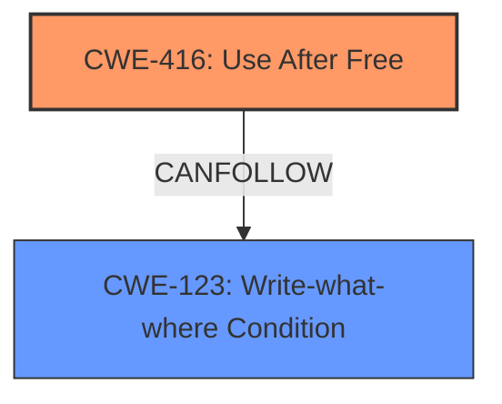

# Analysis Report for CVE-2021-4052

# Vulnerability Analysis Report: CVE-2021-4052

## Description

Use after free in web apps in Google Chrome prior to 96.0.4664.93 allowed an attacker who convinced a user to install a malicious extension to potentially exploit heap corruption via a crafted Chrome Extension.

## Vulnerability Description Key Phrases

**Rootcause:** use after free
**Weakness:** heap corruption
**Vector:** crafted Chrome Extension
**Attacker:** attacker
**Product:** Google Chrome
**Version:** prior to 96.0.4664.93
**Component:** web apps

## Analysis (with Relationship Data)

# Summary
| CWE ID  | CWE Name                      | Confidence | CWE Abstraction Level | CWE Vulnerability Mapping Label | CWE-Vulnerability Mapping Notes |
| :------- | :----------------------------- | :--------- | :--------------------- | :------------------------------ | :----------------------------- |
| CWE-416 | Use After Free                | 0.95      | Variant               | Allowed                       | Primary CWE                     |

## Evidence and Confidence

*   **Confidence Score:** 0.95
*   **Evidence Strength:** HIGH

- **Analysis and Justification:**
  - *Explanation:* The vulnerability description explicitly states "**use after free** in web apps". The CVE Reference Links Content Summary also confirms the **root cause** as "**use-after-free** in web apps." CWE-416 (Use After Free) is a Variant-level CWE that precisely matches this description: "The product reuses or references memory after it has been freed." The description notes "**heap corruption**" as a weakness, which is a common consequence of use-after-free vulnerabilities, however, the root cause is the 'use after free', so CWE-416 is more appropriate. The Retriever Results also rank CWE-416 as the top candidate with a high combined score.
  
  - *Relationship Analysis:* While CWE-416 does not have direct parent-child relationships listed in the provided information, it is often related to memory management issues. It can be a consequence of other weaknesses or lead to other vulnerabilities like CWE-123 (Write-what-where Condition).

- **Confidence Score:**
  - Confidence: 0.95 (High confidence due to direct evidence from vulnerability description and CVE reference materials)

## Criticism of Analysis

Okay, let's review the provided CWE analysis for CVE-2021-4052.

**Overall Assessment:**

The primary CWE mapping to CWE-416 (Use After Free) is accurate and well-supported by the provided information. The confidence score of 0.95 is justified. The analysis clearly connects the vulnerability description to the CWE definition, and the justification is strong.

**Detailed Review:**

*   **CWE-416 (Use After Free):**
    *   **Correctness:**  The analysis correctly identifies CWE-416 as the root cause. The vulnerability description explicitly mentions "use after free," making this a direct match. The provided CWE description for CWE-416 aligns perfectly: "The product reuses or references memory after it has been freed."
    *   **Abstraction Level:** Mapping to the Variant level is appropriate. The analysis correctly states that the Variant level is the preferred level for mapping to root causes.
    *   **Justification:** The justification is detailed and thorough. It clearly explains the connection between the vulnerability description, the CVE Reference Links Content Summary, and the CWE definition.
    *   **Relationship Analysis:** The relationship analysis correctly points out the connection between the use-after-free and memory management issues. The "CanPrecede" relationship to CWE-123 (Write-what-where Condition) is also accurate since a UAF can lead to an attacker writing arbitrary data to arbitrary locations.
    *   **Mitigations:** Mitigation strategies listed in CWE-416 are relevant.  Choosing a language with automatic memory management is a good long-term architectural solution. Setting pointers to NULL after freeing them is a practical, though not foolproof, mitigation technique.
    *   **Observed Examples:** The observed examples provided for CWE-416 are relevant and help to contextualize the weakness.

*   **Retriever Results Review (Alternative CWEs Considered):**

Let's consider why the other top CWEs from the Retriever Results were not chosen, keeping in mind that we are looking for the *root cause* of the vulnerability:

    *   **CWE-366 (Race Condition within a Thread):** While race conditions can *lead* to use-after-free vulnerabilities (as seen in the observed examples), the vulnerability description doesn't explicitly mention concurrency issues. If there was a race condition that resulted in memory being freed by one thread while another thread was still using it, this would be a more appropriate choice. Without that evidence, it is better to stick with direct cause.
    *   **CWE-843 (Access of Resource Using Incompatible Type ('Type Confusion')):** Type confusion *could* lead to memory corruption and potentially a use-after-free, but the description doesn't point to a type confusion issue. Type confusion is about misinterpreting the *type* of data at a memory location, whereas UAF is about accessing memory that has been *deallocated*.
    *   **CWE-415 (Double Free):** Double-free is *similar* to UAF but distinct.  It involves freeing the *same* memory twice. The vulnerability description specifies "use after free," not double free.
    *   **CWE-191 (Integer Underflow (Wrap or Wraparound)):** Integer overflows/underflows are not directly related to the description of the issue.
    *   **CWE-122 (Heap-based Buffer Overflow):** The description does not describe a classic buffer overflow, where data is written past the end of an allocated buffer. While a UAF *could* lead to a heap overflow if an attacker can control the contents of the freed memory, it is a consequence of UAF, not the root cause.
    *   **CWE-356 (Product UI does not Warn User of Unsafe Actions) & CWE-451 (User Interface (UI) Misrepresentation of Critical Information):** These relate to issues with the user interface, which isn't directly relevant to the code-level cause.
    *   **CWE-362 (Concurrent Execution using Shared Resource with Improper Synchronization ('Race Condition')):** Similar to CWE-366, a race condition could be involved, but the description doesn't specify it.

*   **"Heap Corruption" Mention:**
    The original vulnerability description includes "heap corruption."  While heap corruption is a *consequence* of a UAF (and other memory safety issues), CWE-416 is still the most appropriate root cause because it *explains* how the heap got corrupted.

**Recommendations:**

1.  **Maintain High Confidence in CWE-416:** The mapping to CWE-416 is well-supported and should be retained with the existing high confidence.
2.  **Consider adding CWE-123 to "CanFollow" relationship:** CWE-123 represents a "Write-What-Where Condition" and can frequently happen after a UAF vulnerability has been exploited. Add this to the relationship section to provide additional context.

**In summary, the analysis is accurate and well-justified.  The choice of CWE-416 is correct based on the provided information. The review considered alternative CWEs and correctly explained why they were not the most appropriate choice. The recommendation to add CWE-123 to "CanFollow" relationship adds additional context.**

## Final Resolution

# Summary
| CWE ID  | CWE Name                      | Confidence | CWE Abstraction Level | CWE Vulnerability Mapping Label | CWE-Vulnerability Mapping Notes |
| :------- | :----------------------------- | :--------- | :--------------------- | :------------------------------ | :----------------------------- |
| CWE-416 | Use After Free                | 0.95      | Variant               | Allowed                       | Primary CWE                     |
| CWE-123 | Write-what-where Condition  | 0.75      | Base                  | Allowed                       | Secondary Candidate - CanFollows CWE-416|

## Evidence and Confidence

*   **Confidence Score:** 0.90
*   **Evidence Strength:** HIGH

## Relationship Analysis
The primary relationship influencing the classification is the "CanFollow" relationship from **CWE-416 (Use After Free)** to **CWE-123 (Write-what-where Condition)**. This indicates that a use-after-free vulnerability can lead to an attacker writing arbitrary data to arbitrary memory locations. While **CWE-416** is a Variant, representing a specific type of memory corruption, **CWE-123** is a Base, describing a more general condition that can arise as a consequence. The abstraction levels were considered to ensure that the root cause is represented as specifically as possible (**CWE-416**), and the consequence is also noted (**CWE-123**).

## Vulnerability Chain
The vulnerability chain starts with the **ROOTCAUSE** of **CWE-416 (Use After Free)**. The product reuses or references memory after it has been freed. This can then lead to **CWE-123 (Write-what-where Condition)**, where an attacker can write arbitrary data to arbitrary locations in memory. The final impact is heap corruption, as stated in the vulnerability description.

## Summary of Analysis
The initial analysis correctly identified **CWE-416 (Use After Free)** as the primary CWE based on the explicit mention of "use after free" in the vulnerability description and CVE reference materials. The criticism confirmed this assessment and suggested adding **CWE-123 (Write-what-where Condition)** as a related CWE that can follow a use-after-free.

The decision to include **CWE-123** is based on the understanding that exploiting a use-after-free often involves overwriting the freed memory with malicious data, leading to arbitrary write capabilities. This aligns with the definition of **CWE-123**. While the vulnerability description mentions "heap corruption," this is a consequence of the arbitrary write and not the **ROOTCAUSE** itself.

The selected CWEs are at the optimal level of specificity. **CWE-416** accurately describes the **ROOTCAUSE**, and **CWE-123** represents a common consequence. This provides a comprehensive understanding of the vulnerability and its potential impact.

*Report generated on 2025-03-18 01:49:00*
