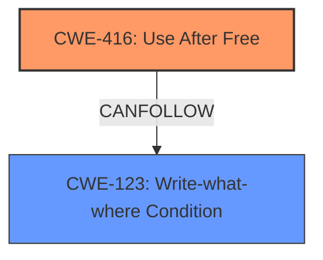

# Final Resolution for CVE-2021-4052

# Summary
| CWE ID  | CWE Name                      | Confidence | CWE Abstraction Level | CWE Vulnerability Mapping Label | CWE-Vulnerability Mapping Notes |
| :------- | :----------------------------- | :--------- | :--------------------- | :------------------------------ | :----------------------------- |
| CWE-416 | Use After Free                | 0.95      | Variant               | Allowed                       | Primary CWE                     |
| CWE-123 | Write-what-where Condition  | 0.75      | Base                  | Allowed                       | Secondary Candidate - CanFollows CWE-416|

## Evidence and Confidence

*   **Confidence Score:** 0.90
*   **Evidence Strength:** HIGH

## Relationship Analysis
The primary relationship influencing the classification is the "CanFollow" relationship from **CWE-416 (Use After Free)** to **CWE-123 (Write-what-where Condition)**. This indicates that a use-after-free vulnerability can lead to an attacker writing arbitrary data to arbitrary memory locations. While **CWE-416** is a Variant, representing a specific type of memory corruption, **CWE-123** is a Base, describing a more general condition that can arise as a consequence. The abstraction levels were considered to ensure that the root cause is represented as specifically as possible (**CWE-416**), and the consequence is also noted (**CWE-123**).

## Vulnerability Chain
The vulnerability chain starts with the **ROOTCAUSE** of **CWE-416 (Use After Free)**. The product reuses or references memory after it has been freed. This can then lead to **CWE-123 (Write-what-where Condition)**, where an attacker can write arbitrary data to arbitrary locations in memory. The final impact is heap corruption, as stated in the vulnerability description.

## Summary of Analysis
The initial analysis correctly identified **CWE-416 (Use After Free)** as the primary CWE based on the explicit mention of "use after free" in the vulnerability description and CVE reference materials. The criticism confirmed this assessment and suggested adding **CWE-123 (Write-what-where Condition)** as a related CWE that can follow a use-after-free.

The decision to include **CWE-123** is based on the understanding that exploiting a use-after-free often involves overwriting the freed memory with malicious data, leading to arbitrary write capabilities. This aligns with the definition of **CWE-123**. While the vulnerability description mentions "heap corruption," this is a consequence of the arbitrary write and not the **ROOTCAUSE** itself.

The selected CWEs are at the optimal level of specificity. **CWE-416** accurately describes the **ROOTCAUSE**, and **CWE-123** represents a common consequence. This provides a comprehensive understanding of the vulnerability and its potential impact.