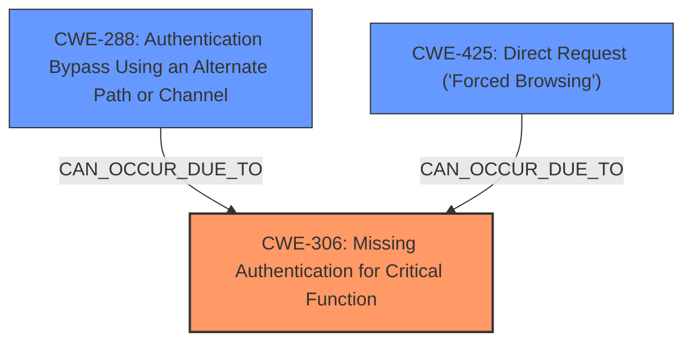

# Analysis Report for CVE-2021-40539

# Vulnerability Analysis Report: CVE-2021-40539

## Description

Zoho ManageEngine ADSelfService Plus version 6113 and prior is vulnerable to REST API authentication bypass with resultant remote code execution.

## Vulnerability Description Key Phrases

**Rootcause:** authentication bypass
**Impact:** remote code execution
**Product:** Zoho ManageEngine ADSelfService Plus
**Version:** 6113 and prior
**Component:** REST API

## Analysis (with Relationship Data)

# Summary
| CWE ID | CWE Name | Confidence | CWE Abstraction Level | CWE Vulnerability Mapping Label | CWE-Vulnerability Mapping Notes |
|---|---|---|---|---|---|
| CWE-306 | Missing Authentication for Critical Function | 0.95 | Base | Primary | Allowed |
| CWE-288 | Authentication Bypass Using an Alternate Path or Channel | 0.75 | Base | Secondary Candidate | Allowed |
| CWE-425 | Direct Request ('Forced Browsing') | 0.60 | Base | Secondary Candidate | Allowed |

## Evidence and Confidence

*   **Confidence Score:** 0.90
*   **Evidence Strength:** HIGH

- **Analysis and Justification:**  
  - *Explanation:* The vulnerability description clearly states an **authentication bypass** in the REST API of Zoho ManageEngine ADSelfService Plus, leading to remote code execution. The CVE Reference Links Content Summary confirms that the security filter for REST API requests fails to properly normalize URLs, allowing crafted URLs to bypass authentication. This aligns directly with CWE-306 [Missing Authentication for Critical Function], which describes a product not performing authentication for functionality requiring a provable user identity. Given the critical nature of REST API endpoints and the lack of authentication, CWE-306 is the most appropriate primary CWE. The MITRE mapping guidance for CWE-306 indicates this is ALLOWED.
  
  - *Relationship Analysis:* While CWE-288 [Authentication Bypass Using an Alternate Path or Channel] and CWE-425 [Direct Request ('Forced Browsing')] are also potential candidates, CWE-306 more directly addresses the root cause of completely missing authentication. CWE-288 and CWE-425 could be contributing factors, but the primary weakness is the lack of authentication for critical functions. There are no direct relationships to explore from CWE-306.

- **Confidence Score:**  
  - Confidence: 0.95 (High confidence due to clear evidence of missing authentication and the critical nature of the affected functionality.)

---

## Criticism of Analysis

Okay, here's a review of the provided CWE analysis, incorporating the full CWE specifications:

**Overall Assessment:**

The analysis is well-reasoned and generally accurate. The primary CWE selection of CWE-306 (Missing Authentication for Critical Function) is appropriate given the root cause described. The consideration of secondary CWEs like CWE-288 (Authentication Bypass Using an Alternate Path or Channel) and CWE-425 (Direct Request ('Forced Browsing')) adds valuable context. The confidence levels assigned are justified.  The explanation of why CWE-306 is preferred over the others is sound.

**Detailed Review:**

*   **CWE-306: Missing Authentication for Critical Function (Primary)**
    *   **Justification Strength:** Very Strong. The description of the vulnerability aligns perfectly with CWE-306. The REST API endpoints, being critical functionality, lack authentication, which allows unauthorized access. The fact that crafted URLs can bypass the filters is secondary to the fact that *any* URL should have *some* authentication.
    *   **Mitigation Alignment:** The mitigations suggested by CWE-306 (Architecture and Design considerations like dividing software into privilege levels, centralizing authentication, and avoiding custom routines) are precisely the types of measures that would prevent this vulnerability.  Duplicating checks on the server-side to avoid CWE-602 is also relevant, as the URL normalization should happen server-side.
    *   **Observed Examples Alignment:** The examples given in the CWE documentation like "TCP-based protocol in Programmable Logic Controller (PLC) has no authentication" align well with the concept of an API with no authentication.
    *   **Suggested Improvement:** None. This is a solid primary CWE selection.

*   **CWE-288: Authentication Bypass Using an Alternate Path or Channel (Secondary Candidate)**
    *   **Justification Strength:** Moderate. While the crafted URLs bypass the *intended* authentication, the problem isn't necessarily an "alternate path." It's more that the *primary* path has a flaw that allows it to be used without authentication.  However, it is still a reasonable secondary candidate, as the URL normalization issue creates a bypass.
    *   **Mitigation Alignment:** The mitigation for CWE-288, "Funnel all access through a single choke point," is relevant.  Proper URL normalization and authentication at a central point would have prevented this.
    *   **Observed Examples Alignment:** Some observed examples, like "Direct request of installation file allows attacker to create administrator accounts" align with the idea of crafting a URL to directly access a protected resource.
    *   **Suggested Improvement:** Consider emphasizing that the bypass is due to a *flaw in the primary authentication mechanism*, rather than a completely separate, unprotected channel.  This is a subtle but important distinction.

*   **CWE-425: Direct Request ('Forced Browsing') (Secondary Candidate)**
    *   **Justification Strength:** Moderate. The attack involves directly requesting API endpoints. The weakness in URL handling allows this direct access to succeed.
    *   **Mitigation Alignment:** The mitigations for CWE-425 are quite relevant: "Apply appropriate access control authorizations for each access to all restricted URLs, scripts or files."  This directly addresses the core issue of not properly restricting access to the API endpoints.
    *   **Observed Examples Alignment:** The example, "Bypass authentication via direct request" aligns well with the described scenario.
    *   **Suggested Improvement:** No change needed. The connection to this vulnerability is more indirect compared to the others, but still valid.

**Other Considerations from Retriever Results:**

*   **CWE-502: Deserialization of Untrusted Data:** This is incorrect. There is no mention of deserialization in the description.
*   **CWE-184: Incomplete List of Disallowed Inputs:** This is a possible contributing factor. If the URL normalization was attempting to *block* certain characters or patterns, and the list was incomplete, then CWE-184 would be applicable. However, without more information, it's speculative.
*   **CWE-602: Client-Side Enforcement of Server-Side Security:** If URL normalization happened in the client, then server-side, this would apply. However, the attack requires remote code execution, implying the server-side is where the vulnerability is.
*   **CWE-287: Improper Authentication:** As a Class, this is a parent of CWE-306, so it is incorrect for the same reasons.
*   **CWE-285: Improper Authorization:** There is an authentication vulnerability, not authorization, making this CWE incorrect.
*   **CWE-55: Path Equivalence: '/./' (Single Dot Directory) and CWE-918: Server-Side Request Forgery (SSRF):** There is no mention of either of these vulnerabilities, meaning they are incorrect.

**Recommendations:**

1.  **Maintain the primary CWE as CWE-306.** It's the most accurate representation of the root cause.
2.  **Keep CWE-288 and CWE-425 as secondary candidates.** They provide valuable context about the attack vector and contributing factors.
3.  **Ensure URL normalization happens on the server-side, not the client-side.** The mitigations must be implemented server-side to avoid potential bypass by clients.
4.  **Emphasize the flaw is in the primary authentication mechanism, not necessarily a completely separate alternate channel.**

By following these recommendations, the analysis will be even more precise and actionable for developers seeking to understand and remediate the vulnerability.

## Final Resolution

# Summary
| CWE ID | CWE Name | Confidence | CWE Abstraction Level | CWE Vulnerability Mapping Label | CWE-Vulnerability Mapping Notes |
|---|---|---|---|---|---|
| CWE-306 | Missing Authentication for Critical Function | 0.95 | Base | Primary CWE | Allowed |
| CWE-288 | Authentication Bypass Using an Alternate Path or Channel | 0.75 | Base | Secondary Candidate | Allowed |
| CWE-425 | Direct Request ('Forced Browsing') | 0.60 | Base | Secondary Candidate | Allowed |

## Evidence and Confidence

*   **Confidence Score:** 0.95
*   **Evidence Strength:** HIGH

## Relationship Analysis
The primary **WEAKNESS** is the **ROOTCAUSE** **CWE-306** [Missing Authentication for Critical Function], indicating a fundamental lack of authentication. **CWE-288** [Authentication Bypass Using an Alternate Path or Channel] and **CWE-425** [Direct Request ('Forced Browsing')] are secondary because they describe how the missing authentication can be exploited. There are no explicit ParentOf or ChildOf relationships shown for these in the provided data, but conceptually, **CWE-306** [Missing Authentication for Critical Function] is a specific case of the broader class of **authentication bypasses**. The abstraction levels influenced the selection by favoring the base level CWEs.

## Vulnerability Chain
The vulnerability chain begins with the **ROOTCAUSE**, which is the **WEAKNESS** described by **CWE-306** [Missing Authentication for Critical Function] in the REST API. This lack of authentication allows an attacker to bypass security measures (**CWE-288** [Authentication Bypass Using an Alternate Path or Channel]) and directly request sensitive API endpoints (**CWE-425** [Direct Request ('Forced Browsing')]). This ultimately leads to remote code execution, which is the impact.

## Summary of Analysis
The initial analysis and criticism both converge on **CWE-306** [Missing Authentication for Critical Function] as the most appropriate primary CWE. The vulnerability description states "REST API authentication bypass," and the CVE Reference Links Content Summary confirms the failure to properly normalize URLs, enabling bypass. This evidence strongly supports the selection of **CWE-306** [Missing Authentication for Critical Function]. While **CWE-288** [Authentication Bypass Using an Alternate Path or Channel] and **CWE-425** [Direct Request ('Forced Browsing')] are relevant, they describe the exploitation method rather than the fundamental flaw. The graph relationships, although not explicitly defined in the provided data, conceptually support this classification. The selection of base-level CWEs ensures optimal specificity, as recommended by MITRE mapping guidance. The high confidence is based on the clear evidence of missing authentication for critical functionality.

*Report generated on 2025-03-17 03:34:09*
