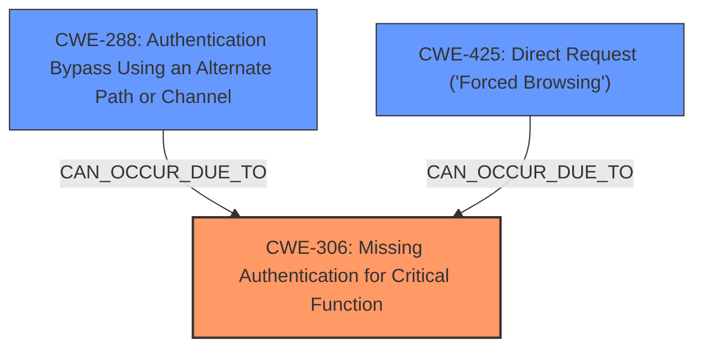

# Final Resolution for CVE-2021-40539

# Summary
| CWE ID | CWE Name | Confidence | CWE Abstraction Level | CWE Vulnerability Mapping Label | CWE-Vulnerability Mapping Notes |
|---|---|---|---|---|---|
| CWE-306 | Missing Authentication for Critical Function | 0.95 | Base | Primary CWE | Allowed |
| CWE-288 | Authentication Bypass Using an Alternate Path or Channel | 0.75 | Base | Secondary Candidate | Allowed |
| CWE-425 | Direct Request ('Forced Browsing') | 0.60 | Base | Secondary Candidate | Allowed |

## Evidence and Confidence

*   **Confidence Score:** 0.95
*   **Evidence Strength:** HIGH

## Relationship Analysis
The primary **WEAKNESS** is the **ROOTCAUSE** **CWE-306** [Missing Authentication for Critical Function], indicating a fundamental lack of authentication. **CWE-288** [Authentication Bypass Using an Alternate Path or Channel] and **CWE-425** [Direct Request ('Forced Browsing')] are secondary because they describe how the missing authentication can be exploited. There are no explicit ParentOf or ChildOf relationships shown for these in the provided data, but conceptually, **CWE-306** [Missing Authentication for Critical Function] is a specific case of the broader class of **authentication bypasses**. The abstraction levels influenced the selection by favoring the base level CWEs.

## Vulnerability Chain
The vulnerability chain begins with the **ROOTCAUSE**, which is the **WEAKNESS** described by **CWE-306** [Missing Authentication for Critical Function] in the REST API. This lack of authentication allows an attacker to bypass security measures (**CWE-288** [Authentication Bypass Using an Alternate Path or Channel]) and directly request sensitive API endpoints (**CWE-425** [Direct Request ('Forced Browsing')]). This ultimately leads to remote code execution, which is the impact.

## Summary of Analysis
The initial analysis and criticism both converge on **CWE-306** [Missing Authentication for Critical Function] as the most appropriate primary CWE. The vulnerability description states "REST API authentication bypass," and the CVE Reference Links Content Summary confirms the failure to properly normalize URLs, enabling bypass. This evidence strongly supports the selection of **CWE-306** [Missing Authentication for Critical Function]. While **CWE-288** [Authentication Bypass Using an Alternate Path or Channel] and **CWE-425** [Direct Request ('Forced Browsing')] are relevant, they describe the exploitation method rather than the fundamental flaw. The graph relationships, although not explicitly defined in the provided data, conceptually support this classification. The selection of base-level CWEs ensures optimal specificity, as recommended by MITRE mapping guidance. The high confidence is based on the clear evidence of missing authentication for critical functionality.