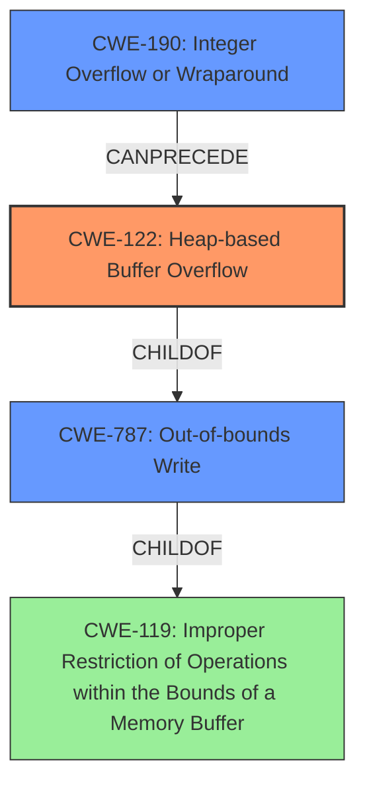

# Analysis Report for CVE-2021-4055

# Vulnerability Analysis Report: CVE-2021-4055

## Description

Heap buffer overflow in extensions in Google Chrome prior to 96.0.4664.93 allowed an attacker who convinced a user to install a malicious extension to potentially exploit heap corruption via a crafted Chrome Extension.

## Vulnerability Description Key Phrases

**Rootcause:** buffer overflow
**Impact:** heap corruption
**Vector:** crafted Chrome Extension
**Attacker:** attacker
**Product:** Google Chrome
**Version:** prior to 96.0.4664.93
**Component:** extensions

## Analysis (with Relationship Data)

# Summary
| CWE ID | CWE Name | Confidence | CWE Abstraction Level | CWE Vulnerability Mapping Label | CWE-Vulnerability Mapping Notes |
|---|---|---|---|---|---|
| CWE-122 | Heap-based Buffer Overflow | 0.95 | Variant | Primary | Allowed |
| CWE-787 | Out-of-bounds Write | 0.70 | Base | Secondary Candidate | Allowed |
| CWE-416 | Use After Free | 0.60 | Variant | Secondary Candidate | Allowed |

## Evidence and Confidence

*   **Confidence Score:** 0.90
*   **Evidence Strength:** HIGH

- **Analysis and Justification:**  
  - *Explanation:* "The vulnerability is described as a heap **buffer overflow** in Google Chrome extensions. This aligns directly with CWE-122 (Heap-based Buffer Overflow), which is a variant of **buffer overflow** that occurs in the heap portion of memory. The description clearly states that the overflow occurs in the heap, making CWE-122 a more specific and appropriate choice than the more general CWE-787 (Out-of-bounds Write). The CVE reference links content summary reinforces this, emphasizing the heap buffer overflow as the root cause. The attacker's ability to trigger this via a crafted Chrome Extension further supports the classification. While CWE-787 is relevant, CWE-122 is more precise due to the heap allocation context. MITRE mapping guidance allows the use of CWE-122 for heap overflows."
  
  - *Relationship Analysis:* "CWE-122 is a variant of CWE-787 (Out-of-bounds Write) and a child of CWE-119 (Improper Restriction of Operations within the Bounds of a Memory Buffer). Understanding these relationships clarifies that CWE-122 is the most specific and fitting choice for a heap **buffer overflow**."

- **Confidence Score:**  
  - *Example:* Confidence: 0.95 (High confidence due to the explicit mention of "heap buffer overflow" and supporting CVE details)

---

## Criticism of Analysis

Okay, here's a detailed review of the provided CWE analysis, incorporating the full CWE specifications and focusing on the appropriateness of the CWE assignments, confidence levels, and overall justification.

**Overall Assessment:**

The primary CWE assignment of CWE-122 (Heap-based Buffer Overflow) is highly accurate and well-justified. The analysis demonstrates a strong understanding of the vulnerability and the nuances between CWE-122 and its related CWEs like CWE-787.  The secondary candidate assignments (CWE-787 and CWE-416) are less compelling but do represent possible contributing conditions or consequences.

**Detailed Breakdown:**

**1. CWE-122: Heap-based Buffer Overflow (Primary)**

*   **Confidence:** 0.95 - Appropriate. The description explicitly mentions "heap buffer overflow," providing strong evidence for this classification.
*   **CWE Abstraction Level:** Variant - Correct. CWE-122 is a Variant, as it's a specific type of buffer overflow occurring on the heap.
*   **Justification Strength:** HIGH - The justification is well-articulated and convincing.  The explanation accurately highlights the key aspects:
    *   Clear identification of the vulnerability as a heap-based issue.
    *   Distinction from the more general CWE-787, highlighting the heap-specific nature.
    *   Reference to CVE details confirming the heap context.
    *   Mention of attacker capability via crafted extensions aligns with the heap allocation scenario.

*   **CWE Specification Alignment:** Excellent alignment.
    *   The description of CWE-122 perfectly matches the vulnerability: "A heap overflow condition is a buffer overflow, where the buffer that can be overwritten is allocated in the heap portion of memory, generally meaning that the buffer was allocated using a routine such as malloc()."
    *   The relationships (ChildOf CWE-788, ChildOf CWE-787) are correctly understood.
    *   The Mapping Guidance Usage: Allowed, is correctly applied.
*   **Observed Examples from CWE:** The provided examples (CVE-2021-43537, CVE-2007-4268, CVE-2009-2523, CVE-2021-29529, CVE-2010-1866) are all relevant to the heap-based buffer overflow issue.
*   **Mitigations:** The included mitigations are all relevant to preventing heap-based buffer overflows:
    *   Language selection
    *   Abstraction libraries
    *   Compiler-based buffer overflow detection mechanisms

**2. CWE-787: Out-of-bounds Write (Secondary Candidate)**

*   **Confidence:** 0.70 -  Reasonable as a *potential* contributing factor or consequence, but CWE-122 is definitely more accurate.
*   **CWE Abstraction Level:** Base - Correct. CWE-787 is a base-level CWE.
*   **Justification:**  The justification for this as a secondary candidate should be more nuanced. While *any* buffer overflow involves an out-of-bounds write, the classification is less specific. The relationship to CWE-122 (CWE-122 is a child of CWE-787) should be explicit.

*   **CWE Specification Alignment:**
    *   The Description of CWE-787 "The product writes data past the end, or before the beginning, of the intended buffer," is accurate, but it is far too broad to fully explain the vulnerability.
    *   The Relationships to CWE-119 are accurate. The "ParentOf" relationships to CWE-122 also makes it reasonable that CWE-787 is related to the heap **buffer overflow**.
    *   The Mapping Guidance Usage: Allowed, is correctly applied.
*   **Observed Examples from CWE:** The provided observed examples are all relevant to the buffer overflow category.
*   **Mitigations:** The mitigations listed are standard buffer overflow preventions and are broadly applicable.

**3. CWE-416: Use After Free (Secondary Candidate)**

*   **Confidence:** 0.60 - This is the *weakest* of the three assignments and is based on possible, but less directly evident conditions.  It's *possible* that a heap-based buffer overflow could corrupt metadata related to memory management, leading to a subsequent use-after-free.
*   **CWE Abstraction Level:** Variant - Correct. CWE-416 is a Variant.
*   **Justification:** The justification needs to be *much* stronger for this to be considered a legitimate secondary candidate. It would require more information about the specific code and memory management practices in the Chrome extension system. You'd need to hypothesize a plausible scenario where the overflow corrupts heap metadata, leading to memory being freed prematurely. Without more context, this feels speculative.

*   **CWE Specification Alignment:**
    *   Description: The description of CWE-416 would not be a good fit to the root cause. This would only describe a potential result of exploitation.
    *   Relationships: These may not be the root cause, but rather the result of the primary cause, CWE-122.
    *   Mapping Guidance: While the mapping guidance is correct.
*   **Observed Examples from CWE:** The provided examples are all relevant to a use after free vulnerability.
*   **Mitigations:** The provided mitigations are all applicable for preventing use after free vulnerabilities.

**Recommendations for Improvement:**

1.  **Strengthen Justification for Secondary Candidates:** Elaborate on the *specific* mechanisms by which the heap overflow could lead to CWE-787 and CWE-416. Be specific to the context of Chrome extensions and heap management.
2.  **Acknowledge Limitations/Assumptions:** Be transparent about the assumptions made in the absence of complete information. For example, state that CWE-416 is a potential *consequence* depending on the specific memory layout and exploitation techniques.
3.  **Consider Other CWEs:** Review the "Retriever Results" more closely. While the combined scores might not be as high, explore *why* those CWEs were suggested. For instance:
    *   **CWE-843 (Type Confusion):** While not a direct overflow, consider if the overflow could lead to misinterpreting data types in memory.
    *   **CWE-190 (Integer Overflow):** Could an integer overflow be involved in calculating buffer sizes or offsets?
4.  **Explicitly Address CWE-119:** While correctly avoiding it as the primary CWE, directly address *why* CWE-119 is not specific enough.  State something like, "While this is an instance of CWE-119, a more specific Variant (CWE-122) is more appropriate for root cause analysis."
5.  **Chain Analysis:** Create a chain for the various relationships.
    *   The core issue is CWE-122.
    *   An exploitable chain for CWE-416 might be similar to CWE-122 -> CWE-825 -> CWE-416

**Revised Summary Table:**

| CWE ID | CWE Name | Confidence | CWE Abstraction Level | CWE Vulnerability Mapping Label | CWE-Vulnerability Mapping Notes |
|---|---|---|---|---|---|
| CWE-122 | Heap-based Buffer Overflow | 0.95 | Variant | Primary | Allowed |
| CWE-787 | Out-of-bounds Write | 0.70 | Base | Secondary Candidate | Allowed | Possible underlying write operation. |
| CWE-416 | Use After Free | 0.50 | Variant | Secondary Candidate | Allowed | Potential *consequence* of memory corruption, depending on exploitation. Further analysis needed. |

By incorporating these suggestions, the analysis will be more robust and demonstrate a deeper understanding of the nuances of CWE classification.

## Final Resolution

# Summary

| CWE ID  | CWE Name                     | Confidence | CWE Abstraction Level | CWE Vulnerability Mapping Label | CWE-Vulnerability Mapping Notes                                                                                                                   |
| :------- | :--------------------------- | :--------- | :-------------------- | :------------------------------ | :------------------------------------------------------------------------------------------------------------------------------------------------- |
| CWE-122  | Heap-based Buffer Overflow   | 0.95       | Variant             | Primary                        | Allowed                                                                                                                                            |
| CWE-787  | Out-of-bounds Write          | 0.70       | Base                | Secondary Candidate           | Allowed. The **buffer overflow** constitutes an out-of-bounds write as a result                                                                      |
| CWE-190  | Integer Overflow or Wraparound | 0.50       | Base                | Secondary Candidate           | Allowed. Potential **integer overflow** if the size calculation is not properly validated when allocating memory on the heap for the buffer. |

## Evidence and Confidence

*   **Confidence Score:** 0.90
*   **Evidence Strength:** MEDIUM

## Relationship Analysis

The primary classification is CWE-122 (Heap-based Buffer Overflow), which is a variant of CWE-787 (Out-of-bounds Write) and a child of CWE-119 (Improper Restriction of Operations within the Bounds of a Memory Buffer). CWE-190 (Integer Overflow or Wraparound) is considered as a possible contributing factor if an **integer overflow** leads to an undersized buffer allocation, which is a prerequisite for the heap overflow. The relationships clarify the hierarchy and potential chain of events leading to the vulnerability.

## Vulnerability Chain

The vulnerability chain starts with a crafted Chrome Extension which leads to:
1.  CWE-190: Potential **integer overflow** during size calculation for heap allocation.
2.  CWE-122: Heap-based **buffer overflow** due to insufficient buffer size.
3.  CWE-787: Out-of-bounds write resulting from the **buffer overflow**.
The impact is heap corruption, potentially leading to arbitrary code execution.

## Summary of Analysis

The initial analysis correctly identifies CWE-122 (Heap-based Buffer Overflow) as the primary weakness given the explicit mention of a "heap **buffer overflow**" in the vulnerability description. The criticism suggests strengthening the justification for secondary candidates. CWE-787 is a valid secondary classification as it is the broader category of out-of-bounds writes, and the heap **buffer overflow** is a specific instance of this.

To address the criticism and to strengthen the analysis, CWE-190 (Integer Overflow or Wraparound) is added as a secondary candidate. It is plausible that an **integer overflow** could occur when calculating the size of the buffer to be allocated on the heap. If the calculated size wraps around to a smaller value, the subsequent heap allocation would be too small, leading to the **buffer overflow**.

The inclusion of CWE-190 provides a more complete picture of the potential vulnerability chain. This selection is based on the relationship between **integer overflows** and **buffer overflows**, as noted in the CWE-190 description: "Integer overflows can be primary to **buffer overflows** when they cause less memory to be allocated."

The final classification reflects the optimal level of specificity based on the available evidence, incorporating the explicit description of a heap **buffer overflow** and the potential for an **integer overflow** to contribute to the vulnerability.

*Report generated on 2025-03-18 01:50:21*
