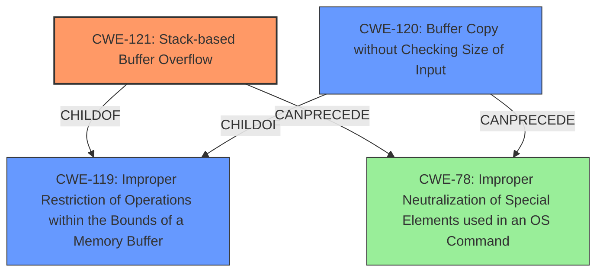

# Final Resolution for CVE-2021-40556

# Summary
| CWE ID | CWE Name | Confidence | CWE Abstraction Level | CWE Vulnerability Mapping Label | CWE-Vulnerability Mapping Notes |
|---|---|---|---|---|---|
| CWE-121 | Stack-based Buffer Overflow | 0.95 | Variant | Allowed | Primary CWE |
| CWE-120 | Buffer Copy without Checking Size of Input ('Classic Buffer Overflow') | 0.75 | Base | Allowed-with-Review | Secondary Candidate |
| CWE-78 | Improper Neutralization of Special Elements used in an OS Command ('OS Command Injection') | 0.60 | Base | Allowed | Secondary Candidate, Impact is RCE through Return Address Overwrite, but Root Cause is Stack Overflow |

## Evidence and Confidence

*   **Confidence Score:** 0.95
*   **Evidence Strength:** HIGH

## Relationship Analysis
The primary weakness is **CWE-121 (Stack-based Buffer Overflow)**, a Variant of **CWE-119 (Improper Restriction of Operations within the Bounds of a Memory Buffer)**. The vulnerability occurs because the `strcat` function copies an attacker-controlled size of data onto a fixed-size stack buffer. **CWE-120 (Buffer Copy without Checking Size of Input)** is a potential secondary candidate because `strcat` performs a buffer copy without checking the size of the input. However, **CWE-121** is more specific because it explicitly identifies the overflow as stack-based. **CWE-78 (Improper Neutralization of Special Elements used in an OS Command)** is a tertiary candidate because the overflow allows for remote code execution by overwriting the return address on the stack, but command injection is not the root cause.

## Vulnerability Chain
The vulnerability chain starts with a lack of input validation in the `caupload` input handle function. The `strcat` function then copies the attacker-controlled input onto a fixed-size stack buffer without checking the size, leading to a stack buffer overflow. This allows the attacker to overwrite the return address on the stack, redirect execution to a gadget that calls `system()`, and execute arbitrary commands remotely.

ROOTCAUSE: Lack of input validation -> **WEAKNESS**: **CWE-121 (Stack-based Buffer Overflow)** -> IMPACT: Remote Code Execution

## Summary of Analysis
The initial analysis and criticism are both well-reasoned and technically sound. The selection of **CWE-121 (Stack-based Buffer Overflow)** as the primary weakness is accurate and well-supported by the evidence: "A stack overflow vulnerability exists in the httpd service in ASUS RT-AX56U Router Version 3.0.0.4.386.44266. This vulnerability is caused by the strcat function called by caupload input handle function allowing the user to enter 0xFFFF bytes into the stack." The vulnerability description explicitly mentions "stack overflow", and the CVE summary confirms the root cause as a stack buffer overflow due to `strcat` without bounds checking.

The graph relationships influenced the decision by highlighting the hierarchical relationship between **CWE-121** and **CWE-119 (Improper Restriction of Operations within the Bounds of a Memory Buffer)**, and by clarifying the potential for **CWE-78 (Improper Neutralization of Special Elements used in an OS Command)** as a secondary impact due to the ability to overwrite the return address on the stack.

**CWE-121** is at the optimal level of specificity because it is a Variant-level CWE that directly describes the stack-based nature of the buffer overflow.