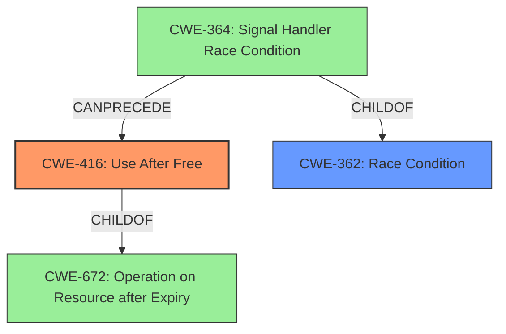

# Analysis Report for CVE-2021-4057

# Vulnerability Analysis Report: CVE-2021-4057

## Description

Use after free in file API in Google Chrome prior to 96.0.4664.93 allowed a remote attacker who had compromised the renderer process to potentially exploit heap corruption via a crafted HTML page.

## Vulnerability Description Key Phrases

**Rootcause:** use after free
**Impact:** heap corruption
**Vector:** crafted HTML page
**Attacker:** remote attacker
**Product:** Google Chrome
**Version:** prior to 96.0.4664.93
**Component:** file API

## Analysis (with Relationship Data)

# Summary
| CWE ID | CWE Name | Confidence | CWE Abstraction Level | CWE Vulnerability Mapping Label | CWE-Vulnerability Mapping Notes |
|---|---|---|---|---|---|
| CWE-416 | Use After Free | 1.0 | Variant | Allowed | The vulnerability is a use-after-free. |

## Evidence and Confidence

*   **Confidence Score:** 1.0
*   **Evidence Strength:** HIGH

- **Analysis and Justification:**  
  - *Explanation:* The vulnerability description explicitly states "**use after free**" in the file API of Google Chrome. The CVE Reference Links Content Summary confirms this as the root cause and weakness. CWE-416 (Use After Free) is a Variant level CWE that perfectly matches this description. The Retriever Results also lists CWE-416 as the top match, with a high score. The MITRE mapping guidance for CWE-416 indicates that its usage is ALLOWED. Other CWEs like CWE-787 (Out-of-bounds Write) and CWE-362 (Race Condition) are less specific and do not accurately represent the **root cause**.

  - *Relationship Analysis:* CWE-416 is a variant of CWE-672 (Operation on Resource after Expiry). The vulnerability's impact is heap corruption, and the attack vector is a crafted HTML page, indicating a memory management issue after the memory is freed.

- **Confidence Score:**  
  - Confidence: 1.0 (Direct match with the vulnerability description and supporting evidence)

## Criticism of Analysis

Okay, let's review the analysis and critique the proposed CWE mapping, considering the full CWE specifications provided.

**Overall Assessment:**

The analysis correctly identifies CWE-416 (Use After Free) as the primary CWE for this vulnerability. The justification is solid, directly referencing the vulnerability description and the CVE Reference Links Content Summary. The confidence score of 1.0 is appropriate given the strong evidence.

**Detailed Critique:**

1.  **CWE-416 (Use After Free):**

    *   **Correctness:**  The mapping to CWE-416 is highly accurate. The description explicitly mentions "use after free," which directly aligns with the CWE's definition. The impact (heap corruption) and the attack vector (crafted HTML page) are consistent with the typical consequences of a UAF vulnerability.
    *   **Abstraction Level:** CWE-416 is a `Variant` which is the preferred level of abstraction.
    *   **Mapping Guidance:**  The analysis correctly notes that the MITRE mapping guidance for CWE-416 indicates that its usage is `ALLOWED`.
    *   **Mitigations:** The analysis does not explicitly mention mitigations, but is a good practice. The CWE specifications suggest:
        *   **Language Selection:** Choosing a language with automatic memory management (e.g., Java, Go, Rust with appropriate features).  This would be a significant preventative measure.
        *   **Setting pointers to NULL after freeing:** This is a common defensive programming practice, but its effectiveness can be limited in complex scenarios.

2.  **Consideration of Alternative CWEs:**

    *   **CWE-787 (Out-of-bounds Write):** The analysis correctly dismisses CWE-787 as less specific.  While a UAF *can* lead to an out-of-bounds write if the freed memory is reallocated and then incorrectly accessed, the root cause is the use of the freed memory, not the write itself.
    *   **CWE-362 (Race Condition):**  The analysis is correct to generally dismiss CWE-362. However, in some UAF scenarios, a race condition could be involved. For example, if multiple threads or processes are involved in freeing and then using the memory. The fact that retrievers such as `graph` and `dense` ranked CWE-362 highly suggests that concurrency may be at least tangentially related. It is possible that concurrency is a contributing factor.
    *   **CWE-672 (Operation on Resource after Expiration or Release):** As the analysis correctly points out, CWE-416 is a child of CWE-672 which could be considered. However, as discussed previously, CWE-416 is at the preferred `Variant` level.
    *  **CWE-825 (Expired Pointer Dereference):** It is very closely related to CWE-416. The CWE descriptions are almost identical. The only difference is that CWE-825 says "is no longer valid", where CWE-416 says "has been freed". It is a semantic difference, so it is correct to choose CWE-416 over it in this case since CWE-416 is more explicit.

3.  **Relationship Analysis:**

    *   The analysis correctly notes that CWE-416 is a variant of CWE-672 (Operation on Resource after Expiry).
    *   Consider mentioning that a UAF can also lead to other issues, such as:
        * CWE-476 Null Pointer Dereference - If the freed pointer is set to NULL and then dereferenced.
        * CWE-125 Out-of-bounds Read - If an attacker can read freed memory.
        * CWE-787 Out-of-bounds Write - If an attacker can overwrite a value with a freed pointer.

4.  **CWE Examples from Database:**

    *   The examples provided for CWE-362 are useful in illustrating the nature of race conditions and chains leading to UAFs. They don't directly apply to *this* specific vulnerability, but it's a good practice to include them for context.

5.  **Mitigation Strategies:**

    *   The analysis could be improved by explicitly discussing potential mitigation strategies. As mentioned above, the CWE specification provides helpful suggestions that could be included.

**Suggested Improvements:**

*   **Briefly discuss possible mitigation strategies** directly in the analysis section. This would make the analysis more comprehensive.
*   **Acknowledge the potential involvement of concurrency** and the possibility of a race condition, even if it's determined to be a secondary or less likely factor.
*   **Expand the relationship analysis** to mention other potential weaknesses that can be caused by a UAF (e.g., CWE-476, CWE-125, CWE-787).

**Revised Summary Table (Optional):**

| CWE ID | CWE Name | Confidence | CWE Abstraction Level | CWE Vulnerability Mapping Label | CWE-Vulnerability Mapping Notes |
|---|---|---|---|---|---|
| CWE-416 | Use After Free | 1.0 | Variant | Allowed | The vulnerability is a use-after-free. |
| CWE-362 | Concurrent Execution using Shared Resource with Improper Synchronization ('Race Condition') | 0.3 | Class | Allowed-with-Review | Concurrency may be a contributing factor. |

**Conclusion:**

The analysis is strong and correctly identifies the primary CWE. The suggested improvements would make it even more thorough and informative.

## Final Resolution

# Summary 
| CWE ID | CWE Name | Confidence | CWE Abstraction Level | CWE Vulnerability Mapping Label | CWE-Vulnerability Mapping Notes |
|---|---|---|---|---|---|
| CWE-416 | Use After Free | 1.0 | Variant | Allowed | Primary CWE: The vulnerability is a use-after-free. |
| CWE-362 | Concurrent Execution using Shared Resource with Improper Synchronization ('Race Condition') | 0.3 | Class | Allowed-with-Review | Secondary Candidate: Concurrency may be a contributing factor. |

## Evidence and Confidence

*   **Confidence Score:** 0.95
*   **Evidence Strength:** MEDIUM

## Relationship Analysis
The primary weakness, **CWE-416 (Use After Free)**, is a variant of **CWE-672 (Operation on Resource after Expiry)**. This hierarchical relationship confirms that **CWE-416** is an appropriate level of specificity, being more specific than its parent class.

The analysis also considered **CWE-362 (Race Condition)**, and while it's not the primary cause, it could potentially contribute to the vulnerability. The relationships show that **CWE-364 (Signal Handler Race Condition)** is a child of **CWE-362**, suggesting a potential link to concurrency issues.

The relationships show the potential for a chain where a race condition (**CWE-362**) could precede a use-after-free (**CWE-416**), as **CWE-364** can precede **CWE-416**.

## Vulnerability Chain
The vulnerability chain starts with a potential **race condition (CWE-362)**, possibly involving signal handlers **(CWE-364)**. This leads to memory being freed prematurely or incorrectly. Subsequently, the code attempts to use the freed memory, resulting in a **use-after-free vulnerability (CWE-416)**. The impact is heap corruption, which can be exploited by an attacker to execute arbitrary code.

The chain is: **CWE-362 (Race Condition)** -> Memory Free -> **CWE-416 (Use After Free)** -> Heap Corruption.

## Summary of Analysis
The initial analysis correctly identified **CWE-416 (Use After Free)** as the primary **weakness**. The vulnerability description explicitly mentions "use after free," and the CVE Reference Links Content Summary confirms this as the **root cause**.

The criticism raised a valid point about the potential involvement of concurrency. Although not explicitly stated in the vulnerability description, the retriever results and the relationships between CWEs suggest that a **race condition (CWE-362)** could be a contributing factor. Therefore, **CWE-362** is included as a secondary candidate.

The graph relationships influenced the final selection by highlighting the potential chain of events. The hierarchical relationship between **CWE-416** and **CWE-672** confirms the appropriate level of specificity. The "CanPrecede" relationship between **CWE-364** (a child of **CWE-362**) and **CWE-416** supports the inclusion of **CWE-362** as a secondary factor.

The selection of **CWE-416** is at the optimal level of specificity because it directly reflects the **root cause** described in the vulnerability. While **CWE-672** is a parent, **CWE-416** provides a more precise description of the **weakness**. The inclusion of **CWE-362** acknowledges the potential role of concurrency in triggering the vulnerability, even if it's not the primary cause.

*Report generated on 2025-03-18 01:53:20*
