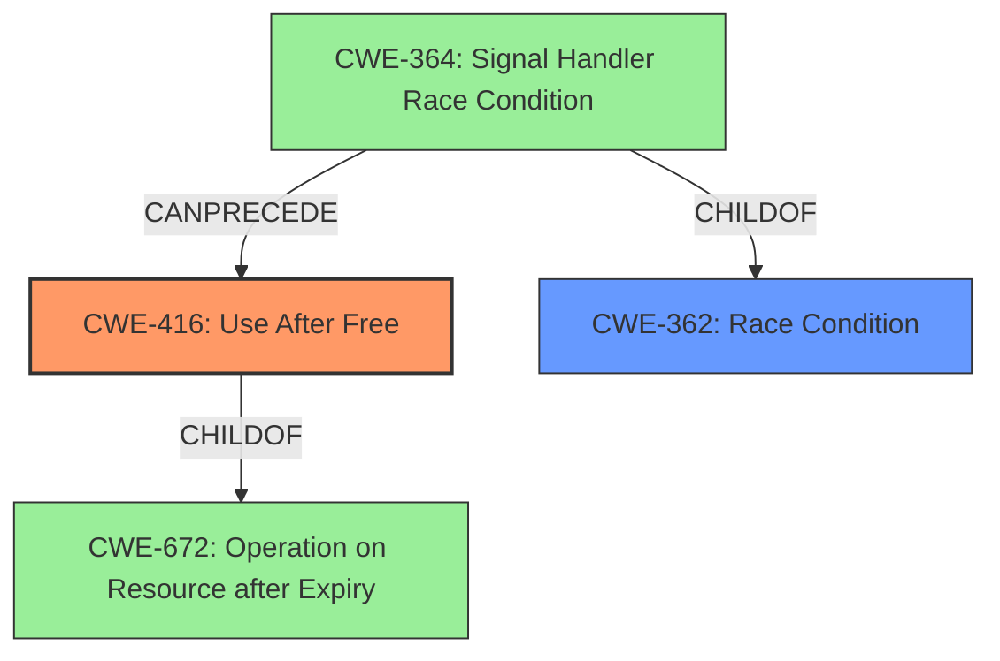

# Final Resolution for CVE-2021-4057

# Summary 
| CWE ID | CWE Name | Confidence | CWE Abstraction Level | CWE Vulnerability Mapping Label | CWE-Vulnerability Mapping Notes |
|---|---|---|---|---|---|
| CWE-416 | Use After Free | 1.0 | Variant | Allowed | Primary CWE: The vulnerability is a use-after-free. |
| CWE-362 | Concurrent Execution using Shared Resource with Improper Synchronization ('Race Condition') | 0.3 | Class | Allowed-with-Review | Secondary Candidate: Concurrency may be a contributing factor. |

## Evidence and Confidence

*   **Confidence Score:** 0.95
*   **Evidence Strength:** MEDIUM

## Relationship Analysis
The primary weakness, **CWE-416 (Use After Free)**, is a variant of **CWE-672 (Operation on Resource after Expiry)**. This hierarchical relationship confirms that **CWE-416** is an appropriate level of specificity, being more specific than its parent class.

The analysis also considered **CWE-362 (Race Condition)**, and while it's not the primary cause, it could potentially contribute to the vulnerability. The relationships show that **CWE-364 (Signal Handler Race Condition)** is a child of **CWE-362**, suggesting a potential link to concurrency issues.

The relationships show the potential for a chain where a race condition (**CWE-362**) could precede a use-after-free (**CWE-416**), as **CWE-364** can precede **CWE-416**.

## Vulnerability Chain
The vulnerability chain starts with a potential **race condition (CWE-362)**, possibly involving signal handlers **(CWE-364)**. This leads to memory being freed prematurely or incorrectly. Subsequently, the code attempts to use the freed memory, resulting in a **use-after-free vulnerability (CWE-416)**. The impact is heap corruption, which can be exploited by an attacker to execute arbitrary code.

The chain is: **CWE-362 (Race Condition)** -> Memory Free -> **CWE-416 (Use After Free)** -> Heap Corruption.

## Summary of Analysis
The initial analysis correctly identified **CWE-416 (Use After Free)** as the primary **weakness**. The vulnerability description explicitly mentions "use after free," and the CVE Reference Links Content Summary confirms this as the **root cause**.

The criticism raised a valid point about the potential involvement of concurrency. Although not explicitly stated in the vulnerability description, the retriever results and the relationships between CWEs suggest that a **race condition (CWE-362)** could be a contributing factor. Therefore, **CWE-362** is included as a secondary candidate.

The graph relationships influenced the final selection by highlighting the potential chain of events. The hierarchical relationship between **CWE-416** and **CWE-672** confirms the appropriate level of specificity. The "CanPrecede" relationship between **CWE-364** (a child of **CWE-362**) and **CWE-416** supports the inclusion of **CWE-362** as a secondary factor.

The selection of **CWE-416** is at the optimal level of specificity because it directly reflects the **root cause** described in the vulnerability. While **CWE-672** is a parent, **CWE-416** provides a more precise description of the **weakness**. The inclusion of **CWE-362** acknowledges the potential role of concurrency in triggering the vulnerability, even if it's not the primary cause.