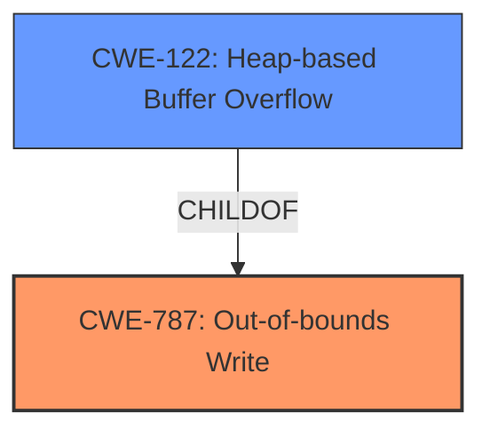

# Final Resolution for CVE-2021-4058

# Summary
| CWE ID | CWE Name | Confidence | CWE Abstraction Level | CWE Vulnerability Mapping Label | CWE-Vulnerability Mapping Notes |
|---|---|---|---|---|---|
| CWE-787 | Out-of-bounds Write | 1.0 | Base | Allowed | Primary CWE |
| CWE-122 | Heap-based Buffer Overflow | 0.7 | Variant | Allowed | Secondary Candidate |

## Evidence and Confidence

*   **Confidence Score:** 1.0
*   **Evidence Strength:** HIGH

## Relationship Analysis
The primary relationship influencing the decision is the parent-child relationship between CWE-787 (**Out-of-bounds Write**) and CWE-122 (**Heap-based Buffer Overflow**). CWE-122 is a variant of CWE-787, providing more specific context. However, since CWE-787 is a base class, it is the more appropriate primary mapping.

## Vulnerability Chain
The vulnerability chain starts with the introduction of a crafted HTML page (input). This input leads to a **HEAP BUFFER OVERFLOW** (CWE-122), which is a specific type of **OUT-OF-BOUNDS WRITE** (CWE-787). The consequence of this overflow is potential heap corruption, which can lead to arbitrary code execution.

## Summary of Analysis
The initial analysis correctly identified CWE-787 (**Out-of-bounds Write**) as the primary CWE and CWE-122 (**Heap-based Buffer Overflow**) as a secondary candidate. This assessment is based on the vulnerability description, which explicitly mentions a "Heap buffer overflow in ANGLE in Google Chrome prior to 96.0.4664.93 allowed a remote attacker to potentially exploit heap corruption via a crafted HTML page."

The graph relationships confirm that CWE-787 is a base CWE, making it a suitable primary mapping, while CWE-122 provides additional specificity as a variant.

The chosen CWEs are at the optimal level of specificity because CWE-787 represents the general **ROOTCAUSE** of the out-of-bounds write, while CWE-122 specifies the location (heap). No additional CWEs are needed as the description does not provide enough information to warrant any other CWEs.