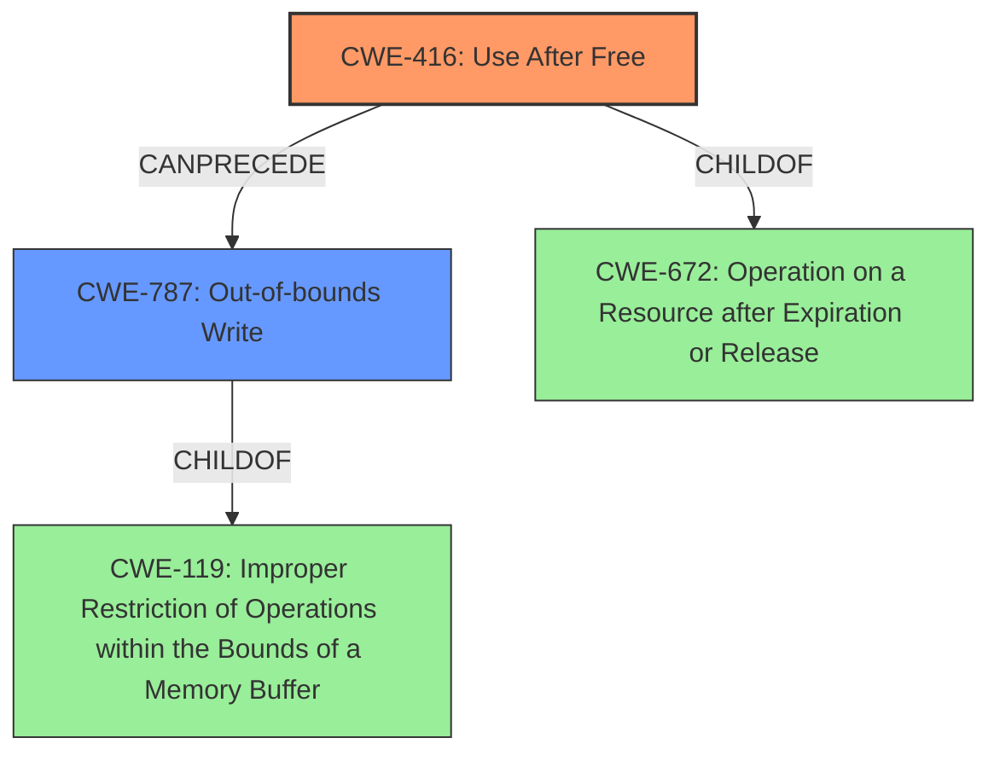

# Final Resolution for CVE-2021-4063

# Summary

| CWE ID | CWE Name | Confidence | CWE Abstraction Level | CWE Vulnerability Mapping Label | CWE-Vulnerability Mapping Notes |
|---|---|---|---|---|---|
| CWE-416 | Use After Free | 1.0 | Variant | Allowed | Primary CWE: This is the primary CWE because the vulnerability description explicitly states "Use after free" and the retriever results also strongly suggest this CWE. |
| CWE-787 | Out-of-bounds Write | 0.4 | Base | Allowed | Secondary Candidate: A successful use-after-free can often lead to an out-of-bounds write, but it is a consequence of the primary weakness. |

## Evidence and Confidence

*   **Confidence Score:** 0.95
*   **Evidence Strength:** HIGH

## Relationship Analysis
The primary relationship influencing the decision is the child-parent relationship between CWE-416 and its parent classes, as well as the "CanPrecede" relationship to CWE-787. CWE-416 is selected as the primary weakness due to its specific nature and direct match to the vulnerability description. While CWE-787 (Out-of-bounds Write) could be a consequence of CWE-416, it's classified as a secondary candidate, influencing the chain of exploitation. The variant level of CWE-416 provides sufficient granularity.

## Vulnerability Chain
The vulnerability chain starts with the **ROOTCAUSE** CWE-416 (**Use After Free**), where memory is accessed after it has been freed. This leads to a state of **WEAKNESS**, where the memory may be reallocated and contain unexpected data. If an attacker can control the data written to the freed memory, this can lead to CWE-787 (**Out-of-bounds Write**), where the attacker can overwrite arbitrary memory locations. The final impact is heap corruption, which can lead to arbitrary code execution.

## Summary of Analysis
The initial analysis accurately identifies CWE-416 (**Use After Free**) as the primary **WEAKNESS**, given the explicit mention in the vulnerability description: "Use after free in developer tools in Google Chrome prior to 96.0.4664.93 allowed a remote attacker to potentially exploit heap corruption via a crafted HTML page." The inclusion of "heap corruption" supports this assessment.

The criticism provided further solidifies this conclusion and suggests minor expansions.

The graph relationships confirm that while other CWEs such as CWE-787 (**Out-of-bounds Write**) may be a consequence, the root cause is the use-after-free condition. CWE-416 is at the optimal level of specificity, being a Variant, and directly addresses the vulnerability.

The final determination retains CWE-416 as the primary **WEAKNESS**. CWE-787 is added as a secondary candidate since the **ROOTCAUSE** of **Use After Free** can lead to out-of-bounds writes and memory corruption.
The confidence score is reduced slightly to 0.95 to reflect the addition of a secondary CWE.