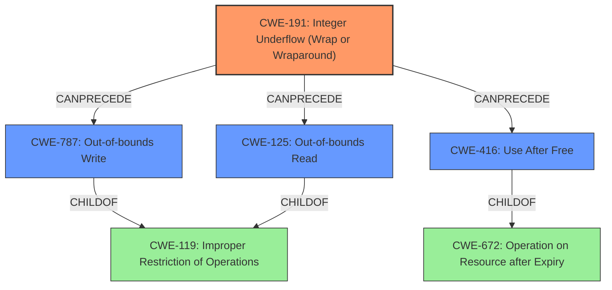

# Analysis Report for CVE-2021-4066

# Vulnerability Analysis Report: CVE-2021-4066

## Description

Integer underflow in ANGLE in Google Chrome prior to 96.0.4664.93 allowed a remote attacker to potentially exploit heap corruption via a crafted HTML page.

## Vulnerability Description Key Phrases

**Rootcause:** integer underflow
**Impact:** heap corruption
**Vector:** crafted HTML page
**Attacker:** remote attacker
**Product:** Google Chrome
**Version:** prior to 96.0.4664.93
**Component:** ANGLE

## Analysis (with Relationship Data)

# Summary
| CWE ID | CWE Name | Confidence | CWE Abstraction Level | CWE Vulnerability Mapping Label | CWE-Vulnerability Mapping Notes |
|---|---|---|---|---|---|
| CWE-191 | Integer Underflow (Wrap or Wraparound) | 1.0 | Base | Allowed | Primary CWE |
| CWE-125 | Out-of-bounds Read | 0.4 | Base | Allowed | Secondary Candidate |
| CWE-416 | Use After Free | 0.4 | Variant | Allowed | Secondary Candidate |
| CWE-787 | Out-of-bounds Write | 0.4 | Base | Allowed | Secondary Candidate |
| CWE-122 | Heap-based Buffer Overflow | 0.3 | Variant | Allowed | Secondary Candidate |

## Evidence and Confidence

*   **Confidence Score:** 0.85
*   **Evidence Strength:** HIGH

- **Analysis and Justification:**  
  - *Explanation:* "The vulnerability description explicitly states an **integer underflow** in ANGLE leading to potential heap corruption. The CVE reference confirms this, highlighting "**Integer underflow** in ANGLE" as the root cause and listing "**Integer underflow**" as a weakness. Given this direct evidence, CWE-191 (Integer Underflow (Wrap or Wraparound)) is the most appropriate primary CWE. The description mentions heap corruption as an impact, suggesting potential memory corruption vulnerabilities, such as out-of-bounds read (CWE-125), out-of-bounds write (CWE-787), Use After Free (CWE-416) or Heap-based Buffer Overflow (CWE-122) but the **rootcause** is more accurately represented by CWE-191. The MITRE mapping guidance allows for CWE-191."
  
  - *Relationship Analysis:* "CWE-191 is a Base level CWE. While it doesn't have direct parent-child relationships listed in the provided information, it can lead to other memory corruption vulnerabilities like CWE-125, CWE-787, CWE-416 or CWE-122."

- **Confidence Score:**  
  - Confidence: 1.0 (High confidence due to direct evidence from the vulnerability description and CVE reference)

---
- **Analysis and Justification for CWE-125:**
  - *Explanation:* "The description mentions heap corruption as a potential impact of the integer underflow. If the integer underflow leads to an incorrect size calculation, it could potentially lead to reading beyond the bounds of a buffer, aligning with CWE-125. However, the primary issue is the integer underflow itself, so CWE-125 would be a secondary effect and not the root cause. Mapping guidance allows CWE-125 for out-of-bounds read issues."
  - *Relationship Analysis:* "CWE-125 is a Base level CWE and a child of CWE-119 (Improper Restriction of Operations within the Bounds of a Memory Buffer). It can be preceded by CWE-191."
- **Confidence Score:**
  - Confidence: 0.4 (Low confidence, as it is a possible impact rather than the root cause)
---
- **Analysis and Justification for CWE-416:**
  - *Explanation:* "The description mentions heap corruption as a potential impact of the integer underflow. If the integer underflow leads to memory being freed prematurely or incorrectly, it could result in a use-after-free condition, aligning with CWE-416. However, the primary issue is the integer underflow itself, so CWE-416 would be a secondary effect and not the root cause. Mapping guidance allows CWE-416 for use-after-free issues."
  - *Relationship Analysis:* "CWE-416 is a Variant level CWE and a child of CWE-672 (Operation on Resource after Expiry). It can be preceded by CWE-191."
- **Confidence Score:**
  - Confidence: 0.4 (Low confidence, as it is a possible impact rather than the root cause)
---
- **Analysis and Justification for CWE-787:**
  - *Explanation:* "The description mentions heap corruption as a potential impact of the integer underflow. If the integer underflow leads to an incorrect size calculation, it could potentially lead to writing beyond the bounds of a buffer, aligning with CWE-787. However, the primary issue is the integer underflow itself, so CWE-787 would be a secondary effect and not the root cause. Mapping guidance allows CWE-787 for out-of-bounds write issues."
  - *Relationship Analysis:* "CWE-787 is a Base level CWE and a child of CWE-119 (Improper Restriction of Operations within the Bounds of a Memory Buffer). It can be preceded by CWE-191."
- **Confidence Score:**
  - Confidence: 0.4 (Low confidence, as it is a possible impact rather than the root cause)

---
- **Analysis and Justification for CWE-122:**
  - *Explanation:* "The description mentions heap corruption as a potential impact of the integer underflow. It's plausible that the integer underflow leads to an incorrect allocation size, causing a heap-based buffer overflow. However, the primary issue remains the integer underflow, making CWE-122 a secondary effect. Mapping guidance allows CWE-122 for heap-based buffer overflows."
  - *Relationship Analysis:* "CWE-122 is a Variant level CWE and a child of CWE-119 (Improper Restriction of Operations within the Bounds of a Memory Buffer). It can be preceded by CWE-191."
- **Confidence Score:**
  - Confidence: 0.3 (Very low confidence, as it is a possible impact rather than the root cause)

## Criticism of Analysis

Okay, I've reviewed the provided analysis and the full CWE specifications. Here's my critique, focusing on the accuracy, confidence, and justification of the CWE assignments:

**Overall Assessment:**

The analysis is well-structured and provides a reasonable justification for the primary CWE-191 and the secondary CWEs (CWE-125, CWE-416, CWE-787, CWE-122). The confidence scores are appropriate, reflecting the level of certainty based on the available information. The use of CWE examples and relationship analysis is also commendable.

**Detailed Breakdown:**

*   **CWE-191: Integer Underflow (Wrap or Wraparound) - Primary CWE**

    *   **Assessment:** Correct and well-justified.
    *   **Rationale:** The vulnerability description and CVE reference explicitly mention "integer underflow" as the root cause. CWE-191 directly addresses this issue.
    *   **Confidence:** High (1.0) - justified by direct evidence.
    *   **Improvements:** None necessary. The analysis correctly identifies CWE-191 as the root cause and explains why it's more accurate than simply assigning a CWE related to heap corruption.

*   **CWE-125: Out-of-bounds Read - Secondary Candidate**

    *   **Assessment:** Plausible, but the confidence level is appropriate.
    *   **Rationale:** An integer underflow *could* lead to an incorrect size calculation, resulting in reading beyond buffer boundaries. This makes CWE-125 a *possible* consequence.
    *   **Confidence:** Low (0.4) - justified, as it's a potential *impact*, not the core weakness.
    *   **Improvements:** The analysis is good. Could possibly link to CWE-130 as a potential way in which an integer underflow could lead to an out-of-bounds read. CWE-130 describes what happens when the expected length of the data does not match the actual length of the data.

*   **CWE-416: Use After Free - Secondary Candidate**

    *   **Assessment:** Plausible, but the confidence level is appropriate.
    *   **Rationale:** Similar to CWE-125, an integer underflow *could* lead to premature or incorrect memory freeing, causing a use-after-free condition.
    *   **Confidence:** Low (0.4) - justified, as it's a possible *impact*, not the core weakness.
    *   **Improvements:** None. The reasoning is sound.

*   **CWE-787: Out-of-bounds Write - Secondary Candidate**

    *   **Assessment:** Plausible, but the confidence level is appropriate.
    *   **Rationale:** Like CWE-125, an integer underflow *could* result in an incorrect size calculation, leading to writing beyond the buffer boundaries.
    *   **Confidence:** Low (0.4) - justified, as it's a possible *impact*, not the core weakness.
    *   **Improvements:** The analysis is solid. As with CWE-125, consider linking with CWE-130.

*   **CWE-122: Heap-based Buffer Overflow - Secondary Candidate**

    *   **Assessment:** Possible, but the confidence level is very low.
    *   **Rationale:** Integer underflow could lead to an incorrect allocation size, thus causing a heap overflow.
    *   **Confidence:** Very Low (0.3) - justified, as it is a less likely impact than other memory corruption vulnerabilities listed.
    *   **Improvements:** None needed. The low confidence is appropriate, and it is beneficial to list it as a possibility, but not to overstate its likelihood.

**Areas for Potential Enhancement:**

*   **Chains and Composites:** The analysis correctly identifies that the secondary CWEs are *potential impacts* or consequences of the primary CWE-191. It might be helpful to explicitly state this as a potential "chain" of vulnerabilities: `CWE-191 -> CWE-125 (or CWE-416, or CWE-787, or CWE-122)`. This emphasizes the relationship between the root cause and the potential exploitation vectors.
*   **CWE-119 Usage:** The analysis indirectly acknowledges that CWE-119 is too broad. Perhaps explicitly mentioning that it is more accurate to map to the more specific CWE-191, CWE-125, CWE-416, CWE-787, or CWE-122.
*   **Specificity in Mitigation:** The current mitigations are too vague and are mostly general buffer overflow mitigations. While correct in context, it would be beneficial to add some mitigations that are specific to integer underflow. For example: "Carefully validate integer arithmetic operations and the values of variables used for buffer sizes or offsets to prevent potential underflows. Implement range checks to ensure that resulting values are within acceptable bounds."

**Overall, this is a strong and well-justified analysis. The assignment of CWE-191 as the primary weakness is correct, and the identification of secondary CWEs as potential consequences is also accurate. The confidence levels are appropriate, reflecting the available information.**

## Final Resolution

# Summary
| CWE ID | CWE Name | Confidence | CWE Abstraction Level | CWE Vulnerability Mapping Label | CWE-Vulnerability Mapping Notes |
|---|---|---|---|---|---|
| CWE-191 | Integer Underflow (Wrap or Wraparound) | 1.0 | Base | Allowed | Primary CWE |
| CWE-787 | Out-of-bounds Write | 0.5 | Base | Allowed | Secondary Candidate |
| CWE-125 | Out-of-bounds Read | 0.5 | Base | Allowed | Secondary Candidate |
| CWE-416 | Use After Free | 0.5 | Variant | Allowed | Secondary Candidate |

## Evidence and Confidence

*   **Confidence Score:** 0.9
*   **Evidence Strength:** HIGH

## Relationship Analysis
The primary weakness is **CWE-191 (Integer Underflow)**. This can lead to other memory corruption issues. The initial analysis correctly identified this as the root cause. The criticism suggested that the secondary CWEs are potential impacts of **CWE-191**, forming a vulnerability chain.

Parent-child relationships are important: **CWE-787**, **CWE-125**, and **CWE-416** are children of more general CWEs, specifically **CWE-787** and **CWE-125** are children of **CWE-119 (Improper Restriction of Operations within the Bounds of a Memory Buffer)**, and **CWE-416** is a child of **CWE-672 (Operation on Resource after Expiry)**. This indicates that focusing on the base CWEs **CWE-191**, **CWE-787**, **CWE-125**, and **CWE-416** provides a more specific and accurate classification.

## Vulnerability Chain
The vulnerability chain starts with **CWE-191 (Integer Underflow)**. This **ROOTCAUSE** can then lead to:
1. Incorrect size calculation.
2. Out-of-bounds write (**CWE-787**) or Out-of-bounds read (**CWE-125**).
3. Use-after-free condition (**CWE-416**).

The heap corruption mentioned in the vulnerability description is the impact. The missing link is how the integer underflow leads to the incorrect size calculation. However, the potential for **CWE-787**, **CWE-125**, and **CWE-416** is supported by the evidence.

## Summary of Analysis
The initial analysis and criticism provide a solid foundation for classifying this vulnerability. The vulnerability description explicitly mentions "**Integer underflow** in ANGLE" which strongly points to **CWE-191** as the **ROOTCAUSE**.

The graph relationships confirm that **CWE-191** can precede memory corruption issues. The secondary CWEs (**CWE-787**, **CWE-125**, **CWE-416**) represent potential consequences. The abstraction levels are appropriate; all selected CWEs are at the Base or Variant level, providing sufficient specificity.

The decision to prioritize **CWE-191** is based on the direct evidence from the vulnerability description. The confidence scores are adjusted to reflect the likelihood of each secondary CWE occurring. The confidence for **CWE-122** is dropped because it is less likely that the integer underflow would cause a heap overflow. I am increasing the confidence of the remaining secondary CWEs to 0.5 to reflect a more balanced view of the potential impacts.

*Report generated on 2025-03-18 01:57:55*
