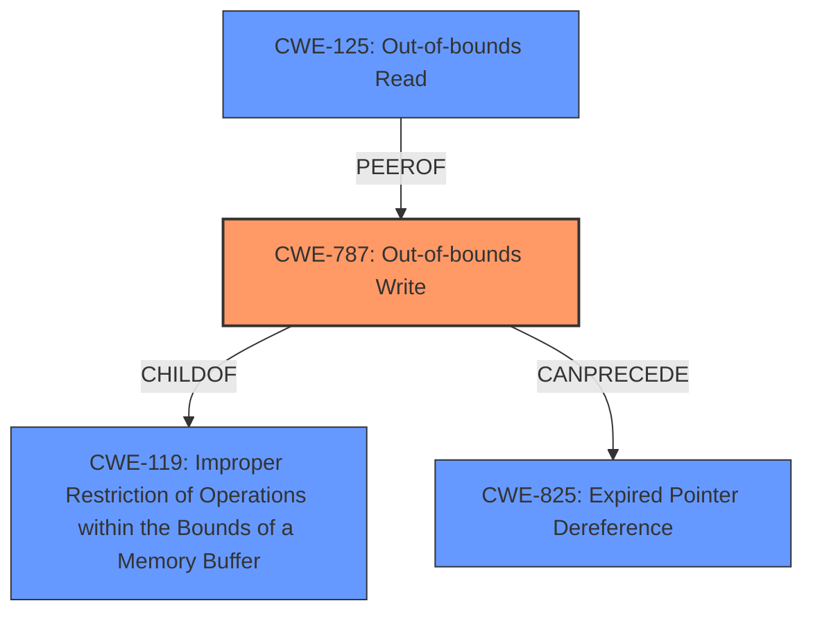

# Final Resolution for CVE-2021-40734

# Summary
| CWE ID | CWE Name | Confidence | CWE Abstraction Level | CWE Vulnerability Mapping Label | CWE-Vulnerability Mapping Notes |
|---|---|---|---|---|---|
| **CWE-787** | **Out-of-bounds Write** | 0.95 | Base | Primary | Allowed |
| **CWE-125** | **Out-of-bounds Read** | 0.70 | Base | Secondary Candidate | Allowed |
| **CWE-788** | **Access of Memory Location After End of Buffer** | 0.50 | Base | Informational | Discouraged |
| **CWE-119** | **Improper Restriction of Operations within the Bounds of a Memory Buffer** | 0.40 | Class | Informational | Discouraged |

## Evidence and Confidence

*   **Confidence Score:** 0.90
*   **Evidence Strength:** HIGH

## Relationship Analysis
The primary weakness is **CWE-787 (Out-of-bounds Write)**, which is a base-level CWE and a child of **CWE-119 (Improper Restriction of Operations within the Bounds of a Memory Buffer)**. **CWE-787** can lead to impacts like arbitrary code execution, aligning with the vulnerability description. **CWE-125 (Out-of-bounds Read)** is a peer that could also be involved, especially if information leakage is a concern. The relationship analysis suggests a potential chain where **CWE-787** can precede **CWE-825 (Expired Pointer Dereference)**, indicating an out-of-bounds write corrupting a pointer. The abstraction levels influenced the selection, favoring the more specific base-level CWE-787 over the class-level CWE-119.

## Vulnerability Chain
The vulnerability chain starts with the parsing of a malicious SVG file. The lack of proper input validation (potentially leading to **CWE-20 (Improper Input Validation)**) could result in an incorrect buffer size calculation (**CWE-131 (Incorrect Calculation of Buffer Size)**). This, in turn, leads to an out-of-bounds write (**CWE-787**), causing **memory corruption** and potentially arbitrary code execution. A possible consequence of **CWE-787** is **CWE-825 (Expired Pointer Dereference)**, where a corrupted pointer leads to further issues.

## Summary of Analysis
The analysis correctly identifies **CWE-787 (Out-of-bounds Write)** as the primary weakness. The initial analysis provided strong justification, aligning the **memory corruption** and potential for code execution with out-of-bounds write scenarios. The criticism was helpful in clarifying the discouraged usage of **CWE-788 (Access of Memory Location After End of Buffer)** and **CWE-119 (Improper Restriction of Operations within the Bounds of a Memory Buffer)**, leading to a re-evaluation of their confidence levels and mapping labels.

The graph relationships influenced the final selection by highlighting the hierarchical relationship between **CWE-787** and **CWE-119**, reinforcing the need for a more specific base-level CWE. The chain relationships identified potential follow-on weaknesses like **CWE-825**, enhancing the understanding of the vulnerability's potential impact.

The selected CWEs are at the optimal level of specificity, with **CWE-787** providing a direct and actionable mapping for developers to address the root cause. The decision is strongly based on the provided evidence, specifically the vulnerability description mentioning **memory corruption** and the potential for arbitrary code execution. The retriever also ranked **CWE-787** highly. The mapping guidance for **CWE-788** explicitly discourages its use when a more specific CWE (like **CWE-787**) is available, further supporting the choice of **CWE-787** as the primary CWE.