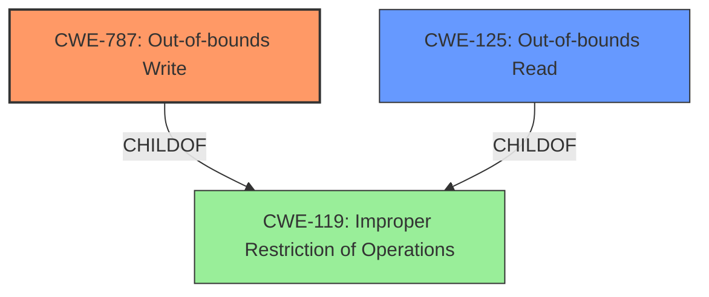

# Final Resolution for CVE-2021-40735

# Summary
| CWE ID | CWE Name | Confidence | CWE Abstraction Level | CWE Vulnerability Mapping Label | CWE-Vulnerability Mapping Notes |
|---|---|---|---|---|---|
| **CWE-787** | **Out-of-bounds Write** | 0.80 | Base | Primary | Allowed |
| CWE-125 | Out-of-bounds Read | 0.50 | Base | Secondary | Allowed |

## Evidence and Confidence

*   **Confidence Score:** 0.70
*   **Evidence Strength:** MEDIUM

## Relationship Analysis
The primary relationship influencing the decision is the parent-child relationship between **CWE-787 (Out-of-bounds Write)** and **CWE-119 (Improper Restriction of Operations within the Memory Buffer)**, where **CWE-787** is a child of **CWE-119**. This indicates that **CWE-787** is a more specific case of a buffer overflow.

Additionally, the relationship between **CWE-125 (Out-of-bounds Read)** and **CWE-119** exists, but is less directly implicated in arbitrary code execution. Both **CWE-787** and **CWE-125** are base-level CWEs, making them suitable for direct mapping.

## Vulnerability Chain
The vulnerability chain starts with a crafted file opened in Adobe Audition. This leads to a **memory corruption**, specifically an **out-of-bounds write (CWE-787)**. As a secondary factor, there may be an **out-of-bounds read (CWE-125)**. The ultimate impact is arbitrary code execution. The chain is as follows:

Crafted File -> **CWE-787** -> Arbitrary Code Execution
Crafted File -> **CWE-125** (Potential, but less direct) -> Information Leakage (Possible prerequisite for further exploitation)

## Summary of Analysis
The initial analysis correctly identified **CWE-787 (Out-of-bounds Write)** as the primary weakness due to the arbitrary code execution impact. The criticism suggested lowering the confidence to 0.80, which is reasonable given that the description only implies a write, not explicitly states it. The criticism also correctly pointed out that **CWE-788** is discouraged and that **CWE-125 (Out-of-bounds Read)** is a more appropriate secondary weakness, given the "out-of-bounds read" mentioned in the CVE reference.

The graph relationships support this decision: **CWE-787** is a specific type of buffer overflow (**CWE-119**), and the arbitrary code execution aligns well with a write operation. While the initial report mentioned "**Root Cause of Vulnerability**: Access of Memory Location After End of Buffer (CWE-788)", the more detailed summary indicates "out-of-bounds read", so **CWE-125** fits better as a secondary issue.

The decision to use **CWE-787** and **CWE-125** is at the optimal level of specificity because they are base-level CWEs that directly describe the type of memory corruption occurring.

My confidence is 0.70 because while the evidence strongly suggests **CWE-787**, the "access of memory location after end of buffer" still leaves room for uncertainty which is why **CWE-125** is added as a secondary issue.