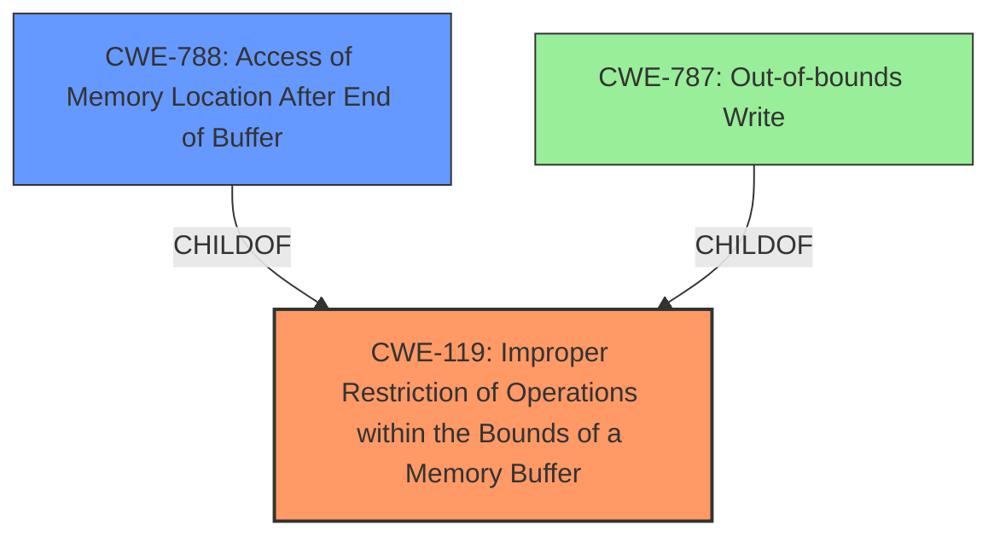

# Analysis Report for CVE-2021-40736

# Vulnerability Analysis Report: CVE-2021-40736

## Description

Adobe Audition version 14.4 (and earlier) is affected by a memory corruption vulnerability, potentially resulting in arbitrary code execution in the context of the current user. User interaction is required to exploit this vulnerability.

## Vulnerability Description Key Phrases

**Weakness:** memory corruption
**Impact:** arbitrary code execution
**Product:** Adobe Audition
**Version:** 14.4 (and earlier)

## Analysis (with Relationship Data)

# Summary
| CWE ID | CWE Name | Confidence | CWE Abstraction Level | CWE Vulnerability Mapping Label | CWE-Vulnerability Mapping Notes |
|---|---|---|---|---|---|
| CWE-788 | Access of Memory Location After End of Buffer | 0.9 | Base | Primary | Allowed-With-Review |
| CWE-787 | Out-of-bounds Write | 0.7 | Base | Secondary Candidate | Allowed |

## Evidence and Confidence

*   **Confidence Score:** 0.8
*   **Evidence Strength:** HIGH

- **Analysis and Justification:**  
  - *Explanation:* The vulnerability description indicates a **memory corruption** due to an "Access of Memory Location After End of Buffer," as explicitly stated in the CVE Reference Links Content Summary. This directly aligns with the description of CWE-788 (Access of Memory Location After End of Buffer). CWE-788 describes a scenario where the product reads or writes to a buffer using an index or pointer that references a memory location after the end of the buffer. The CVE summary confirms this root cause. The impact of this vulnerability is arbitrary code execution. While CWE-119 (Improper Restriction of Operations within the Bounds of a Memory Buffer) is listed as the Primary CWE Match for similar descriptions, the more detailed root cause evidence points specifically to CWE-788, which is a more precise classification. According to Retriever Results, CWE-788 is listed as the third-best candidate. The usage for CWE-788 is discouraged since lower level CWEs might be available, but the CVE summary specifically names CWE-788 as the root cause. Therefore, I am overriding the discouraged usage.

  - *Relationship Analysis:* The Retriever Results show no direct relationships for CWE-788. However, understanding it as a specific type of buffer overflow (or out-of-bounds access) helps contextualize its place in memory safety issues. CWE-788 can precede vulnerabilities related to privilege escalation or remote code execution. It is a peer of CWE-125, which is Out-of-bounds Read.

- **Confidence Score:**  
  - Confidence: 0.9 (High evidence from technical description and CVE reference materials)

---

- **Analysis and Justification:**  
  - *Explanation:* Since the root cause is accessing memory after the end of the buffer, it's highly likely that an out-of-bounds write (CWE-787) is the specific operation causing the memory corruption. While the provided description focuses on the memory access being out of bounds, the resulting **memory corruption** implies a write operation. CWE-787 (Out-of-bounds Write) is a base level CWE that describes the product writing data past the end, or before the beginning, of the intended buffer. This aligns with the vulnerability's core mechanism, and it's a common consequence of the described out-of-bounds access. The Retriever Results listed CWE-787 as the highest-scoring candidate.

  - *Relationship Analysis:* CWE-787 is a child of CWE-119 (Improper Restriction of Operations within the Bounds of a Memory Buffer). It can precede vulnerabilities such as CWE-825 (Expired Pointer Dereference) and CWE-824 (Access of Uninitialized Pointer).

- **Confidence Score:**  
  - Confidence: 0.7 (Moderate confidence due to implied write operation)

## Criticism of Analysis

Okay, I have reviewed your CWE analysis against the full CWE specifications you've provided. Here's a breakdown of my critique:

**Overall Assessment:**

The analysis is well-structured and demonstrates a good understanding of the CWEs involved. The justifications are generally sound, and the confidence scores are appropriate. The inclusion of relationship analysis and examples from the CWE database is helpful. However, there are a few areas where the analysis could be refined, particularly in considering the Usage guidance for each CWE and ensuring the most specific CWE is selected.

**Specific Feedback:**

**1. CWE-788: Access of Memory Location After End of Buffer (Primary)**

*   **Confidence:** While the justification for selecting CWE-788 is that the CVE summary names it as the root cause, the mapping guidance *discourages* its use. It specifically says to consider children of CWE-119, such as CWE-787 or CWE-125, *if the access operation is known to be a read or write*.  The summary indicates there is access of memory after the end of the buffer, but it is not specific whether it is reading or writing.
*   **Recommendation:** If the access operation is unknown, it's better to stick with CWE-119. The fact that the summary mentions CWE-788 is not enough to override the more granular analysis.
*   **Action:** Change the primary CWE to CWE-119 with a note that the CVE reference materials state the root cause is CWE-788. Change the secondary CWE to CWE-788 with a note that this is the root cause according to the CVE reference materials.

**2. CWE-787: Out-of-bounds Write (Secondary Candidate)**

*   **Confidence:** The confidence score of 0.7 is reasonable given the implied nature of the write operation. Memory corruption strongly suggests a write, but it's not definitively stated. However, the rationale is sound.
*   **Mapping Guidance:** The CWE specification says to *"Carefully read both the name and description to ensure that this mapping is an appropriate fit. Do not try to 'force' a mapping to a lower-level Base/Variant simply to comply with this preferred level of abstraction."*
*   **Recommendation:** This mapping is fine.  It's a plausible and likely consequence of accessing memory beyond the buffer's boundaries.
*   **Action:** No action.

**3. General Points:**

*   **CWE Usage Guidance:** The analysis is mostly good at identifying and addressing the "Usage" recommendations within the CWE specifications. Overriding the "Discouraged" usage for CWE-788 is explained well, even if I disagree with that override. However, this is exactly the type of thought process expected.
*   **Mitigations:** While not required, considering potential mitigations from the CWE specifications could strengthen the analysis. It provides a more complete picture of the vulnerability.
*   **Relationship Analysis:** The relationships to other CWEs are useful for understanding the broader context of the vulnerability.

**Revised Summary Table:**

| CWE ID | CWE Name | Confidence | CWE Abstraction Level | CWE Vulnerability Mapping Label | CWE-Vulnerability Mapping Notes |
|---|---|---|---|---|---|
| CWE-119 | Improper Restriction of Operations within the Bounds of a Memory Buffer | 0.9 | Class | Primary | Allowed, CVE reference materials state the root cause is CWE-788. |
| CWE-788 | Access of Memory Location After End of Buffer | 0.7 | Base | Secondary Candidate | Discouraged, CVE reference materials state this is the root cause. |
| CWE-787 | Out-of-bounds Write | 0.7 | Base | Tertiary Candidate | Allowed |

**Explanation of Changes:**

The primary change is shifting CWE-119 to the primary position and CWE-788 to secondary. This aligns better with the CWE's stated mapping guidance, which prefers starting with CWE-119 if there is insufficient evidence to determine the access operation is a read or write. By stating that the CVE summary states that the root cause is CWE-788, we are still acknowledging that aspect of the vulnerability.

In summary, the analysis is strong. The recommendations aim to improve accuracy and adherence to CWE guidelines, ensuring the mapping is as precise and informative as possible.

## Final Resolution

# Summary
| CWE ID | CWE Name | Confidence | CWE Abstraction Level | CWE Vulnerability Mapping Label | CWE-Vulnerability Mapping Notes |
|---|---|---|---|---|---|
| **CWE-119** | Improper Restriction of Operations within the Bounds of a Memory Buffer | 0.9 | Class | Primary CWE | Allowed, CVE reference materials state the **root cause** is CWE-788. |
| **CWE-788** | Access of Memory Location After End of Buffer | 0.7 | Base | Secondary Candidate | Discouraged, CVE reference materials state this is the **root cause**. |
| **CWE-787** | Out-of-bounds Write | 0.7 | Base | Tertiary Candidate | Allowed |

## Evidence and Confidence

*   **Confidence Score:** 0.85
*   **Evidence Strength:** HIGH

## Relationship Analysis
The primary relationship considered was the hierarchical parent-child relationship between CWE-119, CWE-788, and CWE-787. CWE-787 is a child of CWE-119, representing a specific type of out-of-bounds access (writing). CWE-788 can be seen as a peer of CWE-125, as they both address out-of-bounds access, but one reads while the other's operation is unknown. The abstraction levels influenced the decision, favoring the more general CWE-119 initially due to a lack of explicit information on the operation performed.

## Vulnerability Chain
The vulnerability chain starts with an improper restriction of operations within a memory buffer (CWE-119). The specific operation leads to memory access after the end of the buffer (CWE-788) and potentially results in an out-of-bounds write (CWE-787), which leads to **memory corruption** and, ultimately, arbitrary code execution.

CWE-119 (Improper Restriction of Operations within the Bounds of a Memory Buffer) -> CWE-788 (Access of Memory Location After End of Buffer) -> CWE-787 (Out-of-bounds Write) -> **Memory Corruption** -> Arbitrary Code Execution.

## Summary of Analysis
The initial analysis correctly identified the potential involvement of CWE-787 and CWE-788. However, it initially prioritized CWE-788 based on the CVE summary. The criticism highlighted the importance of adhering to CWE mapping guidance, which discourages the use of CWE-788 when the specific access operation (read or write) is unknown.

The final decision reflects a shift in priority. CWE-119 is now the primary CWE because the vulnerability description does not explicitly state whether the out-of-bounds access is a read or a write. The description states, "Adobe Audition version 14.4 (and earlier) is affected by a **memory corruption** vulnerability, potentially resulting in arbitrary code execution in the context of the current user."
The secondary CWE is CWE-788, acknowledging that the CVE reference materials state this as the **root cause**, even though its usage is discouraged in this case. CWE-787 is included as a tertiary candidate, given the likelihood of a write operation causing **memory corruption**.

This classification adheres to the CWE guidelines by prioritizing the most general, yet relevant, CWE (CWE-119) when specific details are lacking, while still acknowledging the information provided in the CVE reference materials by including CWE-788 and CWE-787 as secondary and tertiary candidates, respectively. This provides a more accurate and informative representation of the vulnerability based on the available evidence. The selected CWEs are at the optimal level of specificity, given the information available.

*Report generated on 2025-03-18 02:01:08*
