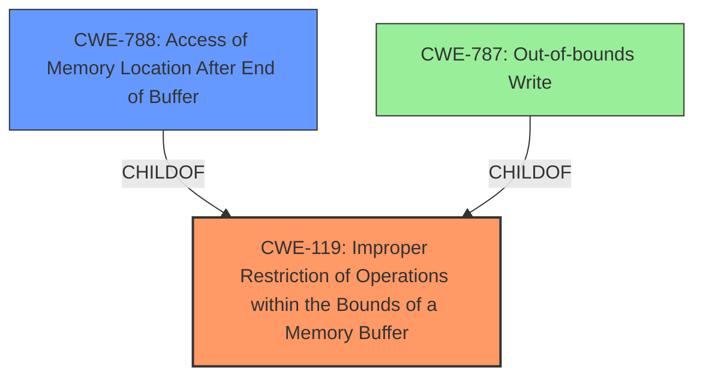

# Final Resolution for CVE-2021-40736

# Summary
| CWE ID | CWE Name | Confidence | CWE Abstraction Level | CWE Vulnerability Mapping Label | CWE-Vulnerability Mapping Notes |
|---|---|---|---|---|---|
| **CWE-119** | Improper Restriction of Operations within the Bounds of a Memory Buffer | 0.9 | Class | Primary CWE | Allowed, CVE reference materials state the **root cause** is CWE-788. |
| **CWE-788** | Access of Memory Location After End of Buffer | 0.7 | Base | Secondary Candidate | Discouraged, CVE reference materials state this is the **root cause**. |
| **CWE-787** | Out-of-bounds Write | 0.7 | Base | Tertiary Candidate | Allowed |

## Evidence and Confidence

*   **Confidence Score:** 0.85
*   **Evidence Strength:** HIGH

## Relationship Analysis
The primary relationship considered was the hierarchical parent-child relationship between CWE-119, CWE-788, and CWE-787. CWE-787 is a child of CWE-119, representing a specific type of out-of-bounds access (writing). CWE-788 can be seen as a peer of CWE-125, as they both address out-of-bounds access, but one reads while the other's operation is unknown. The abstraction levels influenced the decision, favoring the more general CWE-119 initially due to a lack of explicit information on the operation performed.

## Vulnerability Chain
The vulnerability chain starts with an improper restriction of operations within a memory buffer (CWE-119). The specific operation leads to memory access after the end of the buffer (CWE-788) and potentially results in an out-of-bounds write (CWE-787), which leads to **memory corruption** and, ultimately, arbitrary code execution.

CWE-119 (Improper Restriction of Operations within the Bounds of a Memory Buffer) -> CWE-788 (Access of Memory Location After End of Buffer) -> CWE-787 (Out-of-bounds Write) -> **Memory Corruption** -> Arbitrary Code Execution.

## Summary of Analysis
The initial analysis correctly identified the potential involvement of CWE-787 and CWE-788. However, it initially prioritized CWE-788 based on the CVE summary. The criticism highlighted the importance of adhering to CWE mapping guidance, which discourages the use of CWE-788 when the specific access operation (read or write) is unknown.

The final decision reflects a shift in priority. CWE-119 is now the primary CWE because the vulnerability description does not explicitly state whether the out-of-bounds access is a read or a write. The description states, "Adobe Audition version 14.4 (and earlier) is affected by a **memory corruption** vulnerability, potentially resulting in arbitrary code execution in the context of the current user."
The secondary CWE is CWE-788, acknowledging that the CVE reference materials state this as the **root cause**, even though its usage is discouraged in this case. CWE-787 is included as a tertiary candidate, given the likelihood of a write operation causing **memory corruption**.

This classification adheres to the CWE guidelines by prioritizing the most general, yet relevant, CWE (CWE-119) when specific details are lacking, while still acknowledging the information provided in the CVE reference materials by including CWE-788 and CWE-787 as secondary and tertiary candidates, respectively. This provides a more accurate and informative representation of the vulnerability based on the available evidence. The selected CWEs are at the optimal level of specificity, given the information available.