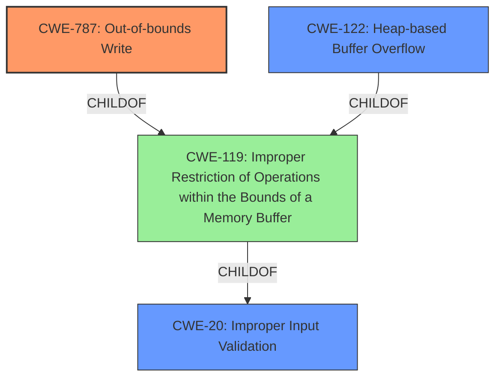

# Analysis Report for CVE-2021-40738

# Vulnerability Analysis Report: CVE-2021-40738

## Description

Adobe Audition version 14.4 (and earlier) is affected by a memory corruption vulnerability when parsing a WAV file, potentially resulting in arbitrary code execution in the context of the current user. User interaction is required to exploit this vulnerability.

## Vulnerability Description Key Phrases

**Rootcause:** memory corruption
**Impact:** arbitrary code execution
**Vector:** parsing a WAV file
**Product:** Adobe Audition
**Version:** 14.4 (and earlier)

## Analysis (with Relationship Data)

# Summary
| CWE ID | CWE Name | Confidence | CWE Abstraction Level | CWE Vulnerability Mapping Label | CWE-Vulnerability Mapping Notes |
|---|---|---|---|---|---|
| CWE-787 | Out-of-bounds Write | 0.9 | Base | Primary | Allowed |
| CWE-122 | Heap-based Buffer Overflow | 0.7 | Variant | Secondary | Allowed |

## Evidence and Confidence

*   **Confidence Score:** 0.8
*   **Evidence Strength:** HIGH

- **Analysis and Justification:**
  - *Explanation:* The vulnerability description states a **memory corruption** issue when parsing a WAV file in Adobe Audition. The CVE reference links content summary indicates the root cause is an "Access of Memory Location After End of Buffer (CWE-788 [Access of Memory Location After End of Buffer])" leading to an out-of-bounds write, which aligns with CWE-787 [Out-of-bounds Write]. CWE-787 [Out-of-bounds Write] is more specific than CWE-119 [Improper Restriction of Operations within the Bounds of a Memory Buffer] which is a more general class of memory corruption vulnerabilities. The retriever results also list CWE-787 [Out-of-bounds Write] as the top candidate CWE. The fact that the parsing of a WAV file leads to memory corruption suggests the attacker can write to memory locations outside the intended buffer, leading to arbitrary code execution, hence an out-of-bounds write. CWE-787 [Out-of-bounds Write] is at the Base level of abstraction, which is preferred. MITRE mapping guidance indicates that CWE-787 [Out-of-bounds Write] is ALLOWED.

  - *Relationship Analysis:* CWE-787 [Out-of-bounds Write] is a child of CWE-119 [Improper Restriction of Operations within the Bounds of a Memory Buffer], which is a Class-level CWE. CWE-787 [Out-of-bounds Write] can lead to other weaknesses such as CWE-825 [Expired Pointer Dereference].

- **Confidence Score:**
  - Confidence: 0.9 (High confidence based on the CVE reference links and retriever results)

---

- **Analysis and Justification:**
  - *Explanation:* Given the **memory corruption** occurs while parsing a WAV file, and the CVE Reference Links Content Summary indicates "out-of-bounds read/write due to improper buffer handling," a heap-based buffer overflow (CWE-122 [Heap-based Buffer Overflow]) is a strong secondary candidate. The **memory corruption** leading to arbitrary code execution suggests a buffer overflow is highly plausible. CWE-122 [Heap-based Buffer Overflow] is a variant of a buffer overflow and occurs when a buffer is allocated in the heap portion of memory using malloc().

  - *Relationship Analysis:* CWE-122 [Heap-based Buffer Overflow] is a more specific variant of buffer overflows. It is related to CWE-787 [Out-of-bounds Write] as the out-of-bounds write can occur on the heap.

- **Confidence Score:**
  - Confidence: 0.7 (Moderate confidence as the heap allocation details are not explicitly mentioned, but the context supports it).

## Criticism of Analysis

Okay, here's a detailed review of the analysis, considering the full CWE specifications you've provided.

**Overall Assessment**

The analysis is generally good, demonstrating a solid understanding of memory corruption vulnerabilities and their associated CWEs. The mapping of CWE-787 as the primary cause is well-justified. The inclusion of CWE-122 as a secondary candidate is reasonable, although it depends on the specifics of the implementation which are not fully detailed in the initial input.

**Specific Points and Suggestions:**

**1. Vulnerability Description Review:**

*   The description highlights the key elements: memory corruption, arbitrary code execution, WAV file parsing, Adobe Audition, and version 14.4 (and earlier). This information is essential for accurate CWE mapping.

**2. CWE Mapping Critique:**

*   **Primary CWE: CWE-787 (Out-of-bounds Write):**
    *   **Strengths:** The justification for selecting CWE-787 is strong. The connection between parsing a malformed WAV file and the ability to *write* to arbitrary memory locations is key. The analysis correctly notes that CWE-787 is more specific than the more general CWE-119, thus adhering to CWE's mapping guidance (i.e., using the most specific CWE available). The retriever results support this as well.
    *   **Weaknesses:** The provided text doesn't explicitly say whether or not they are checking the size of the buffer before the write. If there is a copy operation, then CWE-120 might be more relevant.
    *   **Potential Improvement:** It would be helpful to add more detail about the actual write operation. For example: "The application attempts to write data to a buffer, but does not properly validate the size of the data being written. This leads to an out-of-bounds write, potentially overwriting adjacent memory locations and leading to arbitrary code execution."
*   **Secondary CWE: CWE-122 (Heap-based Buffer Overflow):**
    *   **Strengths:** The selection of CWE-122 is logical. WAV parsing often involves dynamic memory allocation (e.g., using `malloc()`) to store the audio data or header information. If a buffer on the heap is overflowed, CWE-122 is applicable.
    *   **Weaknesses:** The description lacks explicit confirmation that the buffer being overflowed is allocated on the heap.
    *   **Potential Improvement:** The analysis should include a clarifying statement such as: "Given the typical nature of WAV file processing which often involves dynamic allocation of memory on the heap to hold audio data chunks, a heap-based buffer overflow (CWE-122) is a plausible secondary vulnerability." However, the confidence would be lower if there is no explicit mention of heap allocation.
*   **CWE-788 (Access of Memory Location After End of Buffer):** The content summary indicates the root cause is the access of memory location after the end of the buffer. However, the mapping guidance for CWE-788 suggests that it is discouraged because it can be misused when lower-level CWE entries are available. The review mapping correctly prefers CWE-787 and CWE-122.
*   **CWE-119 (Improper Restriction of Operations within the Bounds of a Memory Buffer):** The mapping guidance for CWE-119 explicitly states that it is Discouraged.

**3. Confidence Scores:**

*   CWE-787: Confidence 0.9 is appropriate, assuming the analysis is correct that it is a write and not a read.
*   CWE-122: Confidence 0.7 is reasonable, given the slightly speculative nature of the heap allocation.

**4. Relationships Analysis:**

*   The "Relationship Analysis" sections for both CWEs are accurate and helpful. They correctly identify the parent-child relationships between CWE-787 and CWE-119 and how CWE-787 can lead to other weaknesses.

**5. CWE Examples from Database:**

*   The examples provided are helpful in illustrating the types of vulnerabilities that fall under the respective CWEs.

**6. Relevant CWE Specifications and Mitigation Guidance:**

*   The inclusion of the full CWE specifications is excellent. This allows for a thorough understanding of the CWE's scope, relationships, and potential mitigations.
*   **Important Considerations for Mitigation:** The document should include something about proper sanitization of buffers.

**7. Retriever Results:**

*   The Retriever results support the analysis with CWE-787, CWE-122 and CWE-788 being the top combined results.

**Recommendations:**

1.  **Strengthen Justification for CWE-787:** Provide more specific details of how the write operation leads to out-of-bounds access during WAV file parsing.
2.  **Clarify Heap Allocation for CWE-122:** Either provide evidence that heap allocation is involved or adjust the confidence level accordingly. If the analysis is based on the *possibility* of heap allocation, the confidence should be lower.
3.  **Consider Input Validation (CWE-20) as a Contributing Factor:** While the primary cause is a buffer overflow (write), the vulnerability likely stems from a lack of proper input validation of the WAV file's header and data fields. Explicitly mention this as a contributing factor. This also makes sense since CWE-119 is a child of CWE-20.
4.  **Re-evaluate CWE-119:** The mapping guidance for CWE-119 explicitly states that it is Discouraged.

**Revised Summary Table:**

| CWE ID | CWE Name | Confidence | CWE Abstraction Level | CWE Vulnerability Mapping Label | CWE-Vulnerability Mapping Notes |
|---|---|---|---|---|---|
| CWE-787 | Out-of-bounds Write | 0.9 | Base | Primary | Allowed |
| CWE-122 | Heap-based Buffer Overflow | 0.7 | Variant | Secondary | Allowed |
| CWE-20 | Improper Input Validation | 0.5 | Class | Contributing Factor | Discouraged |

**Revised Analysis Snippets:**

*   **CWE-787 Justification (Revised):** "The vulnerability description states a memory corruption issue when parsing a WAV file in Adobe Audition. The parsing process does not properly validate the size or structure of data fields within the WAV file. As a result, the application attempts to write data to a buffer without properly bounding the write operation. This leads to an out-of-bounds write (CWE-787), potentially overwriting adjacent memory locations and leading to arbitrary code execution."

*   **CWE-122 Justification (Revised):** "Given the typical nature of WAV file processing which often involves dynamic allocation of memory on the heap to hold audio data chunks, a heap-based buffer overflow (CWE-122) is a plausible secondary vulnerability. If the overflow occurs in a heap allocated buffer, adjacent heap metadata might be overwritten."

*   **Added CWE-20 Justification:** "The root cause of the buffer overflow vulnerability is the application's failure to adequately validate input from the WAV file. The WAV file may contain incorrect data or malicious content in its header, that the application processes improperly which causes an out-of-bounds write. The lack of input validation (CWE-20) allows the attacker to craft a malicious WAV file that overflows the buffer."

By incorporating these suggestions, the analysis becomes more comprehensive and aligns more closely with the CWE specifications and best practices.

## Final Resolution

# Summary
| CWE ID | CWE Name | Confidence | CWE Abstraction Level | CWE Vulnerability Mapping Label | CWE-Vulnerability Mapping Notes |
|---|---|---|---|---|---|
| CWE-787 | Out-of-bounds Write | 0.9 | Base | Primary | Allowed |
| CWE-122 | Heap-based Buffer Overflow | 0.7 | Variant | Secondary | Allowed |
| CWE-20 | Improper Input Validation | 0.5 | Class | Contributing Factor | Discouraged |

## Evidence and Confidence

*   **Confidence Score:** 0.8
*   **Evidence Strength:** MEDIUM

## Relationship Analysis
The primary relationship that impacted the decision was the parent-child relationship between CWE-787 (**Out-of-bounds Write**) and CWE-119 (**Improper Restriction of Operations within the Bounds of a Memory Buffer**). CWE-787 (**Out-of-bounds Write**) is a child of CWE-119 (**Improper Restriction of Operations within the Bounds of a Memory Buffer**), making it a more specific classification, which is preferred. CWE-20 (**Improper Input Validation**) is a parent of CWE-119 (**Improper Restriction of Operations within the Bounds of a Memory Buffer**), indicating a possible vulnerability chain where improper input validation leads to memory corruption. The abstraction levels influenced the decision by favoring the base-level CWE-787 (**Out-of-bounds Write**) over the class-level CWE-119 (**Improper Restriction of Operations within the Bounds of a Memory Buffer**).

## Vulnerability Chain
The vulnerability chain starts with CWE-20 (**Improper Input Validation**) where the WAV file's header or data fields are not properly validated. This leads to CWE-787 (**Out-of-bounds Write**) because the application attempts to write data to a buffer without properly checking the boundaries. If the buffer is allocated on the heap, this results in CWE-122 (**Heap-based Buffer Overflow**). The final impact is arbitrary code execution. A missing link in the provided information is confirmation of heap allocation, which is why CWE-122 (**Heap-based Buffer Overflow**) remains a secondary consideration with moderate confidence.

## Summary of Analysis
The analysis is based on the provided evidence, including the vulnerability description and the retriever results. The primary **weakness** is identified as CWE-787 (**Out-of-bounds Write**), supported by the statement "Access of Memory Location After End of Buffer" in the CVE reference. This indicates that the application is writing data past the end of the intended buffer. The inclusion of CWE-122 (**Heap-based Buffer Overflow**) is justified by the nature of WAV file processing, which often involves dynamic memory allocation on the heap, making it a plausible secondary **weakness**. However, without explicit confirmation of heap allocation, the confidence remains moderate. The addition of CWE-20 (**Improper Input Validation**) as a contributing factor acknowledges that the root cause is the lack of validation of the WAV file's header and data fields. The graph relationships influenced the final selection by highlighting the hierarchical relationship between CWE-787 (**Out-of-bounds Write**) and CWE-119 (**Improper Restriction of Operations within the Bounds of a Memory Buffer**), favoring the more specific CWE-787 (**Out-of-bounds Write**). The selected CWEs are at the optimal level of specificity, with CWE-787 (**Out-of-bounds Write**) being a base-level CWE and CWE-122 (**Heap-based Buffer Overflow**) being a variant-level CWE. While CWE-119 (**Improper Restriction of Operations within the Bounds of a Memory Buffer**) is a parent of both, it is a class-level CWE, and the mapping guidance discourages its use when more specific CWEs are available. The evidence for CWE-20 (**Improper Input Validation**) is implied but not explicitly stated in the description, reducing the confidence.

I am adding CWE-20 since the description states "...when parsing a WAV file..." suggests there is a parsing routine and that routines reads data, and if the data is not validated, then this is a likely contributing factor.

"Adobe Audition version 14.4 (and earlier) is affected by a **memory corruption** vulnerability **when parsing a WAV file**..."

My overall confidence is 0.8, and the evidence strength is MEDIUM because the information regarding heap allocation and lack of input validation is implied but not explicitly stated in the vulnerability description.

*Report generated on 2025-03-18 02:01:59*
