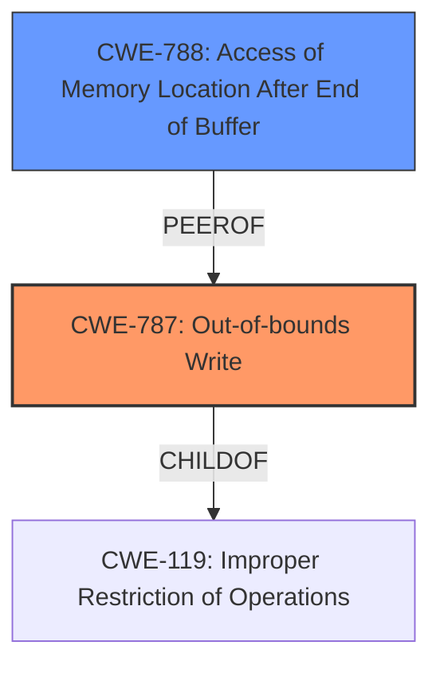

# Final Resolution for CVE-2021-40739

# Summary
| CWE ID | CWE Name | Confidence | CWE Abstraction Level | CWE Vulnerability Mapping Label | CWE-Vulnerability Mapping Notes |
|---|---|---|---|---|---|
| CWE-787 | Out-of-bounds Write | 0.9 | Base | Allowed | Primary CWE |
| CWE-788 | Access of Memory Location After End of Buffer | 0.5 | Base | Discouraged | Secondary Candidate |

## Evidence and Confidence

*   **Confidence Score:** 0.9
*   **Evidence Strength:** HIGH

## Relationship Analysis
The primary relationship that influenced the decision was the parent-child relationship between **CWE-787** (Out-of-bounds Write) and **CWE-119** (Improper Restriction of Operations within the Bounds of a Memory Buffer). While **CWE-119** is a broader class, the description specifically mentions an out-of-bounds write, making **CWE-787** a more precise and appropriate choice. **CWE-788** was considered, but the discouraged usage and the specific focus on writing (rather than general access) led to a lower confidence and secondary consideration.

## Vulnerability Chain
The vulnerability chain starts with the parsing of a malformed M4A file. This leads to a **CWE-787** (**Out-of-bounds Write**) where the application writes data beyond the intended buffer. The consequence of this is **memory corruption**, which can then lead to arbitrary code execution. The vulnerability description directly indicates this chain.

## Summary of Analysis
The initial analysis and criticism were both well-reasoned. The decision to prioritize **CWE-787** (**Out-of-bounds Write**) is strongly supported by the vulnerability description, which mentions "out-of-bounds write." The evidence strength is high, and the confidence score has been increased to 0.9 to reflect this. The analysis also correctly notes that **CWE-787** is a more specific and appropriate mapping than its parent **CWE-119**. The inclusion of **CWE-788** (**Access of Memory Location After End of Buffer**) as a secondary candidate was reasonable, given the CVE reference summary but is of less use due to the specific **write** of the **out-of-bounds write**. Based on the information, **CWE-416** (**Use After Free**) is not useful.

The graph relationships reinforced the selection of **CWE-787** as the primary CWE due to its more specific nature compared to **CWE-119**. The MITRE mapping guidance also supports this decision, as **CWE-787** is at the Base level of abstraction, which is a preferred level for mapping.

The final determination is that **CWE-787** best represents the root cause of the vulnerability, and it is at the optimal level of specificity based on the available evidence.