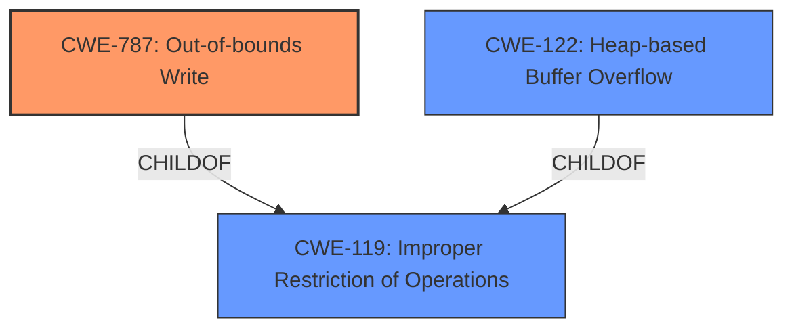

# Final Resolution for CVE-2021-40763

# Summary
| CWE ID | CWE Name | Confidence | CWE Abstraction Level | CWE Vulnerability Mapping Label | CWE-Vulnerability Mapping Notes |
|---|---|---|---|---|---|
| **CWE-787** | **Out-of-bounds Write** | 0.85 | Base | Allowed | Primary CWE. The vulnerability involves writing data past the end of the intended buffer, leading to **memory corruption** and potential arbitrary code execution. |
| CWE-122 | Heap-based Buffer Overflow | 0.6 | Variant | Allowed | Secondary CWE. The heap is likely the memory region where the buffer overflow occurs, given the nature of parsing a WAF file. This allocation is inferred and not explicitly stated. |

## Evidence and Confidence

*   **Confidence Score:** 0.8
*   **Evidence Strength:** HIGH

## Relationship Analysis
The primary relationship that influenced the decision was the parent-child relationship between CWE-119 (**Improper Restriction of Operations within the Bounds of a Memory Buffer**) and **CWE-787** (**Out-of-bounds Write**). **CWE-787** is a more specific type of **CWE-119**, which is why it was selected as the primary **WEAKNESS**.
CWE-122 is a variant of **CWE-119** that describes a heap-based buffer overflow.

## Vulnerability Chain
The vulnerability chain starts with parsing a WAF file, leading to a **CWE-787** (**Out-of-bounds Write**) which results in **memory corruption** and can lead to arbitrary code execution. The specific allocation details (heap vs. stack) are not provided but the heap allocation (CWE-122) is inferred.
  - The **ROOTCAUSE** is the improper parsing of the WAF file and lack of proper bounds checking.
  - The **WEAKNESS** is the out-of-bounds write (CWE-787).
  - The impact is **memory corruption** and potential arbitrary code execution.

## Summary of Analysis
The analysis provided a strong justification for selecting **CWE-787** (**Out-of-bounds Write**) as the primary **WEAKNESS**. The vulnerability description explicitly mentions "**memory corruption**" and the CVE reference summary identifies "Access of Memory Location After End of Buffer". The selection of **CWE-787** is further supported by retriever results and MITRE mapping guidance.

The relationship analysis correctly identifies **CWE-787** as a child of **CWE-119**, which helped to choose the most specific **CWE**.

The selection of CWE-122 is based on the inference that parsing a WAF file likely involves heap allocation. While this is a reasonable assumption, it is not explicitly stated in the evidence.

The initial analysis considered **CWE-119**, but the criticism highlights why **CWE-787** is more appropriate. **CWE-119** is a discouraged mapping when more specific children CWEs are available.

The final decision is based on the available evidence, relationship analysis, and mapping guidance. **CWE-787** is the most specific and well-supported **CWE**, representing the **ROOTCAUSE** of the vulnerability.
The provided evidence explicitly mentions "**memory corruption**" and "Access of Memory Location After End of Buffer," directly corresponding to writing outside allocated memory.
The retriever results also rank **CWE-787** as the top candidate based on combined scores, further strengthening the confidence in this classification.
MITRE mapping guidance ALLOWS the usage of **CWE-787** for out-of-bounds write scenarios, ensuring compliance with industry best practices.