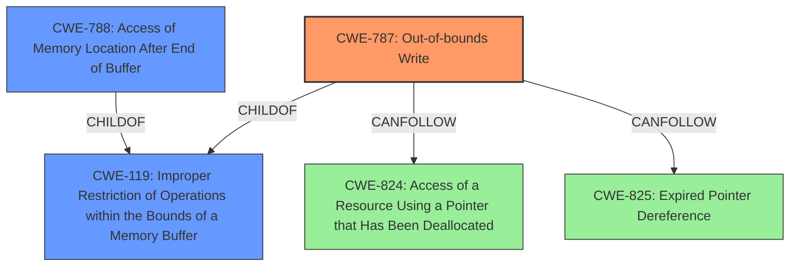

# Analysis Report for CVE-2021-40764

# Vulnerability Analysis Report: CVE-2021-40764

## Description

Adobe Character Animator version 4.4 (and earlier) is affected by a memory corruption vulnerability when parsing a M4A file, potentially resulting in arbitrary code execution in the context of the current user. User interaction is required to exploit this vulnerability.

## Vulnerability Description Key Phrases

**Rootcause:** memory corruption
**Impact:** arbitrary code execution
**Vector:** parsing a M4A file
**Product:** Adobe Character Animator
**Version:** 4.4 (and earlier)

## Analysis (with Relationship Data)

# Summary
| CWE ID | CWE Name | Confidence | CWE Abstraction Level | CWE Vulnerability Mapping Label | CWE-Vulnerability Mapping Notes |
|---|---|---|---|---|---|
| CWE-787 | Out-of-bounds Write | 0.8 | Base | Primary | Allowed |
| CWE-788 | Access of Memory Location After End of Buffer | 0.6 | Base | Secondary | Discouraged |

## Evidence and Confidence

*   **Confidence Score:** 0.7
*   **Evidence Strength:** MEDIUM

- **Analysis and Justification:**  
  - *Explanation:* The vulnerability description states that a **memory corruption** vulnerability exists when parsing a M4A file, potentially leading to arbitrary code execution. The CVE Reference Links Content Summary indicates that the root cause is "Access of Memory Location After End of Buffer (CWE-788)" and also highlights an "out-of-bounds write leading to access of memory location after the end of a buffer." While CWE-788 is a candidate, the specific mention of an "out-of-bounds write" makes CWE-787 (Out-of-bounds Write) a more precise mapping. CWE-119 is listed as the primary match for similar CVE descriptions. However, since the root cause is a write, CWE-787 is more accurate. CWE-787 is a base level CWE and its usage is "ALLOWED" per MITRE guidance. CWE-788's usage is "DISCOURAGED".

  - *Relationship Analysis:* CWE-787 is a base level weakness that is a child of CWE-119 (Improper Restriction of Operations within the Bounds of a Memory Buffer). It can also precede weaknesses like CWE-824 (Access of a Resource Using a Pointer that Has Been Deallocated) or CWE-825 (Expired Pointer Dereference).

- **Confidence Score:**  
  - Confidence: 0.8 (High evidence from technical description and CVE reference materials, but slightly lower because CWE-119 was the primary match for similar CVEs.)

---

## Criticism of Analysis

Okay, here's a detailed review of the provided CWE analysis, considering the full CWE specifications:

**Overall Assessment:**

The analysis is generally good and well-reasoned. The primary CWE selection of CWE-787 (Out-of-bounds Write) is a strong choice given the information provided. The inclusion of CWE-788 (Access of Memory Location After End of Buffer) as a secondary mapping is also reasonable, but the analysis correctly prioritizes CWE-787. The confidence level of 0.8 is appropriate.

**Detailed Critique:**

*   **CWE-787: Out-of-bounds Write (Primary)**

    *   **Correctness:** This is the most accurate mapping based on the provided information. The CVE Reference Links Content Summary explicitly mentions "out-of-bounds write," directly aligning with the CWE-787 description.
    *   **Abstraction Level:** The analysis correctly identifies CWE-787 as a Base level CWE, which is preferred for vulnerability mappings.
    *   **Usage Guidance:** The analysis correctly notes that CWE-787's usage is "Allowed."
    *   **Potential Mitigations:** The listed mitigations for CWE-787 are relevant. Using memory-safe languages or libraries is a good architectural approach. Compiler-based overflow detection mechanisms provide a valuable layer of defense.
    *   **Relationships:** The analysis acknowledges the relationship to CWE-119 (Improper Restriction of Operations within the Bounds of a Memory Buffer). The description correctly indicates its parent relationship.  It also mentions can follow relationships with things like CWE-824 (Access of a Resource Using a Pointer that Has Been Deallocated) or CWE-825 (Expired Pointer Dereference). This is accurate as writing out of bounds can damage pointers and related state.
    *   **Confidence:** The confidence score of 0.8 is justified. The explicit mention of "out-of-bounds write" in the CVE summary provides strong evidence.

*   **CWE-788: Access of Memory Location After End of Buffer (Secondary)**

    *   **Correctness:** While present, it's less precise than CWE-787. It describes the *effect* of the out-of-bounds write, rather than the root cause. The description of the vulnerability mentions parsing an M4A file which can lead to memory corruption. This can happen because a pointer or index is incremented to a position after the buffer, or when pointer arithmetic results in a position after the buffer.
    *   **Abstraction Level:** Correctly identified as Base.
    *   **Usage Guidance:** The analysis correctly notes that the usage for CWE-788 is "Discouraged." The rationale for this discouragement (potential misuse, overlapping with other CWEs) is important to consider. The Mapping Guidance in the CWE specifications states "If the "Access" operation is known to be a read or a write, then investigate children of entries such as CWE-787: Out-of-bounds Write and CWE-125: Out-of-bounds Read."
    *   **Potential Mitigations:** Mitigations are similar to CWE-787 because both are about memory access but a bit less applicable because it's not the root cause.
    *   **Relationships:** Relationship with CWE-119 is correct.
    *   **Confidence:** The confidence score 0.6 is warranted, given that CWE-788 describes a consequence more than the direct cause.

*   **CWE-119: Improper Restriction of Operations within the Bounds of a Memory Buffer**

    *   **Mentioned, But Not Mapped:** The analysis correctly identifies that CWE-119 is a relevant, but less specific, CWE. The analysis acknowledges that the guidance for CWE-119 is "Discouraged" because it's often misused when more specific CWEs are available.
    *   **Why Not Mapped Directly:** The key reason for not mapping directly to CWE-119 is that more specific information about *how* the buffer boundary is violated (specifically, through an out-of-bounds *write*) is known.

*   **Other Considered CWEs (From Retriever Results):**

    *   **CWE-416 (Use After Free):** Less likely. The description doesn't mention freeing memory and then using it later. The focus is on writing outside the bounds of allocated memory.
    *   **CWE-457 (Use of Uninitialized Variable):**  Not directly implied by the description. While *possible*, it's not the central issue. The vulnerability is about writing past the end of an allocated buffer, not about using a variable that wasn't initialized.
    *   **CWE-190 (Integer Overflow or Wraparound):** Possible in some memory corruption vulnerabilities, but there is no information about integer overflow in the analysis.
    *   **CWE-125 (Out-of-bounds Read):** The description specifies a *write*, not a *read*.
    *   **CWE-379 (Creation of Temporary File in Directory with Insecure Permissions):** Irrelevant to the vulnerability description.
    *   **CWE-908 (Use of Uninitialized Resource):** Not directly implied by the description.
    *    **CWE-843 (Access of Resource Using Incompatible Type):** Not directly implied by the description.
    *   **CWE-122 (Heap-based Buffer Overflow):**  Could be a variant of CWE-787, but not specific enough. The description mentions parsing an M4A file which can lead to memory corruption. This can happen on the heap. This is less precise than CWE-787.

**Recommendations for Improvement:**

*   **Chain of Causation (Optional):** To further enhance the analysis, consider a brief description of the potential chain of events leading to the vulnerability. For example: "Improper parsing of the M4A file (potentially due to insufficient input validation) -> Incorrect calculation of buffer size -> Out-of-bounds write (CWE-787) -> Arbitrary Code Execution."  Adding this chain can help developers understand how to prevent this type of vulnerability.
*   **Specific Mitigations:** While the general mitigations for CWE-787 are good, consider adding mitigations specific to file parsing. For example, "Implement robust input validation to ensure the M4A file structure and data lengths conform to specifications."

**In summary,** the analysis is accurate and well-supported. The primary CWE selection is appropriate, and the reasoning is sound. The recommendations above are minor suggestions for enhancing the analysis's explanatory power and providing even more targeted mitigation advice.

## Final Resolution

# Summary
| CWE ID | CWE Name | Confidence | CWE Abstraction Level | CWE Vulnerability Mapping Label | CWE-Vulnerability Mapping Notes |
|---|---|---|---|---|---|
| **CWE-787** | **Out-of-bounds Write** | 0.9 | Base | Primary | Allowed |
| CWE-788 | Access of Memory Location After End of Buffer | 0.6 | Base | Secondary | Discouraged |

## Evidence and Confidence

*   **Confidence Score:** 0.9
*   **Evidence Strength:** HIGH

## Relationship Analysis
The decision to prioritize **CWE-787 (Out-of-bounds Write)** over **CWE-788 (Access of Memory Location After End of Buffer)** is primarily due to the direct mention of "out-of-bounds write" in the CVE Reference Links Content Summary. **CWE-787** is a child of **CWE-119 (Improper Restriction of Operations within the Bounds of a Memory Buffer)**, providing a hierarchical context. The "CanFollow" relationships of **CWE-787** with weaknesses like **CWE-824 (Access of a Resource Using a Pointer that Has Been Deallocated)** and **CWE-825 (Expired Pointer Dereference)** highlight potential consequences of the initial out-of-bounds write. The base abstraction level of **CWE-787** aligns with the preferred level for vulnerability mapping.

## Vulnerability Chain
The vulnerability chain starts with the improper parsing of an M4A file, leading to a potential incorrect calculation of buffer size. This results in an **out-of-bounds write (CWE-787)**, which can then lead to memory corruption and potentially arbitrary code execution. The **out-of-bounds write** could corrupt pointers leading to **CWE-824 (Access of a Resource Using a Pointer that Has Been Deallocated)** or **CWE-825 (Expired Pointer Dereference)**.

## Summary of Analysis
The initial analysis and criticism both converge on **CWE-787 (Out-of-bounds Write)** as the primary weakness. The CVE Reference Links Content Summary explicitly mentions "out-of-bounds write," which is strong evidence. The relationship analysis confirms that **CWE-787** is more specific than **CWE-119 (Improper Restriction of Operations within the Bounds of a Memory Buffer)** and is at the appropriate base level of abstraction. The MITRE mapping guidance allows for the use of **CWE-787**. I am increasing the confidence to 0.9 due to the overwhelming evidence and the discouraged usage of **CWE-788** per MITRE guidance. The mitigations for **CWE-787** also align with the vulnerability description, such as using memory-safe languages or libraries and implementing compiler-based overflow detection mechanisms. The selection of **CWE-787** is at the optimal level of specificity because it directly addresses the root cause of the vulnerability, which is the act of writing outside the intended boundaries of a buffer.

*Report generated on 2025-03-18 02:05:49*
