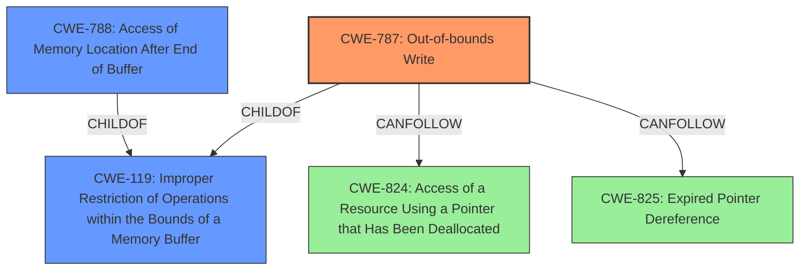

# Final Resolution for CVE-2021-40764

# Summary
| CWE ID | CWE Name | Confidence | CWE Abstraction Level | CWE Vulnerability Mapping Label | CWE-Vulnerability Mapping Notes |
|---|---|---|---|---|---|
| **CWE-787** | **Out-of-bounds Write** | 0.9 | Base | Primary | Allowed |
| CWE-788 | Access of Memory Location After End of Buffer | 0.6 | Base | Secondary | Discouraged |

## Evidence and Confidence

*   **Confidence Score:** 0.9
*   **Evidence Strength:** HIGH

## Relationship Analysis
The decision to prioritize **CWE-787 (Out-of-bounds Write)** over **CWE-788 (Access of Memory Location After End of Buffer)** is primarily due to the direct mention of "out-of-bounds write" in the CVE Reference Links Content Summary. **CWE-787** is a child of **CWE-119 (Improper Restriction of Operations within the Bounds of a Memory Buffer)**, providing a hierarchical context. The "CanFollow" relationships of **CWE-787** with weaknesses like **CWE-824 (Access of a Resource Using a Pointer that Has Been Deallocated)** and **CWE-825 (Expired Pointer Dereference)** highlight potential consequences of the initial out-of-bounds write. The base abstraction level of **CWE-787** aligns with the preferred level for vulnerability mapping.

## Vulnerability Chain
The vulnerability chain starts with the improper parsing of an M4A file, leading to a potential incorrect calculation of buffer size. This results in an **out-of-bounds write (CWE-787)**, which can then lead to memory corruption and potentially arbitrary code execution. The **out-of-bounds write** could corrupt pointers leading to **CWE-824 (Access of a Resource Using a Pointer that Has Been Deallocated)** or **CWE-825 (Expired Pointer Dereference)**.

## Summary of Analysis
The initial analysis and criticism both converge on **CWE-787 (Out-of-bounds Write)** as the primary weakness. The CVE Reference Links Content Summary explicitly mentions "out-of-bounds write," which is strong evidence. The relationship analysis confirms that **CWE-787** is more specific than **CWE-119 (Improper Restriction of Operations within the Bounds of a Memory Buffer)** and is at the appropriate base level of abstraction. The MITRE mapping guidance allows for the use of **CWE-787**. I am increasing the confidence to 0.9 due to the overwhelming evidence and the discouraged usage of **CWE-788** per MITRE guidance. The mitigations for **CWE-787** also align with the vulnerability description, such as using memory-safe languages or libraries and implementing compiler-based overflow detection mechanisms. The selection of **CWE-787** is at the optimal level of specificity because it directly addresses the root cause of the vulnerability, which is the act of writing outside the intended boundaries of a buffer.