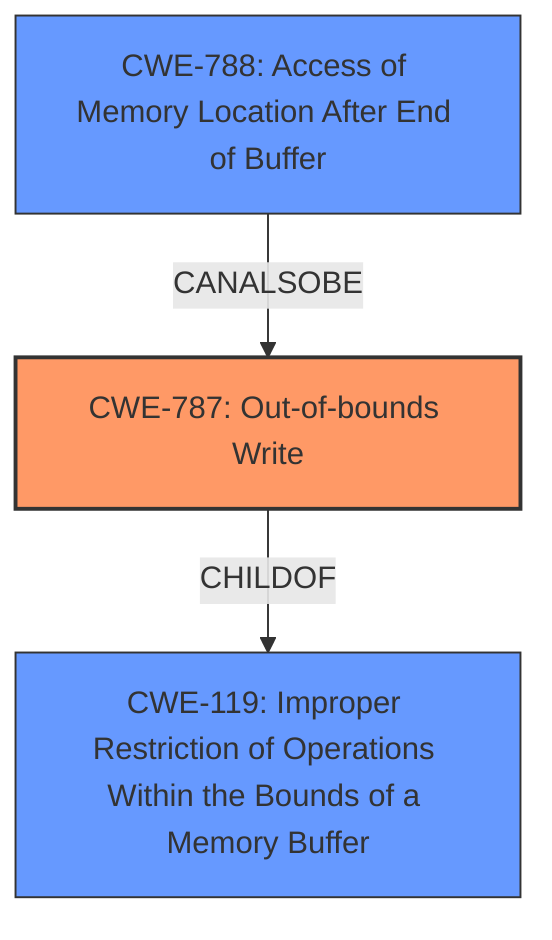

# Final Resolution for CVE-2021-40765

# Summary
| CWE ID | CWE Name | Confidence | CWE Abstraction Level | CWE Vulnerability Mapping Label | CWE-Vulnerability Mapping Notes |
|---|---|---|---|---|---|
| **CWE-787** | **Out-of-bounds Write** | 0.9 | Base | Primary CWE | Allowed. Retriever results support this choice as the top candidate. CWE-787 is a child of the discouraged CWE-119, indicating that this choice is a better match. |
| CWE-788 | Access of Memory Location After End of Buffer | 0.6 | Base | Secondary Candidate | Discouraged. While directly mentioned in the CVE reference, CWE-787 provides a more specific and accurate description of the **root cause** as an out-of-bounds *write*. CWE-788 is discouraged because it might be misused when more specific CWE entries are available and overlaps existing CWE entries. |

## Evidence and Confidence

*   **Confidence Score:** 0.9
*   **Evidence Strength:** HIGH

## Relationship Analysis
The primary relationship considered was the parent-child relationship between CWE-119 (**Improper Restriction of Operations Within the Bounds of a Memory Buffer**) and CWE-787 (**Out-of-bounds Write**). CWE-787 being a child of CWE-119 indicates a more specific form of buffer-related **weakness**. Additionally, the discouraged usage of CWE-788 (**Access of Memory Location After End of Buffer**) due to the availability of more specific CWEs, such as CWE-787, influenced the decision to prioritize CWE-787 as the primary **weakness**.

## Vulnerability Chain
The vulnerability chain starts with the parsing of a malicious M4A file. The program then attempts to write data past the end of the allocated buffer (**CWE-787**), leading to memory corruption. This memory corruption can then lead to arbitrary code execution.

## Summary of Analysis
The initial analysis and criticism provide a solid basis for the CWE classification. The vulnerability description clearly indicates a memory corruption issue due to parsing a malicious M4A file. The CVE reference link confirms that the **root cause** involves accessing a memory location after the end of a buffer.

The selection of CWE-787 as the primary CWE is justified because it describes the **weakness** of writing past the end of a buffer, which is a more precise description than simply accessing an out-of-bounds memory location (CWE-788). This aligns with MITRE's guidance to use the most specific CWE available. The relationship analysis reinforces this decision, as CWE-787 is a child of the broader CWE-119.

The decision to include CWE-788 as a secondary candidate acknowledges its direct mention in the CVE reference, but the discouraged usage of CWE-788, combined with the more specific nature of CWE-787, makes CWE-787 the optimal primary classification. As the criticism suggested, it's important to select the *most specific* flaw for the context.

The provided evidence supports a high confidence level (0.9) in the selection of CWE-787 as the primary CWE.