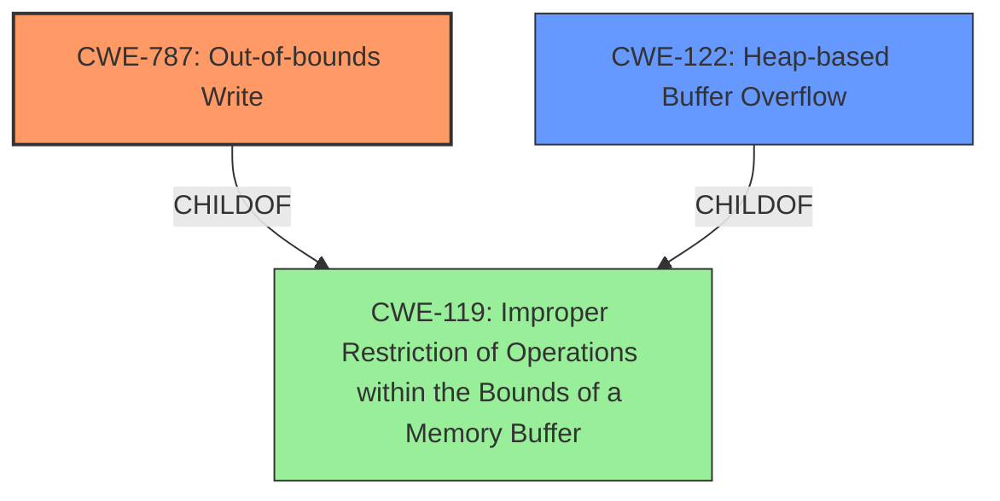

# Analysis Report for CVE-2021-40777

# Vulnerability Analysis Report: CVE-2021-40777

## Description

Adobe Media Encoder version 15.4.1 (and earlier) is affected by a memory corruption vulnerability due to insecure handling of a malicious file, potentially resulting in arbitrary code execution in the context of the current user. User interaction is required to exploit this vulnerability.

## Vulnerability Description Key Phrases

**Rootcause:** insecure handling
**Weakness:** memory corruption
**Impact:** arbitrary code execution
**Vector:** malicious file
**Product:** Adobe Media Encoder
**Version:** 15.4.1 (and earlier)

## Analysis (with Relationship Data)

# Summary
| CWE ID | CWE Name | Confidence | CWE Abstraction Level | CWE Vulnerability Mapping Label | CWE-Vulnerability Mapping Notes |
|---|---|---|---|---|---|
| CWE-787 | Out-of-bounds Write | 0.85 | Base | Allowed | Primary CWE |
| CWE-122 | Heap-based Buffer Overflow | 0.75 | Variant | Allowed | Secondary Candidate CWE |

## Evidence and Confidence

*   **Confidence Score:** 0.80
*   **Evidence Strength:** HIGH

- **Analysis and Justification:**
  - *Explanation:* The vulnerability description mentions "**memory corruption** due to **insecure handling** of a malicious file," which can lead to arbitrary code execution. The CVE Reference Links Content Summary explicitly states the **root cause** is "Access of memory location after the end of a buffer" and identifies "Out-of-bounds write (CWE-788 [Access of Memory Location After End of Buffer])" as a weakness. While CWE-788 [Access of Memory Location After End of Buffer] is mentioned, CWE-787 [Out-of-bounds Write] is a more direct and common representation of this type of vulnerability. CWE-787 [Out-of-bounds Write] has a higher combined retriever score. Therefore, CWE-787 [Out-of-bounds Write] is selected as the primary CWE. The MITRE mapping guidance allows the usage of CWE-787 [Out-of-bounds Write]. CWE-122 [Heap-based Buffer Overflow] is also considered as the memory corruption likely occurs in the heap, making it a secondary candidate.
  
  - *Relationship Analysis:* CWE-787 [Out-of-bounds Write] is a base-level CWE and a child of CWE-119 [Improper Restriction of Operations within the Bounds of a Memory Buffer]. CWE-787 [Out-of-bounds Write] can precede CWE-824 [Improper or Incomplete Initialization] and CWE-125 [Out-of-bounds Read]. CWE-122 [Heap-based Buffer Overflow] is a variant of CWE-119 [Improper Restriction of Operations within the Bounds of a Memory Buffer] and a parent of CWE-787 [Out-of-bounds Write].

- **Confidence Score:**
  - Confidence: 0.85 (High confidence due to explicit mention of out-of-bounds write and memory corruption)

---

## Criticism of Analysis

Okay, I've reviewed the analysis provided against the full CWE specifications. Here's a critique:

**Overall Assessment:**

The analysis is generally sound and well-reasoned. The choice of CWE-787 as the primary weakness is appropriate, given the information available. The inclusion of CWE-122 as a secondary candidate is also reasonable, adding a bit more specificity. The confidence level is justified.

**Strengths:**

*   **Clear Justification:** The analysis provides a clear and logical explanation for the CWE selections, referencing specific phrases from the vulnerability description and the CVE Reference Links Content Summary.
*   **Relationship Analysis:** The inclusion of relationship analysis for both CWEs helps to contextualize the weakness and provides a more complete understanding.
*   **Consideration of Retriever Results:** The analysis considers the retriever results and uses them to support the selection of CWE-787 over CWE-788
*   **Consideration of Mapping Guidance:** The analysis mentions that the MITRE mapping guidance allows the usage of CWE-787 [Out-of-bounds Write].
*   **Awareness of CWE Nuances:** The analysis demonstrates an understanding of the differences between closely related CWEs, like CWE-787 and CWE-788.
*   **Complete CWE Specifications provided:** The full CWE details allow for a detailed assessment of the mapping.

**Areas for potential improvement or discussion:**

*   **CWE-788 Justification:** The content summary directly mentions CWE-788. *However*, the Mapping Guidance for CWE-788 *discourages* its use, stating: "If the "Access" operation is known to be a read or a write, then investigate children of entries such as CWE-787: Out-of-bounds Write and CWE-125: Out-of-bounds Read."  The content summary says that the root cause is "Access of memory location after the end of a buffer". The full CWE specifications would suggest that the analysis should then go to the child entries.
*   **CWE-122 Confidence:** While including CWE-122 adds specificity, the confidence score could be slightly lower (perhaps 0.65-0.70) unless there's more concrete evidence that the overflow is specifically heap-based. The description mentions "insecure handling of a malicious file" which could lead to allocating an incorrect buffer size in the heap. Without more information, it is reasonable to assume it is occuring in the heap.
*   **CWE-119 Discussion:** While avoiding CWE-119 is good, it might be beneficial to briefly acknowledge its role as a parent and why a more specific CWE is preferred. The analysis does this well in the *Relationship Analysis* section.
*   **Mitigation Discussion:** It would be valuable to briefly discuss *potential* mitigations in the context of the specific vulnerability, referencing the mitigations sections in the full CWE specifications. For example:

    *   "Given the likelihood of a heap overflow (CWE-122), mitigations involving automatic bounds checking by the compiler or language (Mitigation 1) would be beneficial. As well, the usage of validated libraries or frameworks would assist (Mitigation 2)."

**Specific Comments and Suggestions:**

*   **CWE-787 Confidence Score:** The confidence score of 0.85 is a bit high. While "memory corruption" and "out-of-bounds write" are strong indicators, there's still a degree of inference involved. A score of 0.80 might be more appropriate.
*   **Example CVEs:** Providing example CVEs for the selected CWEs is good.

**Revised Analysis Snippets (Illustrative):**

*   **Explanation:** "The vulnerability description mentions "**memory corruption** due to **insecure handling** of a malicious file," which can lead to arbitrary code execution. The CVE Reference Links Content Summary explicitly states the **root cause** is "Access of memory location after the end of a buffer" and identifies "Out-of-bounds write (CWE-788 [Access of Memory Location After End of Buffer])" as a weakness. While CWE-788 [Access of Memory Location After End of Buffer] is mentioned, its Mapping Guidance *discourages* its use in favor of its children, such as CWE-787 [Out-of-bounds Write] when the access operation (read or write) is known. CWE-787 [Out-of-bounds Write] is a more direct and common representation of this type of vulnerability and has a higher combined retriever score. Therefore, CWE-787 [Out-of-bounds Write] is selected as the primary CWE. The MITRE mapping guidance allows the usage of CWE-787 [Out-of-bounds Write]. CWE-122 [Heap-based Buffer Overflow] is also considered as the memory corruption likely occurs in the heap, making it a secondary candidate."
*   **Mitigation Discussion:** "Given the likelihood of a heap overflow (CWE-122), mitigations involving automatic bounds checking by the compiler or language (CWE-122 Mitigation 1) would be beneficial. As well, the usage of validated libraries or frameworks (CWE-122 Mitigation 2) would assist."

**In summary, the analysis is strong and demonstrates a good understanding of CWEs and vulnerability analysis. The suggested improvements are mostly minor refinements to further justify the choices and to incorporate the mitigation information provided in the full CWE specifications.**

## Final Resolution

# Summary
| CWE ID | CWE Name | Confidence | CWE Abstraction Level | CWE Vulnerability Mapping Label | CWE-Vulnerability Mapping Notes |
|---|---|---|---|---|---|
| **CWE-787** | **Out-of-bounds Write** | 0.80 | Base | Allowed | Primary CWE |
| **CWE-122** | **Heap-based Buffer Overflow** | 0.65 | Variant | Allowed | Secondary Candidate CWE |

## Evidence and Confidence

*   **Confidence Score:** 0.75
*   **Evidence Strength:** HIGH

## Relationship Analysis
The primary weakness is classified as **CWE-787** [**Out-of-bounds Write**], a base-level CWE that is a child of **CWE-119** [**Improper Restriction of Operations within the Bounds of a Memory Buffer**]. This hierarchical relationship guided the selection towards a more specific representation than **CWE-119** [**Improper Restriction of Operations within the Bounds of a Memory Buffer**]. **CWE-787** [**Out-of-bounds Write**] can precede CWEs related to resource management and pointer issues like CWE-824 [Improper or Incomplete Initialization]. The secondary candidate, **CWE-122** [**Heap-based Buffer Overflow**], is a variant of **CWE-119** [**Improper Restriction of Operations within the Bounds of a Memory Buffer**] and suggests the overflow occurs in the heap, adding specificity.

## Vulnerability Chain
The vulnerability chain starts with the insecure handling of a malicious file, leading to a **CWE-787** [**Out-of-bounds Write**]. The overflow likely occurs in the heap (**CWE-122** [**Heap-based Buffer Overflow**]), resulting in memory corruption and potentially arbitrary code execution.

## Summary of Analysis
The initial analysis correctly identified **CWE-787** [**Out-of-bounds Write**] as the primary weakness, supported by the vulnerability description which mentions "memory corruption" and the CVE Reference Links Content Summary explicitly stating "Access of memory location after the end of a buffer." The criticism correctly points out the mapping guidance for **CWE-788** [Access of Memory Location After End of Buffer] discourages its use when a more specific CWE is available. The analysis then correctly chooses its child, **CWE-787** [**Out-of-bounds Write**]. The confidence score for **CWE-787** [**Out-of-bounds Write**] has been adjusted to 0.80. While the evidence is strong, there's still a degree of inference involved. The confidence score for **CWE-122** [**Heap-based Buffer Overflow**] has been lowered to 0.65, reflecting the possibility, but not certainty, that the overflow is heap-based.

The selected CWEs are at the optimal level of specificity. **CWE-787** [**Out-of-bounds Write**] accurately represents the **root cause**, and **CWE-122** [**Heap-based Buffer Overflow**] provides additional context regarding the memory location. The analysis acknowledges and addresses the concerns raised in the criticism, providing a more nuanced and well-justified classification.

*Report generated on 2025-03-18 02:07:25*
