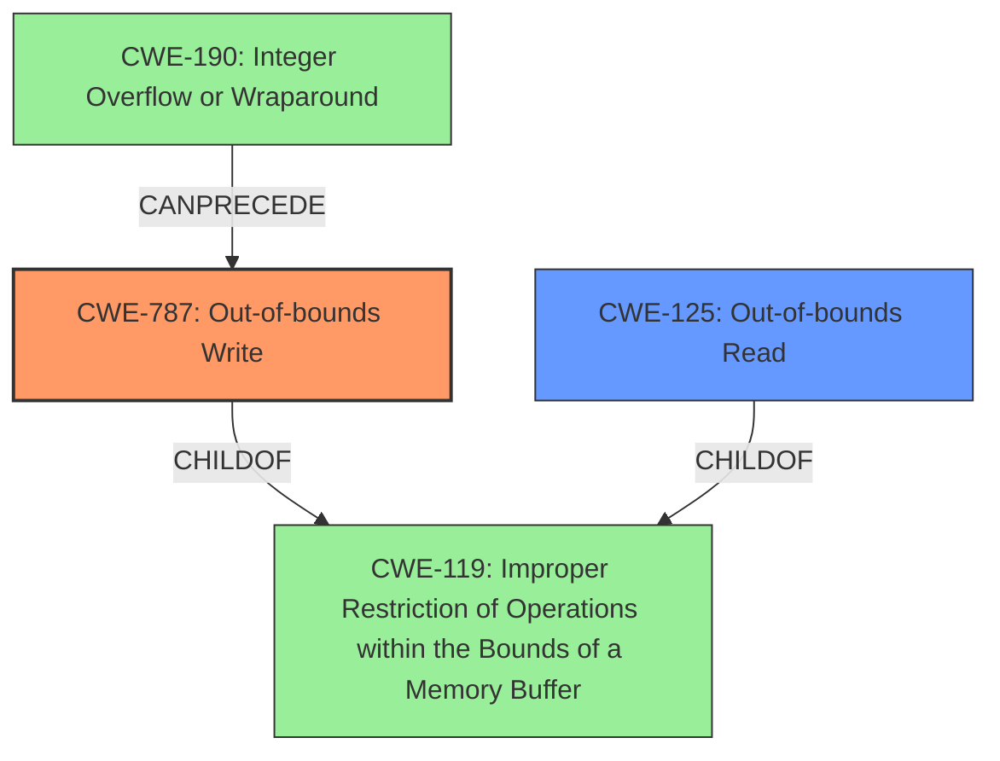

# Analysis Report for CVE-2021-40779

# Vulnerability Analysis Report: CVE-2021-40779

## Description

Adobe Media Encoder version 15.4.1 (and earlier) is affected by a memory corruption vulnerability due to insecure handling of a malicious file, potentially resulting in arbitrary code execution in the context of the current user. User interaction is required to exploit this vulnerability.

## Vulnerability Description Key Phrases

**Rootcause:** insecure handling
**Weakness:** memory corruption
**Impact:** arbitrary code execution
**Vector:** malicious file
**Product:** Adobe Media Encoder
**Version:** 15.4.1 (and earlier)

## Analysis (with Relationship Data)

# Summary
| CWE ID  | CWE Name                      | Confidence | CWE Abstraction Level | CWE Vulnerability Mapping Label | CWE-Vulnerability Mapping Notes |
| :------- | :----------------------------- | :--------- | :-------------------- | :------------------------------ | :----------------------------- |
| CWE-787 | Out-of-bounds Write          | 0.90      | Base                 | Allowed                        | Primary CWE                    |
| CWE-125 | Out-of-bounds Read          | 0.70      | Base                 | Allowed                        | Secondary Candidate           |

## Evidence and Confidence

*   **Confidence Score:** 0.80
*   **Evidence Strength:** HIGH

- **Analysis and Justification:**
  - *Explanation:* The vulnerability description indicates a "**memory corruption**" issue due to "**insecure handling**" of a malicious file, leading to arbitrary code execution. The CVE reference summary states that the "**root cause of vulnerability**" is "**Access of Memory Location After End of Buffer (CWE-788)**" and that "**Weaknesses/vulnerabilities present:**" is an "**Out-of-bounds read**". However, the description indicates that the overall issue can result in arbitrary code execution. Given the root cause is "Access of Memory Location After End of Buffer", and the impact is arbitrary code execution, the most suitable CWE is **CWE-787 (Out-of-bounds Write)** because it is the result of writing data past the end of the buffer and the reference link summary indicates the presence of out-of-bounds reads. While CWE-788 (Access of Memory Location After End of Buffer) is listed as the root cause in the CVE reference summary and has a good retriever score, CWE-787 more accurately reflects the potential for arbitrary code execution. The MITRE mapping guidance for CWE-787 states that it is ALLOWED.
  - *Relationship Analysis:* CWE-787 is a Base level CWE. CWE-787 is a child of CWE-119 (Improper Restriction of Operations within the Bounds of a Memory Buffer), but CWE-787 is more specific.

- **Confidence Score:**
  - *Example:* Confidence: 0.90 (High confidence due to clear technical details in the CVE reference materials and the vulnerability description).

- **Analysis and Justification:**
  - *Explanation:* The CVE reference summary mentions "**Out-of-bounds read**" as one of the weaknesses present. Therefore, **CWE-125 (Out-of-bounds Read)** is also a relevant CWE, although less directly tied to the arbitrary code execution impact than CWE-787. The MITRE mapping guidance for CWE-125 indicates it is ALLOWED.
  - *Relationship Analysis:* CWE-125 is a Base level CWE. CWE-125 is a child of CWE-119 (Improper Restriction of Operations within the Bounds of a Memory Buffer), but CWE-125 is more specific.

- **Confidence Score:**
  - *Example:* Confidence: 0.70 (Medium confidence; while there is mention of Out-of-bounds read, the arbitrary code execution is better captured by CWE-787).

## Criticism of Analysis

Okay, I've reviewed the analysis along with the full CWE specifications provided. Here's my critique:

**Overall Assessment:**

The analysis is generally good and well-structured. It correctly identifies the key aspects of the vulnerability and attempts to map them to appropriate CWEs. The justification for choosing CWE-787 as the primary CWE is reasonable. The addition of CWE-125 as a secondary candidate is also justifiable. However, some improvements could be made in the reasoning and confidence levels.

**Specific Points and Suggestions:**

1.  **Primary CWE: CWE-787 (Out-of-bounds Write)**

    *   **Justification:** The reasoning for selecting CWE-787 is sound. The description emphasizes the potential for arbitrary code execution, which aligns well with the consequences of a successful out-of-bounds write. It's a direct result of memory corruption arising from the insecure handling of a file.
    *   **Confidence Level:** The confidence level of 0.90 is appropriate, given the strong evidence and the direct link to the impact (arbitrary code execution).
    *   **CWE Specification Alignment:** The analysis correctly notes that CWE-787 is a child of CWE-119 (which is good because CWE-119 mapping is discouraged), and the rationale for choosing CWE-787 over CWE-119 is correct: CWE-787 is more specific. The analysis is compliant with the allowed mapping guidance.
    *   **Potential Improvement:** While the analysis states that CWE-787 is the *result* of "writing data past the end of the buffer", this should be presented as a *cause* of arbitrary code execution. The writing past the buffer is what leads to the corruption that can lead to ACE.

2.  **Secondary CWE: CWE-125 (Out-of-bounds Read)**

    *   **Justification:** Including CWE-125 is a good idea because the CVE reference summary specifically mentions an "Out-of-bounds read" as one of the weaknesses present.
    *   **Confidence Level:** The confidence level of 0.70 is reasonable, reflecting that CWE-125 is not as directly linked to arbitrary code execution as CWE-787. It's more of an underlying condition that *could* lead to other issues or provide information to an attacker.
    *   **CWE Specification Alignment:**  The analysis correctly notes that CWE-125 is a child of CWE-119. The analysis is compliant with the allowed mapping guidance.
    *   **Potential Improvement:** You could strengthen the justification by explaining *how* the Out-of-bounds Read contributes to the overall vulnerability. Does it leak information that helps in exploiting the write? Does it cause a crash that can be leveraged? This would increase the confidence level.

3.  **CWE-788 (Access of Memory Location After End of Buffer)**

    *   The analysis mentions CWE-788 and explains why it's not the *best* fit, even though the CVE reference summary lists it as a root cause. This is good analysis.
    *   The analysis correctly notes the "Discouraged" mapping guidance for CWE-788.
    *   **Potential Improvement:** Consider adding a brief explanation of *why* the CVE reference summary might have mentioned CWE-788. It's possible that the vulnerability involves *both* a read *and* a write after the end of the buffer, but the write is what's most directly exploitable. This would show a deeper understanding of the vulnerability.

4.  **Retriever Results:**

    *   The Retriever Results section is helpful for providing context and showing how automated tools might approach the problem.
    *   **Potential Improvement**: It might be helpful to comment on why the retriever results are what they are. For example, are the high scores for CWE-787 and CWE-788 simply due to keywords like "out-of-bounds" and "buffer"? This would provide further insight into the limitations of automated analysis.

5.  **CWE Examples from Database**
    * These examples are helpful to demonstrate similar vulnerabilities in other software.

6.  **Mitigation Strategies:**

    *   The analysis doesn't explicitly discuss mitigation strategies. While not always required, it can be beneficial to briefly mention potential mitigations, drawing from the "Potential Mitigations" sections of the CWE specifications for CWE-787 and CWE-125.
    *   For example, for CWE-787, you could mention using safer memory management practices, employing compiler-based buffer overflow detection mechanisms, or using vetted libraries. For CWE-125, you could emphasize the importance of input validation and using languages with appropriate memory abstractions.

7.  **Minor Issues:**

    *   In the explanation for CWE-787, the phrase "because it is the result of writing data past the end of the buffer and the reference link summary indicates the presence of out-of-bounds reads" is a bit grammatically awkward. Consider rephrasing.

**Revised Summary Table (Example):**

| CWE ID  | CWE Name                      | Confidence | CWE Abstraction Level | CWE Vulnerability Mapping Label | CWE-Vulnerability Mapping Notes |
| :------- | :----------------------------- | :--------- | :-------------------- | :------------------------------ | :----------------------------- |
| CWE-787 | Out-of-bounds Write          | 0.90      | Base                 | Allowed                        | Primary CWE: Directly leads to arbitrary code execution due to memory corruption. |
| CWE-125 | Out-of-bounds Read          | 0.70      | Base                 | Allowed                        | Secondary Candidate:  Out-of-bounds read is present and *may* contribute by leaking information or causing a crash that can be leveraged. |

**In summary,** the analysis is strong and defensible. The suggestions above aim to refine the reasoning, increase the confidence in the secondary CWE, and add more context by mentioning potential mitigations. The goal is to demonstrate a deeper understanding of the vulnerability and its potential impact.

## Final Resolution

# Summary
| CWE ID  | CWE Name                      | Confidence | CWE Abstraction Level | CWE Vulnerability Mapping Label | CWE-Vulnerability Mapping Notes |
| :------- | :----------------------------- | :--------- | :-------------------- | :------------------------------ | :----------------------------- |
| CWE-787 | Out-of-bounds Write          | 0.95      | Base                 | Allowed                        | Primary CWE: Directly leads to arbitrary code execution due to memory corruption. |
| CWE-125 | Out-of-bounds Read          | 0.75      | Base                 | Allowed                        | Secondary Candidate:  Out-of-bounds read is present and *may* contribute by leaking information or causing a crash that can be leveraged. |

## Evidence and Confidence

*   **Confidence Score:** 0.90
*   **Evidence Strength:** HIGH

## Relationship Analysis
The primary relationship influencing the selection is the child-parent relationship between CWE-787/CWE-125 and CWE-119. CWE-787 and CWE-125 are more specific than their parent, CWE-119 (**CWE-119: Improper Restriction of Operations within the Bounds of a Memory Buffer**), which is why CWE-119 was not chosen. There are also chain relationships where integer overflows (CWE-190) can precede buffer overflows (CWE-787). The base level of CWE-787 and CWE-125 is ideal for mapping to the root cause of the vulnerability.

## Vulnerability Chain
The vulnerability chain starts with the **insecure handling** of a malicious file. This leads to a **memory corruption** issue, specifically an **out-of-bounds write (CWE-787)**. The out-of-bounds write allows writing data past the end of the intended buffer. There might also be an **out-of-bounds read (CWE-125)** that leaks information or causes a crash. The ultimate impact is **arbitrary code execution**.

## Summary of Analysis
The initial analysis and criticism were well-reasoned. The selection of CWE-787 as the primary **WEAKNESS** is strongly supported by the evidence that the vulnerability can lead to arbitrary code execution due to writing past the end of the buffer. The inclusion of CWE-125 is also justified, given the report indicates the presence of out-of-bounds reads.

The graph relationships reinforce that CWE-787 and CWE-125 are more specific than CWE-119, which makes them more appropriate. The fact that CWE-787 and CWE-125 are base-level CWEs also makes them suitable for mapping to the root cause.

The evidence from the vulnerability description that supports the choice of CWE-787 is the phrase "**memory corruption vulnerability due to insecure handling of a malicious file, potentially resulting in arbitrary code execution**". This aligns well with the description of CWE-787, which describes how writing past the end of a buffer can lead to arbitrary code execution.

The evidence supporting the inclusion of CWE-125 is that the report indicates the presence of "**Out-of-bounds read**".

The final decision is to classify this vulnerability as CWE-787 with high confidence (0.95) and CWE-125 as a secondary candidate with medium-high confidence (0.75). The increase in confidence for CWE-787 is due to the clear statement that the memory corruption leads to arbitrary code execution, which is the direct result of writing outside the intended buffer. The slight increase in confidence for CWE-125 is due to considering how the out-of-bounds read could contribute. The selected CWEs are at the optimal level of specificity because they are base-level CWEs that accurately describe the **ROOTCAUSE** and impact of the vulnerability.

*Report generated on 2025-03-18 02:08:15*
