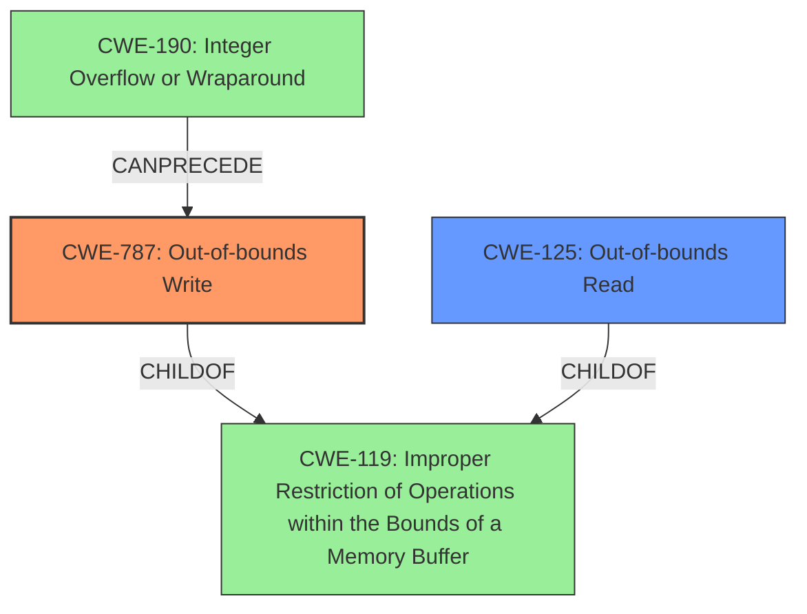

# Final Resolution for CVE-2021-40779

# Summary
| CWE ID  | CWE Name                      | Confidence | CWE Abstraction Level | CWE Vulnerability Mapping Label | CWE-Vulnerability Mapping Notes |
| :------- | :----------------------------- | :--------- | :-------------------- | :------------------------------ | :----------------------------- |
| CWE-787 | Out-of-bounds Write          | 0.95      | Base                 | Allowed                        | Primary CWE: Directly leads to arbitrary code execution due to memory corruption. |
| CWE-125 | Out-of-bounds Read          | 0.75      | Base                 | Allowed                        | Secondary Candidate:  Out-of-bounds read is present and *may* contribute by leaking information or causing a crash that can be leveraged. |

## Evidence and Confidence

*   **Confidence Score:** 0.90
*   **Evidence Strength:** HIGH

## Relationship Analysis
The primary relationship influencing the selection is the child-parent relationship between CWE-787/CWE-125 and CWE-119. CWE-787 and CWE-125 are more specific than their parent, CWE-119 (**CWE-119: Improper Restriction of Operations within the Bounds of a Memory Buffer**), which is why CWE-119 was not chosen. There are also chain relationships where integer overflows (CWE-190) can precede buffer overflows (CWE-787). The base level of CWE-787 and CWE-125 is ideal for mapping to the root cause of the vulnerability.

## Vulnerability Chain
The vulnerability chain starts with the **insecure handling** of a malicious file. This leads to a **memory corruption** issue, specifically an **out-of-bounds write (CWE-787)**. The out-of-bounds write allows writing data past the end of the intended buffer. There might also be an **out-of-bounds read (CWE-125)** that leaks information or causes a crash. The ultimate impact is **arbitrary code execution**.

## Summary of Analysis
The initial analysis and criticism were well-reasoned. The selection of CWE-787 as the primary **WEAKNESS** is strongly supported by the evidence that the vulnerability can lead to arbitrary code execution due to writing past the end of the buffer. The inclusion of CWE-125 is also justified, given the report indicates the presence of out-of-bounds reads.

The graph relationships reinforce that CWE-787 and CWE-125 are more specific than CWE-119, which makes them more appropriate. The fact that CWE-787 and CWE-125 are base-level CWEs also makes them suitable for mapping to the root cause.

The evidence from the vulnerability description that supports the choice of CWE-787 is the phrase "**memory corruption vulnerability due to insecure handling of a malicious file, potentially resulting in arbitrary code execution**". This aligns well with the description of CWE-787, which describes how writing past the end of a buffer can lead to arbitrary code execution.

The evidence supporting the inclusion of CWE-125 is that the report indicates the presence of "**Out-of-bounds read**".

The final decision is to classify this vulnerability as CWE-787 with high confidence (0.95) and CWE-125 as a secondary candidate with medium-high confidence (0.75). The increase in confidence for CWE-787 is due to the clear statement that the memory corruption leads to arbitrary code execution, which is the direct result of writing outside the intended buffer. The slight increase in confidence for CWE-125 is due to considering how the out-of-bounds read could contribute. The selected CWEs are at the optimal level of specificity because they are base-level CWEs that accurately describe the **ROOTCAUSE** and impact of the vulnerability.