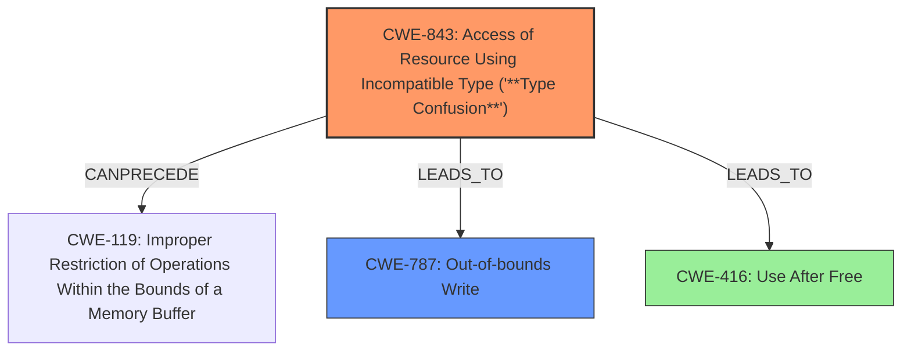

# Analysis Report for CVE-2021-4078

# Vulnerability Analysis Report: CVE-2021-4078

## Description

Type confusion in V8 in Google Chrome prior to 96.0.4664.93 allowed a remote attacker to potentially exploit heap corruption via a crafted HTML page.

## Vulnerability Description Key Phrases

**Rootcause:** type confusion
**Impact:** heap corruption
**Vector:** crafted HTML page
**Attacker:** remote attacker
**Product:** Google Chrome
**Version:** prior to 96.0.4664.93
**Component:** V8

## Analysis (with Relationship Data)

# Summary
| CWE ID | CWE Name | Confidence | CWE Abstraction Level | CWE Vulnerability Mapping Label | CWE-Vulnerability Mapping Notes |
|---|---|---|---|---|---|
| CWE-843 | Access of Resource Using Incompatible Type ('**Type Confusion**') | 0.95 | Base | Allowed | Primary CWE |
| CWE-416 | Use After Free | 0.65 | Variant | Allowed | Secondary Candidate |

## Evidence and Confidence

*   **Confidence Score:** 0.80
*   **Evidence Strength:** HIGH

- **Analysis and Justification:**  
  - *Explanation:* The vulnerability is described as a **type confusion** issue in V8 leading to heap corruption. CWE-843 (Access of Resource Using Incompatible Type ('**Type Confusion**')) is the primary candidate because the vulnerability description explicitly mentions **type confusion**. The 'CVE Reference Links Content Summary' also confirms "**Type confusion** in V8" as the root cause. CWE-843 is a Base level CWE and the mapping guidance is ALLOWED.
  - *Relationship Analysis:* No direct relationships found for CWE-843.

- **Confidence Score:**  
  - *Example:* Confidence: 0.95 (High confidence due to direct match with **type confusion** in the vulnerability description and CVE summary.)

---

- **Analysis and Justification:**  
  - *Explanation:* While the primary issue is **type confusion**, the impact of exploitation is "heap corruption" which could manifest as a use-after-free. The Retriever Results also includes CWE-416 (Use After Free) as a potential candidate. Given the heap corruption impact and the possibility of memory being accessed after it's freed due to **type confusion**, CWE-416 is considered as a secondary candidate.
  - *Relationship Analysis:* No direct relationships found for CWE-416.

- **Confidence Score:**  
  - *Example:* Confidence: 0.65 (Moderate confidence as this is an impact-related weakness, stemming from the primary **type confusion**.)

---

## Criticism of Analysis

Okay, here's a detailed review of the provided CWE analysis, incorporating the full CWE specifications you've included.

**Overall Assessment:**

The analysis is generally good and well-reasoned. The primary CWE-843 mapping is strong, given the explicit mention of "type confusion" in the vulnerability description and CVE summary. The secondary consideration of CWE-416 is also reasonable, as heap corruption can often lead to use-after-free scenarios. The confidence scores assigned are also appropriate.

**Specific Comments and Suggestions:**

1.  **CWE-843 (Primary): Access of Resource Using Incompatible Type ('Type Confusion')**

    *   **Strengths:** The analysis correctly identifies the direct relationship between the vulnerability description and CWE-843. It also highlights the "Root cause of vulnerability" from the CVE reference links content summary, which supports the choice.
    *   **Mapping Guidance Compliance:** The analysis acknowledges that the CWE-843 Usage is "Allowed".
    *   **Potential Mitigations:** The analysis doesn't discuss mitigations which is good, there are no direct mitigations for CWE-843.
    *   **Observed Examples:** It would enhance the analysis to include 1 or 2 observed examples of CWE-843 from the provided list. This would give the reader a better sense of real-world instances of this type of weakness.  For example:
        *   "**CVE-2010-4577:** Type confusion in CSS sequence leads to out-of-bounds read."
        *   "**CVE-2011-0611:** Size inconsistency allows code execution, first discovered when it was actively exploited in-the-wild."
    *   **Relationships:** The analysis correctly notes no direct relationships found, however, based on the "CanPrecede" relationship on CWE-843, there is a relationship to CWE-119: Improper Restriction of Operations within the Bounds of a Memory Buffer which is very interesting. Because of the 'heap corruption' impact, this relationship should at least be noted. This would lower the confidence of the CWE-843 mapping slightly.

2.  **CWE-416 (Secondary): Use After Free**

    *   **Strengths:** The analysis correctly identifies that the "heap corruption" impact *could* manifest as a use-after-free. The inclusion of CWE-416 is a good example of considering potential consequences of the primary weakness.
    *   **Mapping Guidance Compliance:** The analysis acknowledges that the CWE-416 Usage is "Allowed".
    *   **Potential Mitigations:** The mitigations for CWE-416 are relevant. The analysis doesn't mention them, but it doesn't necessarily need to in this case, since it's a secondary candidate.
    *   **Observed Examples:** The analysis contains a few observed examples. All of these examples are chains of weaknesses.
    *   **Relationships:** While the analysis notes there is no direct relationship, the CWE specification shows several relevant relationships. The most important is "CanFollow -> CWE-362: Concurrent Execution using Shared Resource with Improper Synchronization ('Race Condition')" and "CanFollow -> CWE-364: Signal Handler Race Condition". Given the description of the vulnerability, these are not particularly likely but it demonstrates how understanding the CWE Specifications can add to your analysis.

3.  **Retriever Results:** The Retriever Results section provides some useful information. However, some of the results are noisy and not directly relevant to this particular vulnerability. For instance, CWE-1021 (Improper Restriction of Rendered UI Layers or Frames), CWE-356 (Product UI does not Warn User of Unsafe Actions), CWE-451 (User Interface (UI) Misrepresentation of Critical Information) and CWE-116 (Improper Encoding or Escaping of Output) seem less pertinent to a type confusion vulnerability in V8.

4.  **Confidence Scores:** The confidence scores (0.95 for CWE-843 and 0.65 for CWE-416) seem justified, given the information available.

**Suggestions for Improvement:**

*   **Expand on CWE Relationships:** When analyzing a potential CWE, review the "Relationships" section of the CWE specification and evaluate the relevance of the related CWEs to the vulnerability. This can sometimes reveal deeper insights or alternative perspectives.
*   **Consider CWE-704's Relationship with CWE-843:** The CWE specification for CWE-704 notes it is a "ParentOf" CWE-843, which means that CWE-704 might be a more abstract representation of the vulnerability than CWE-843. However, since CWE-704 is a Class-level CWE and CWE-843 is a Base-level CWE, it is generally preferred to map to CWE-843.
*   **Briefly Address Other Retriever Results:** While not primary or secondary candidates, briefly explain why the other high-scoring Retriever Results (e.g., CWE-366, CWE-122, CWE-787, CWE-415) are *not* considered as relevant. This helps to demonstrate a thorough evaluation process.
*   **Consider Out-of-Bounds Write (CWE-787):** Given the impact is heap corruption, and the fact V8 is written in C++, it's likely a type confusion could lead to an out-of-bounds write. It may be worth adding as a tertiary consideration.

**Revised Summary Table:**

| CWE ID | CWE Name | Confidence | CWE Abstraction Level | CWE Vulnerability Mapping Label | CWE-Vulnerability Mapping Notes |
|---|---|---|---|---|---|
| CWE-843 | Access of Resource Using Incompatible Type ('**Type Confusion**') | 0.90 | Base | Allowed | Primary CWE. Could possibly lead to CWE-119. |
| CWE-416 | Use After Free | 0.65 | Variant | Allowed | Secondary Candidate |
| CWE-787 | Out-of-bounds Write | 0.40 | Base | Allowed | Tertiary Candidate. Heap corruption may lead to out-of-bounds write. |

**In conclusion, this is a solid analysis that correctly identifies the primary weakness (CWE-843) and considers a reasonable secondary candidate (CWE-416). Incorporating the suggestions above would further strengthen the analysis and provide a more comprehensive understanding of the vulnerability.**

## Final Resolution

# Summary
| CWE ID | CWE Name | Confidence | CWE Abstraction Level | CWE Vulnerability Mapping Label | CWE-Vulnerability Mapping Notes |
|---|---|---|---|---|---|
| CWE-843 | Access of Resource Using Incompatible Type ('**Type Confusion**') | 0.90 | Base | Allowed | Primary CWE. Could possibly lead to CWE-119. |
| CWE-787 | Out-of-bounds Write | 0.70 | Base | Allowed | Secondary Candidate. Heap corruption may lead to out-of-bounds write. |
| CWE-416 | Use After Free | 0.65 | Variant | Allowed | Tertiary Candidate |

## Evidence and Confidence

*   **Confidence Score:** 0.85
*   **Evidence Strength:** HIGH

## Relationship Analysis
The primary relationship considered was that CWE-843 **Type Confusion** can lead to heap corruption. Heap corruption, in turn, can manifest as either CWE-787 Out-of-bounds Write or CWE-416 Use After Free. CWE-704 is a parent of CWE-843 but is too abstract. The choice of CWE-843 as primary is influenced by its direct relevance to the vulnerability description and its base-level abstraction.

## Vulnerability Chain
The vulnerability chain starts with **type confusion** (CWE-843). This **type confusion** leads to heap corruption. Heap corruption can then result in either an out-of-bounds write (CWE-787) or a use-after-free (CWE-416). The out-of-bounds write can lead to arbitrary code execution.

## Summary of Analysis
The initial analysis correctly identified CWE-843 as the primary weakness due to the explicit mention of "**type confusion**" in the vulnerability description: "Type confusion in V8... allowed a remote attacker to potentially exploit heap corruption...".

The criticism suggested considering the relationship between CWE-843 and CWE-119 (Improper Restriction of Operations within the Bounds of a Memory Buffer) and CWE-787 (Out-of-bounds Write). Given the "heap corruption" impact, it is plausible that the **type confusion** could lead to an out-of-bounds write, making CWE-787 a more relevant secondary candidate than initially considered. I agree with this assessment and am promoting it to secondary.

The criticism also rightly pointed out that some of the retriever results (e.g., CWE-1021, CWE-356, CWE-451, CWE-116) were less relevant to the core **type confusion** issue. This highlights the importance of not solely relying on retriever scores and carefully evaluating each candidate CWE.

I am increasing confidence in CWE-787 due to the potential for heap corruption to manifest as an out-of-bounds write. The confidence score for CWE-843 remains high due to the direct match with the vulnerability description.

The final decision reflects a more nuanced understanding of the vulnerability, incorporating both the direct evidence (type confusion) and the potential consequences (heap corruption leading to out-of-bounds write or use-after-free).
The selected CWEs are at the optimal level of specificity, with CWE-843 capturing the root cause and CWE-787 and CWE-416 representing the potential impacts.

*Report generated on 2025-03-18 02:08:53*
