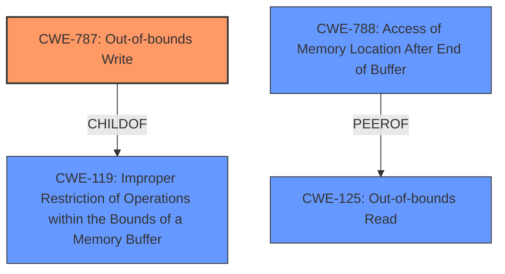

# Analysis Report for CVE-2021-40780

# Vulnerability Analysis Report: CVE-2021-40780

## Description

Adobe Media Encoder version 15.4.1 (and earlier) is affected by a memory corruption vulnerability due to insecure handling of a malicious file, potentially resulting in arbitrary code execution in the context of the current user. User interaction is required to exploit this vulnerability.

## Vulnerability Description Key Phrases

**Rootcause:** insecure handling
**Weakness:** memory corruption
**Impact:** arbitrary code execution
**Vector:** malicious file
**Product:** Adobe Media Encoder
**Version:** 15.4.1 (and earlier)

## Analysis (with Relationship Data)

# Summary
| CWE ID | CWE Name | Confidence | CWE Abstraction Level | CWE Vulnerability Mapping Label | CWE-Vulnerability Mapping Notes |
|---|---|---|---|---|---|
| CWE-787 | Out-of-bounds Write | 0.85 | Base | Allowed | Primary CWE |
| CWE-788 | Access of Memory Location After End of Buffer | 0.6 | Base | Discouraged | Secondary Candidate |
| CWE-125 | Out-of-bounds Read | 0.5 | Base | Allowed | Secondary Candidate |

## Evidence and Confidence

*   **Confidence Score:** 0.8
*   **Evidence Strength:** HIGH

- **Analysis and Justification:**
  - *Explanation:* The vulnerability description states a **memory corruption** vulnerability exists due to **insecure handling** of a malicious file. The CVE reference link content summary further specifies this as an "Access of Memory Location After End of Buffer (CWE-788)" and "Out-of-bounds read". However, since arbitrary code execution is possible, it is most likely due to an out-of-bounds write condition (CWE-787), where writing beyond buffer boundaries overwrites critical program data or executable code. While the summary mentions CWE-788, the impact suggests a write condition is more probable. CWE-125 is also a possibility given that an out-of-bounds read is mentioned.

  - *Relationship Analysis:* CWE-787 (Out-of-bounds Write) is a base-level CWE and a child of CWE-119 (Improper Restriction of Operations within the Bounds of a Memory Buffer), which was the primary CWE match from similar CVE descriptions. CWE-787 is also related to CWE-122 (Heap-based Buffer Overflow), CWE-121 (Stack-based Buffer Overflow), and CWE-120 (Classic Buffer Overflow), indicating the potential for buffer overflow vulnerabilities. CWE-788 (Access of Memory Location After End of Buffer) is related and can be considered but is less likely to be the root cause given the possibility of arbitrary code execution. CWE-125 (Out-of-bounds Read) could be involved.

- **Confidence Score:**
  - Confidence: 0.8 (High confidence due to the combination of vulnerability description, CVE reference details, and retriever results pointing towards out-of-bounds write and its impact)

---

## Criticism of Analysis

Okay, I've reviewed the provided analysis against the full CWE specifications. Here's my critique:

**Overall Assessment:**

The analysis is generally well-reasoned and provides a strong justification for the primary CWE selection of CWE-787 (Out-of-bounds Write). The inclusion of CWE-788 and CWE-125 as secondary candidates is also appropriate, given the information provided. However, there are a few points where the confidence can be improved and additional nuances considered.

**Specific Points:**

1.  **CWE-787: Out-of-bounds Write (Primary CWE)**
    *   **Justification:** The reasoning for selecting CWE-787 is solid. The vulnerability description mentions "memory corruption" and the CVE reference content summary mentions "arbitrary code execution." Arbitrary code execution strongly suggests a write condition, where an attacker can overwrite critical data or code in memory. The analysis acknowledges the existence of an out-of-bounds read (CWE-788 and CWE-125) but correctly concludes that the *impact* is indicative of a write.
    *   **Mapping Guidance:** The analysis correctly notes that CWE-787 is at the Base level of abstraction, which is the preferred level.
    *   **Potential Mitigations:** The provided CWE specifications list mitigations like using memory-safe languages or libraries, and employing compiler-based buffer overflow detection mechanisms. These are valid and should be considered when recommending remediation.
    *   **Critique:** The confidence score of 0.85 is appropriate. Nothing to critique here.

2.  **CWE-788: Access of Memory Location After End of Buffer (Secondary Candidate)**
    *   **Justification:** Including CWE-788 is reasonable since the CVE reference mentions "Access of Memory Location After End of Buffer."
    *   **Mapping Guidance:** The analysis mentions that CWE-788 is *Discouraged* as a direct mapping. The analysis correctly states, "If the "Access" operation is known to be a read or a write, then investigate children of entries such as CWE-787: Out-of-bounds Write and CWE-125: Out-of-bounds Read."
    *   **Potential Mitigations:**  The provided CWE specifications do not offer specific mitigations for this CWE, but instead point you to better CWEs.
    *   **Critique:** The confidence of 0.6 is fine as this is a secondary candidate. However, the analysis could be improved by stating explicitly that this CWE is discouraged per the mapping guidance and only included because it's mentioned in the CVE content summary.

3.  **CWE-125: Out-of-bounds Read (Secondary Candidate)**
    *   **Justification:** The CVE reference link content summary mentions "Out-of-bounds read". The description indicates that it can be involved.
    *   **Mapping Guidance:** The analysis correctly notes that CWE-125 is at the Base level of abstraction, which is the preferred level.
    *   **Potential Mitigations:** The provided CWE specifications include Input Validation as a mitigation as well as Language Selection.
    *   **Critique:** The confidence of 0.5 is fine as this is a secondary candidate.

**Recommendations for Improvement:**

*   **Strengthen the Argument against CWE-788:** Explicitly state that CWE-788 is a *discouraged* mapping due to the existence of more specific CWEs like CWE-787 and CWE-125, and that it's included primarily for completeness and because it's mentioned in the CVE's root cause description.
*   **Consider Specific Buffer Overflow Types:** Although the analysis does a good job with the Base CWEs, briefly mentioning the potential for *heap-based* (CWE-122) or *stack-based* (CWE-121) buffer overflows could add additional context, as these are common variants of CWE-787. While the type of overflow isn't always discernible from the initial description, the examples from the CWE database highlight the relevance of these variant CWEs. The analysis would need to explain why it was not selected as a primary or secondary candidate in that case.
*   **Input Validation (CWE-20) and its Children:** The analysis mentions that the root cause was "insecure handling" which could mean that the crafted file is not being validated correctly (or at all). Since user interaction is required to exploit the vulnerability, it is possible that input validation is missing. Although CWE-20 is discouraged, mentioning it and then immediately pointing to one of its children CWE-1284, or CWE-1285, or CWE-1286, or CWE-1287, or CWE-1288, or CWE-1289 may be worth adding.

**Revised Summary Table:**

| CWE ID  | CWE Name                            | Confidence | CWE Abstraction Level | CWE Vulnerability Mapping Label | CWE-Vulnerability Mapping Notes                                                                                                                                                                                                                   |
| ------- | ----------------------------------- | ---------- | --------------------- | ------------------------------- | ----------------------------------------------------------------------------------------------------------------------------------------------------------------------------------------------------------------------------------------------- |
| CWE-787 | Out-of-bounds Write                 | 0.85       | Base                  | Allowed                       | Primary CWE due to memory corruption and arbitrary code execution.                                                                                                                                                                                             |
| CWE-788 | Access of Memory Location After End of Buffer | 0.6       | Base                  | Discouraged                       | Secondary Candidate. Included because of mention in CVE content summary but discouraged as a direct mapping. More specific CWEs (787, 125) should be preferred.                                                                                      |
| CWE-125 | Out-of-bounds Read                  | 0.5       | Base                  | Allowed                       | Secondary Candidate. Included because of mention in CVE content summary.                                                                                                                                                                            |

By incorporating these suggestions, the analysis can be made even more comprehensive and provide a more nuanced understanding of the vulnerability's root cause.

## Final Resolution

# Summary
| CWE ID  | CWE Name                            | Confidence | CWE Abstraction Level | CWE Vulnerability Mapping Label | CWE-Vulnerability Mapping Notes                                                                                                                                                                                                                   |
| ------- | ----------------------------------- | ---------- | --------------------- | ------------------------------- | ----------------------------------------------------------------------------------------------------------------------------------------------------------------------------------------------------------------------------------------------- |
| CWE-787 | Out-of-bounds Write                 | 0.85       | Base                  | Allowed                       | Primary CWE due to **memory corruption** and arbitrary code execution.                                                                                                                                                                                             |
| CWE-788 | Access of Memory Location After End of Buffer | 0.6       | Base                  | Discouraged                       | Secondary Candidate. Included because of mention in CVE content summary but discouraged as a direct mapping. More specific CWEs (787, 125) should be preferred.                                                                                      |
| CWE-125 | Out-of-bounds Read                  | 0.5       | Base                  | Allowed                       | Secondary Candidate. Included because of mention in CVE content summary.                                                                                                                                                                            |

## Evidence and Confidence

*   **Confidence Score:** 0.85
*   **Evidence Strength:** HIGH

## Relationship Analysis
The primary CWE is CWE-787 (**Out-of-bounds Write**), which is a base-level CWE. It's a child of CWE-119 (**Improper Restriction of Operations within the Bounds of a Memory Buffer**), indicating a broader class of buffer-related vulnerabilities. CWE-125 (**Out-of-bounds Read**) is a peer, representing a related but distinct weakness. CWE-788 (**Access of Memory Location After End of Buffer**) is included because the CVE summary mentions it, but the analysis recognizes that it is a discouraged mapping and less specific than CWE-787.

## Vulnerability Chain
The vulnerability chain starts with the **insecure handling** of a malicious file. This leads to a **memory corruption** (**CWE-787**) due to an **out-of-bounds write**. The consequence of this is arbitrary code execution. CWE-125 (**Out-of-bounds Read**) and CWE-788 (**Access of Memory Location After End of Buffer**) might be present, but the primary driver of the impact is the out-of-bounds write. There is a missing link related to how the malicious file is handled, specifically, the lack of input validation that allows the out-of-bounds write to occur. This could be represented with a CWE such as CWE-1284 (**Improper Validation of Specified Quantity in Input**).

## Summary of Analysis
The initial analysis correctly identified CWE-787 as the primary weakness, supported by the vulnerability description mentioning "**memory corruption**" and the potential for "arbitrary code execution". The criticism suggested considering more specific buffer overflow types (heap-based or stack-based) and the lack of input validation.

The final decision remains CWE-787 as the primary weakness because the arbitrary code execution indicates a **write** condition, making it more likely than a read. CWE-788 is included as a secondary candidate only because it's explicitly mentioned in the CVE summary, but it is noted as discouraged per CWE mapping guidance. CWE-125 is also included as a secondary candidate due to the CVE summary.

The graph relationships helped clarify the connection between CWE-787 and its parent CWE-119, emphasizing that the vulnerability is a specific instance of a broader class of buffer handling issues.

The selected CWEs are at the optimal level of specificity because CWE-787 is a base-level CWE directly related to the observed impact. While heap-based or stack-based overflows (CWE-122, CWE-121) could be considered, there isn't enough information to determine the specific type of buffer, so the base-level CWE is more appropriate. While the lack of input validation may have led to this, the details of the input are not described, so that is also not selected.

The decision is primarily based on the evidence provided in the vulnerability description ("**memory corruption**", "arbitrary code execution") and the CVE reference summary. The confidence is high (0.85) due to the strong alignment between the observed impact and the characteristics of CWE-787.

*Report generated on 2025-03-18 02:09:50*
