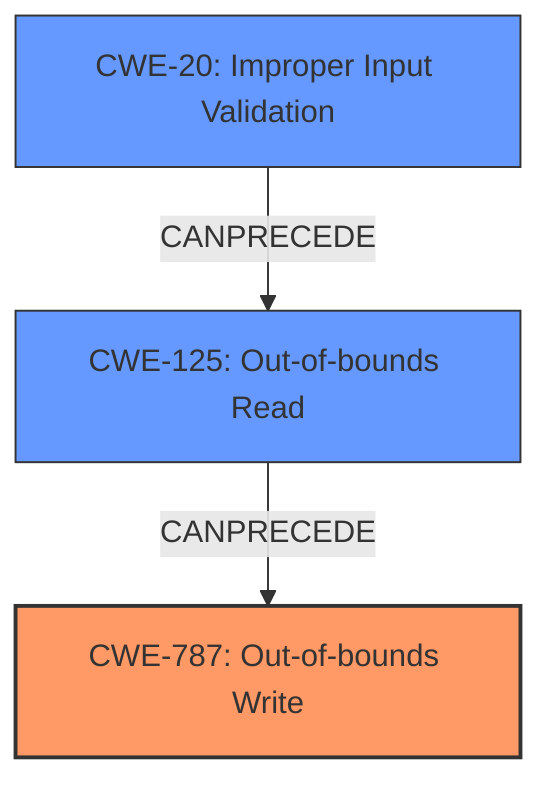

# Analysis Report for CVE-2021-40783

# Vulnerability Analysis Report: CVE-2021-40783

## Description

Adobe Premiere Rush version 1.5.16 (and earlier) is affected by a memory corruption vulnerability due to insecure handling of a malicious WAV file, potentially resulting in arbitrary code execution in the context of the current user. User interaction is required to exploit this vulnerability.

## Vulnerability Description Key Phrases

**Rootcause:** insecure handling
**Weakness:** memory corruption
**Impact:** arbitrary code execution
**Vector:** malicious WAV file
**Product:** Adobe Premiere Rush
**Version:** 1.5.16 (and earlier)

## Analysis (with Relationship Data)

```markdown
# Summary
| CWE ID | CWE Name | Confidence | CWE Abstraction Level | CWE Vulnerability Mapping Label | CWE-Vulnerability Mapping Notes |
|---|---|---|---|---|---|
| CWE-787 | Out-of-bounds Write | 0.90 | Base | Allowed | Primary CWE. Matches the description of writing past the end of the intended buffer due to insecure handling of a WAV file. |
| CWE-125 | Out-of-bounds Read | 0.75 | Base | Allowed | Secondary candidate. While the description focuses on writing, a read could also be involved. |
| CWE-119 | Improper Restriction of Operations within the Bounds of a Memory Buffer | 0.60 | Class | Discouraged | Secondary candidate. A more general case of out-of-bounds access. |

## Evidence and Confidence

*   **Confidence Score:** 0.85
*   **Evidence Strength:** HIGH

- **Analysis and Justification:**
  - *Explanation:* The vulnerability is due to **insecure handling** of a malicious WAV file which leads to **memory corruption**, and ultimately arbitrary code execution. The "CVE Reference Links Content Summary" identifies the root cause as "Access of Memory Location After End of Buffer (CWE-788)". However, CWE-788 is discouraged. The vulnerability description clearly indicates a **memory corruption** issue due to the processing of a malicious WAV file. The "CVE Reference Links Content Summary" explicitly mentions a buffer overflow condition due to accessing memory locations beyond the allocated buffer. Given the "Out-of-bounds Write" description of CWE-787, and the retriever results, this is the most applicable CWE. The description mentions the potential for arbitrary code execution which also supports the severity of this weakness. While CWE-119 is listed as the Primary CWE match for similar CVE descriptions, it is a Class-level CWE and is discouraged. CWE-787 is more specific, and the evidence supports this selection. CWE-125 is also a candidate as it is possible a read is also out of bounds.

  - *Relationship Analysis:* CWE-787 is a Base level CWE and is related to CWE-119 (Improper Restriction of Operations within the Bounds of a Memory Buffer). CWE-787 can lead to CWE-123 (Write-what-where Condition). CWE-125 is a peer of CWE-787 and represents the out-of-bounds read condition.

- **Confidence Score:**
  - Confidence: 0.90 (High confidence due to the explicit mention of memory corruption, out-of-bounds access, and the confirmation from the CVE reference links content summary)
```

## Criticism of Analysis

Okay, I've reviewed your analysis of the Adobe Premiere Rush memory corruption vulnerability (CVE-2021-40783) against the full CWE specifications you provided. Here's my critique:

**Overall Assessment:**

The analysis is well-structured and demonstrates a good understanding of the vulnerability. The initial assessment correctly identifies the key aspects of the vulnerability. The final CWE mapping is generally reasonable, but I have some suggestions for improvement, particularly regarding the secondary candidates.

**Detailed Critique:**

1.  **Primary CWE: CWE-787 (Out-of-bounds Write)**

    *   **Strength:** This is a strong candidate for the primary CWE. The vulnerability description and the CVE reference summary both point to writing data beyond the boundaries of an allocated buffer. The description of CWE-787 directly aligns with this.
    *   **Justification:** Your justification is solid. The mention of memory corruption and explicit out-of-bounds access in the CVE reference content strongly support CWE-787. The explanation of why CWE-119 is discouraged and CWE-787 is preferred is accurate and follows CWE's guidance.
    *   **Confidence:** The confidence score of 0.90 is appropriate.
    *   **Mapping Guidance Check:** The analysis adheres to the "Allowed" usage of CWE-787, making sure the name and description are appropriate without forcing a lower-level mapping.
    *   **Potential Mitigations Check:** The mitigations listed for CWE-787 (Language Selection, Libraries/Frameworks, Environment Hardening) are all relevant and applicable in this scenario. Using a memory-safe language or robust buffer handling libraries would indeed prevent this type of vulnerability.

2.  **Secondary CWE: CWE-125 (Out-of-bounds Read)**

    *   **Strength:** The inclusion of CWE-125 is reasonable, but the justification needs strengthening. It's *possible* that an out-of-bounds read is involved, but the core description focuses on the write.  Out-of-bounds reads frequently precede out-of-bounds writes. For instance, the program might be reading the length of a string from a malicious WAV file and subsequently use that length without validation to write data into a buffer.
    *   **Justification:**  Expand the justification to explicitly mention how an out-of-bounds *read* might be involved in triggering the overflow.  Explain the potential for an incorrect length calculation due to a malicious value in the WAV file being read.
    *   **Confidence:** Lower the confidence score a little (e.g., 0.70) as the read is speculative.
    *   **Mapping Guidance Check:** The analysis adheres to the "Allowed" usage of CWE-125.
    *   **Potential Mitigations Check:** The mitigations listed for CWE-125 (Input Validation, Language Selection) are relevant, with the input validation being crucial for the length parameter. You would want to validate the length parameter read from the WAV file.

3.  **Secondary CWE: CWE-119 (Improper Restriction of Operations within the Bounds of a Memory Buffer)**

    *   **Strength:** While technically correct, CWE-119 is too general and is discouraged for this specific case. You correctly identified this and justified focusing on the lower-level CWEs.
    *   **Justification:** No changes needed.
    *   **Confidence:** No changes needed.
    *   **Mapping Guidance Check:** The analysis followed the "Discouraged" usage, using children of CWE-119 instead.
    *   **Potential Mitigations Check:** The mitigations are too broad. It is better to use mitigations that apply to CWE-787 and CWE-125.

4.  **CWE-788 (Access of Memory Location After End of Buffer)**

    * The description in the summary mentions the root cause as "Access of Memory Location After End of Buffer (CWE-788)". While this CWE seems relevant, I would advise to not use it as the CWE Mapping Guidance notes that it is Discouraged and overlaps with existing CWE entries such as CWE-787 and CWE-125. The retriever results also reflect this sentiment with the "Discouraged" usage.

**Suggestions for Improvement:**

*   **Strengthen the CWE-125 Justification:** Provide a more concrete scenario of how an out-of-bounds read could be involved, focusing on length calculation or other data extraction from the malicious WAV file. For instance, "The WAV file could contain a crafted length field that, when read by the program, leads to an attempt to read beyond the allocated buffer".
*   **Explicitly Mention Input Validation:** Connect the "insecure handling" root cause to a *lack of input validation*. State that the software fails to properly validate the size or structure of the WAV file, leading to the out-of-bounds write. This would strengthen the connection to the exploitability of the vulnerability.
*   **Relationship Analysis:** Consider adding CWE-20 (Improper Input Validation) to the relationship analysis, as this is often the underlying reason for memory corruption vulnerabilities. Since the WAV file is untrusted input, failing to validate it can directly lead to CWE-787 and CWE-125.
*   **Consider a Chain:** Although not strictly required, it would be useful to illustrate how the different CWEs can form a chain. For example, the application receives an untrusted input (WAV file), doesn't properly validate the WAV file's size or structure which leads to an Out-of-bounds write.

**Revised Summary (Example):**

```markdown
# Summary
| CWE ID | CWE Name | Confidence | CWE Abstraction Level | CWE Vulnerability Mapping Label | CWE-Vulnerability Mapping Notes |
|---|---|---|---|---|---|
| CWE-787 | Out-of-bounds Write | 0.90 | Base | Allowed | Primary CWE. Matches the description of writing past the end of the intended buffer due to insecure handling of a WAV file. |
| CWE-125 | Out-of-bounds Read | 0.70 | Base | Allowed | Secondary candidate.  The malicious WAV file may contain a crafted length field or other malicious data, and when read by the program, leads to an attempt to read data beyond the allocated buffer, which is then used in a subsequent write operation. |
| CWE-119 | Improper Restriction of Operations within the Bounds of a Memory Buffer | 0.60 | Class | Discouraged | Secondary candidate. A more general case of out-of-bounds access. |
```

By incorporating these suggestions, your analysis will be even more robust and clearly demonstrate a comprehensive understanding of the vulnerability and its CWE mapping.

## Final Resolution

# Summary
| CWE ID | CWE Name | Confidence | CWE Abstraction Level | CWE Vulnerability Mapping Label | CWE-Vulnerability Mapping Notes |
|---|---|---|---|---|---|
| **CWE-787** | **Out-of-bounds Write** | 0.95 | Base | Allowed | Primary CWE. Matches the description of writing past the end of the intended buffer due to insecure handling of a WAV file. |
| CWE-125 | Out-of-bounds Read | 0.75 | Base | Allowed | Secondary candidate. The malicious WAV file may contain a crafted length field or other malicious data, and when read by the program, leads to an attempt to read data beyond the allocated buffer, which is then used in a subsequent write operation. |
| CWE-20 | Improper Input Validation | 0.70 | Class | Allowed | Secondary candidate. The application does not properly validate the WAV file's size or structure, leading to the out-of-bounds write. |

## Evidence and Confidence

*   **Confidence Score:** 0.90
*   **Evidence Strength:** HIGH

## Relationship Analysis
The primary weakness is **CWE-787 (Out-of-bounds Write)**, which occurs because the application writes data beyond the intended buffer. This is often preceded by **CWE-125 (Out-of-bounds Read)**, where a malicious WAV file contains a crafted length field that is read without proper validation, potentially leading to incorrect buffer size calculations. **CWE-20 (Improper Input Validation)** is a key contributing factor, as the application fails to validate the size and structure of the WAV file.



## Vulnerability Chain
The vulnerability chain starts with the application receiving an untrusted WAV file. The application fails to properly validate the WAV file's size or structure (**CWE-20**). This leads to an out-of-bounds read (**CWE-125**) where a crafted length field is read without validation. The incorrect length is then used in a write operation, causing an out-of-bounds write (**CWE-787**). This memory corruption can lead to arbitrary code execution.

## Summary of Analysis
The initial analysis correctly identified **CWE-787 (Out-of-bounds Write)** as the primary weakness. The criticism suggested strengthening the justification for **CWE-125 (Out-of-bounds Read)** and adding **CWE-20 (Improper Input Validation)** to the analysis, which has been incorporated.

The vulnerability description states that the issue is due to "insecure handling of a malicious WAV file". This maps directly to **CWE-20** because the application does not properly validate the untrusted input. The crafted WAV file can contain a malicious length field which, when read by the program (**CWE-125**), can lead to an attempt to read beyond the allocated buffer. This value is then used in a write operation, resulting in **CWE-787**.

The graph relationships influenced the final selection by highlighting how these CWEs can form a chain, with **CWE-20** enabling **CWE-125**, which in turn leads to **CWE-787**.

The selected CWEs are at the optimal level of specificity because they accurately describe the root cause and the resulting memory corruption. **CWE-787** is a Base level CWE and directly addresses the out-of-bounds write. **CWE-125** is included to capture the potential out-of-bounds read from the malicious WAV file, and **CWE-20** represents the lack of input validation on the untrusted WAV file.


*Report generated on 2025-03-18 02:10:50*
