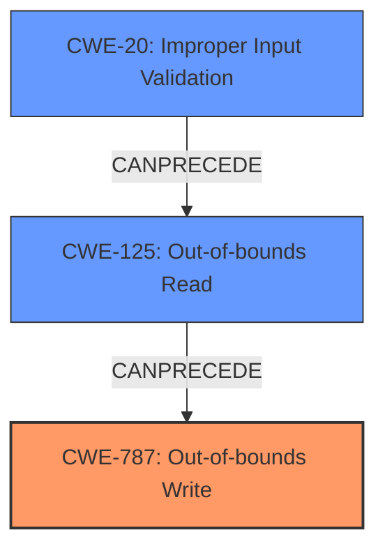

# Final Resolution for CVE-2021-40783

# Summary
| CWE ID | CWE Name | Confidence | CWE Abstraction Level | CWE Vulnerability Mapping Label | CWE-Vulnerability Mapping Notes |
|---|---|---|---|---|---|
| **CWE-787** | **Out-of-bounds Write** | 0.95 | Base | Allowed | Primary CWE. Matches the description of writing past the end of the intended buffer due to insecure handling of a WAV file. |
| CWE-125 | Out-of-bounds Read | 0.75 | Base | Allowed | Secondary candidate. The malicious WAV file may contain a crafted length field or other malicious data, and when read by the program, leads to an attempt to read data beyond the allocated buffer, which is then used in a subsequent write operation. |
| CWE-20 | Improper Input Validation | 0.70 | Class | Allowed | Secondary candidate. The application does not properly validate the WAV file's size or structure, leading to the out-of-bounds write. |

## Evidence and Confidence

*   **Confidence Score:** 0.90
*   **Evidence Strength:** HIGH

## Relationship Analysis
The primary weakness is **CWE-787 (Out-of-bounds Write)**, which occurs because the application writes data beyond the intended buffer. This is often preceded by **CWE-125 (Out-of-bounds Read)**, where a malicious WAV file contains a crafted length field that is read without proper validation, potentially leading to incorrect buffer size calculations. **CWE-20 (Improper Input Validation)** is a key contributing factor, as the application fails to validate the size and structure of the WAV file.

## Vulnerability Chain
The vulnerability chain starts with the application receiving an untrusted WAV file. The application fails to properly validate the WAV file's size or structure (**CWE-20**). This leads to an out-of-bounds read (**CWE-125**) where a crafted length field is read without validation. The incorrect length is then used in a write operation, causing an out-of-bounds write (**CWE-787**). This memory corruption can lead to arbitrary code execution.

## Summary of Analysis
The initial analysis correctly identified **CWE-787 (Out-of-bounds Write)** as the primary weakness. The criticism suggested strengthening the justification for **CWE-125 (Out-of-bounds Read)** and adding **CWE-20 (Improper Input Validation)** to the analysis, which has been incorporated.

The vulnerability description states that the issue is due to "insecure handling of a malicious WAV file". This maps directly to **CWE-20** because the application does not properly validate the untrusted input. The crafted WAV file can contain a malicious length field which, when read by the program (**CWE-125**), can lead to an attempt to read beyond the allocated buffer. This value is then used in a write operation, resulting in **CWE-787**.

The graph relationships influenced the final selection by highlighting how these CWEs can form a chain, with **CWE-20** enabling **CWE-125**, which in turn leads to **CWE-787**.

The selected CWEs are at the optimal level of specificity because they accurately describe the root cause and the resulting memory corruption. **CWE-787** is a Base level CWE and directly addresses the out-of-bounds write. **CWE-125** is included to capture the potential out-of-bounds read from the malicious WAV file, and **CWE-20** represents the lack of input validation on the untrusted WAV file.