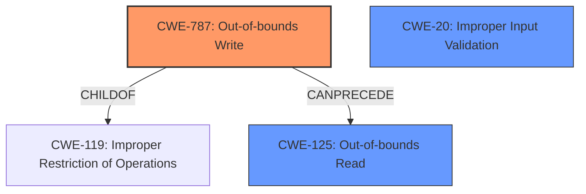

# Final Resolution for CVE-2021-40784

# Summary
| CWE ID | CWE Name | Confidence | CWE Abstraction Level | CWE Vulnerability Mapping Label | CWE-Vulnerability Mapping Notes |
|---|---|---|---|---|---|
| CWE-787 | Out-of-bounds Write | 0.9 | Base | Allowed | Primary CWE |
| CWE-125 | Out-of-bounds Read | 0.7 | Base | Allowed | Secondary Candidate |
| CWE-20 | Improper Input Validation | 0.5 | Class | Discouraged | Secondary Candidate |

## Evidence and Confidence

*   **Confidence Score:** 0.85
*   **Evidence Strength:** MEDIUM

## Relationship Analysis
The primary relationship that impacted the decision was the hierarchical relationship between CWE-787 **Out-of-bounds Write** and CWE-119 **Improper Restriction of Operations within the Bounds of a Memory Buffer**, where CWE-787 is a child of CWE-119. This helped refine the classification to a more specific **weakness**. Additionally, the potential for CWE-125 **Out-of-bounds Read** to occur in conjunction with CWE-787 was considered. Finally, CWE-20 was considered due to the phrase "insecure handling" implying lack of input validation, but it was kept as a low confidence secondary candidate due to its generality.

## Vulnerability Chain
The vulnerability chain starts with the **insecure handling** of a malicious WAV file. This leads to a **CWE-787 Out-of-bounds Write**, which corrupts memory. The corrupted memory can then potentially be read via **CWE-125 Out-of-bounds Read**. The ultimate impact is arbitrary code execution. The lack of input validation **CWE-20** is a potential contributing factor.

## Summary of Analysis
The initial analysis correctly identified CWE-787 **Out-of-bounds Write** as the primary **weakness**. The criticism suggested considering whether the overflow occurred on the heap or stack and also suggested considering CWE-20 **Improper Input Validation**. Given the description, "insecure handling of a malicious WAV file," it is reasonable to assume that there is some form of **improper input validation**, which is why I added **CWE-20** as a secondary candidate. While not explicitly stated, the **insecure handling** implies a lack of proper validation of the WAV file's structure and data, which allows the out-of-bounds write to occur.

The graph relationships helped to confirm that **CWE-787** is the most specific and appropriate classification, being a child of the more general **CWE-119**.

The selected CWEs are at the optimal level of specificity. **CWE-787** is a base-level CWE and directly reflects the root cause of the memory corruption. **CWE-125** is also a base-level CWE and represents a potential consequence of the memory corruption. **CWE-20** is a class-level CWE and represents the general lack of input validation.