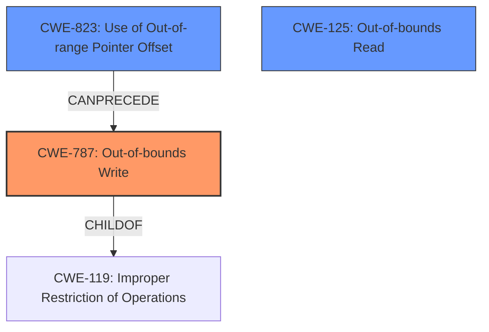

# Final Resolution for CVE-2021-40787

# Summary
| CWE ID | CWE Name | Confidence | CWE Abstraction Level | CWE Vulnerability Mapping Label | CWE-Vulnerability Mapping Notes |
|---|---|---|---|---|---|
| CWE-787 | Out-of-bounds Write | 0.95 | Base | Allowed | Primary CWE |
| CWE-823 | Use of Out-of-range Pointer Offset | 0.75 | Base | Allowed | Secondary Candidate |
| CWE-125 | Out-of-bounds Read | 0.65 | Base | Allowed | Secondary Candidate |

## Evidence and Confidence

*   **Confidence Score:** 0.90
*   **Evidence Strength:** HIGH

## Relationship Analysis
The decision was influenced by the following CWE relationships:
  - CWE-787 is a base CWE and a child of the class-level CWE-119, providing a more specific classification.
  - CWE-823 can precede CWE-787, indicating a potential chain where an out-of-range pointer offset leads to an out-of-bounds write.
  - CWE-125 is a peer of CWE-787, representing a similar but distinct vulnerability (out-of-bounds read vs. write). The evidence suggests the primary action is a write.
  - Abstraction levels were crucial: base-level CWEs were preferred for their specificity over class-level CWEs like CWE-119.

## Vulnerability Chain
The vulnerability chain starts with the **insecure handling** of a malicious file. This **insecure handling** could involve an attacker-controlled offset (CWE-823) that leads to writing data outside the intended buffer boundary (CWE-787), resulting in **memory corruption** and potentially arbitrary code execution. A possible secondary effect could be out-of-bounds read (CWE-125).

## Summary of Analysis
The initial analysis and criticism were both well-reasoned. The decision to classify this vulnerability as CWE-787 (Out-of-bounds Write) is strongly supported by the evidence from the vulnerability description which highlights a **memory corruption** issue due to **insecure handling** of a malicious file. The explicit mention of an "Out-of-bounds write, specifically accessing a memory location after the end of a buffer" in the CVE reference content summary is key.

The graph relationships influenced the decision by highlighting potential vulnerability chains. The possibility of CWE-823 (Use of Out-of-range Pointer Offset) preceding CWE-787 was considered, and it was deemed likely enough to include as a secondary CWE.

The selected CWEs are at the optimal level of specificity. CWE-787 is a base-level CWE, which is preferred over the class-level CWE-119. While other CWEs were considered (e.g., CWE-122, CWE-190, CWE-843), they were deemed less relevant based on the available evidence. The addition of CWE-823 strengthens the analysis by suggesting a potential mechanism for the out-of-bounds write.